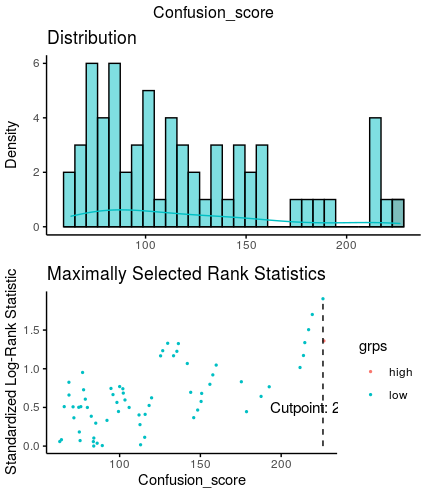
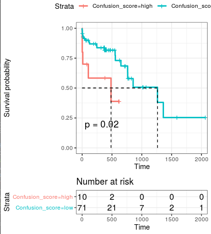
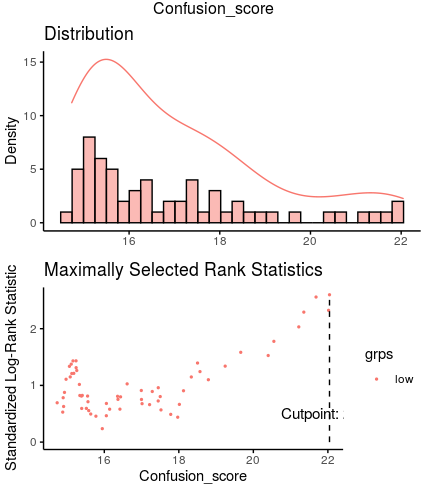
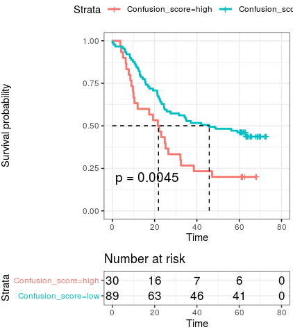

# Codes of CCI as an independent dignosis marker

This part recorded the codes to validate the CCI was an independent dignosis marker.  Here we unsed the TCGA-ESCC data and GSE53624 data for analysis. 

## 1. CCI was an independent dignosis marker in TCGA-ESCC

~~~R

ESCC_FPKM <- fread("/mnt/data/user_data/xiangyu/workshop/DATABASE/TCGA_ESCA/ESCA_RNA_transfer_symbol.csv")
ESCC_FPKM <- as.data.frame(ESCC_FPKM)
rownames(ESCC_FPKM) <- ESCC_FPKM$V1
ESCC_FPKM <- ESCC_FPKM[,-1]
Escc_clinical <- fread("/mnt/data/user_data/xiangyu/workshop/DATABASE/TCGA_ESCA/ESCA_all_clinical.csv")
Escc_clinical <- as.data.frame(Escc_clinical)
rownames(Escc_clinical) <- Escc_clinical$V1
Escc_clinical <- Escc_clinical[,c("gender","V1","submitter_id","primary_diagnosis","tumor_stage","age_at_diagnosis","days_to_death","vital_status","days_to_last_follow_up")]
Escc_clinical$submitter_id <- gsub("-",".",Escc_clinical$submitter_id)
rownames(Escc_clinical) <- Escc_clinical$submitter_id
Escc_clinical <- subset(Escc_clinical,primary_diagnosis=="Basaloid squamous cell carcinoma" | primary_diagnosis == "Squamous cell carcinoma, keratinizing, NOS" |
  primary_diagnosis == "Squamous cell carcinoma, NOS")
both_id <- intersect(Escc_clinical$submitter_id,colnames(ESCC_FPKM))
Escc_clinical <- Escc_clinical[both_id,]
ESCC_FPKM <- ESCC_FPKM[,both_id]
ESCC_FPKM <- log(ESCC_FPKM+1,2)
only_Normal_epi.markers <- mcreadRDS("/mnt/data/user_data/xiangyu/workshop/scRNA/eso_scRNA/Heso_cancer6/normal/Heso6_normal_only_epi_hetero.marker.rds",mc.cores=20)
only_Normal_epi.markers$cluster <- as.character(only_Normal_epi.markers$cluster)
only_Normal_epi.markers_DK <- subset(only_Normal_epi.markers,cluster=="Differentiated_keratinocyte" &pct.2 < 0.4)
only_Normal_epi.markers_BK <- subset(only_Normal_epi.markers,cluster=="Basel_keratinocyte" &pct.2 < 0.4)
only_Normal_epi.markers_BS <- subset(only_Normal_epi.markers,cluster=="Basel_Stem_Cells" &pct.2 < 0.4)
TCGA_ESCC <- data.frame(DK=apply(ESCC_FPKM[intersect(rownames(ESCC_FPKM),only_Normal_epi.markers_DK$gene),],2,mean),
  BK=apply(ESCC_FPKM[intersect(rownames(ESCC_FPKM),only_Normal_epi.markers_BK$gene),],2,mean),
  BS=apply(ESCC_FPKM[intersect(rownames(ESCC_FPKM),only_Normal_epi.markers_BS$gene),],2,mean),
  TPM4=as.character(ESCC_FPKM["TPM4",]))
TCGA_ESCC$DK <- as.numeric(as.character(TCGA_ESCC$DK))
TCGA_ESCC$BK <- as.numeric(as.character(TCGA_ESCC$BK))
TCGA_ESCC$BS <- as.numeric(as.character(TCGA_ESCC$BS))
TCGA_ESCC$TPM4 <- as.numeric(as.character(TCGA_ESCC$TPM4))
a <- TCGA_ESCC$BK
b <- TCGA_ESCC$DK
c <- TCGA_ESCC$BS
TCGA_ESCC$cos1 <- (a^2 +(((a^2+b^2+c^2)^0.5)^2)-(((b^2+c^2)^0.5)^2))/(2*a*((a^2+b^2+c^2)^0.5))
TCGA_ESCC$cos2 <- (b^2 +(((a^2+b^2+c^2)^0.5)^2)-(((a^2+c^2)^0.5)^2))/(2*b*((a^2+b^2+c^2)^0.5))
TCGA_ESCC$cos3 <- (c^2 +(((a^2+b^2+c^2)^0.5)^2)-(((a^2+b^2)^0.5)^2))/(2*c*((a^2+b^2+c^2)^0.5))
TCGA_ESCC$cos1[which((2*a*((a^2+b^2+c^2)^0.5)==0))] <- 2
TCGA_ESCC$cos2[which((2*b*((a^2+b^2+c^2)^0.5)==0))] <- 2
TCGA_ESCC$cos3[which((2*c*((a^2+b^2+c^2)^0.5)==0))] <- 2
TCGA_ESCC$Confusion_score <- future_apply(TCGA_ESCC[,c("cos1","cos2","cos3")],1,sd)
TCGA_ESCC$Confusion_score <- 10/TCGA_ESCC$Confusion_score
TCGA_ESCC$Confusion_score1 <- log(TCGA_ESCC$Confusion_score+1,2)
library("survival")
library("survminer")
Escc_clinical_sel <- Escc_clinical[rownames(TCGA_ESCC),]
Escc_clinical_ <- cbind(Escc_clinical_sel,TCGA_ESCC)
meta <- Escc_clinical_
meta[is.na(meta)] <- "HHH"
tmp <- subset(meta,days_to_last_follow_up=="HHH")
tmp$days_to_last_follow_up <- tmp$days_to_death
no_na <- meta[setdiff(rownames(meta),rownames(tmp)),]
all_merge <- rbind(tmp,no_na)
all_merge <- subset(all_merge,days_to_last_follow_up != "HHH")
all_merge$vital_status <- as.character(all_merge$vital_status)
all_merge$status <- ifelse(all_merge$vital_status=="Alive",0,1)
all_merge$days_to_last_follow_up <- as.numeric(all_merge$days_to_last_follow_up)
all_merge.cut <- surv_cutpoint(
   all_merge,
   time = "days_to_last_follow_up",
   event = "status",
   variables = c("Confusion_score"),
   progressbar=TRUE,
   minprop=0.1
)
summary(all_merge.cut)
plot(all_merge.cut, "Confusion_score")
all_merge.cut.cat <- surv_categorize(all_merge.cut) 
library(survival)
fit <- survfit(Surv(days_to_last_follow_up, status) ~ Confusion_score, data = all_merge.cut.cat)
p1 <- ggsurvplot(fit, data = all_merge.cut.cat,
surv.median.line = "hv",
pval = TRUE,
ggtheme = theme_bw(),
risk.table=TRUE)
ggsave("/mnt/data/user_data/xiangyu/workshop/scRNA/eso_scRNA/Heso_all_sample_merge/figure_making/Confusion_score_survival_TCGA.svg", plot=p1$plot,width = 5, height = 5,dpi=1080)
~~~

## 2. CCI was an independent dignosis marker in GSE53624 data

~~~r
All_data_list_calculate_Confused <- mcreadRDS("/mnt/data/user_data/xiangyu/workshop/scRNA/eso_scRNA/Heso_all_sample_merge/OTS_data/All_data_merge.rds")
GSE53624_INFO <- All_data_list_calculate_Confused[[6]][[]]
GSE53624_INFO <- as.data.frame(cbind(GSE53624_INFO,FetchData(object = All_data_list_calculate_Confused[[6]], vars = c("SOX2-OT","TPM4","STAT3"),slot="counts")))
colnames(GSE53624_INFO)[which(colnames(GSE53624_INFO)=="SOX2-OT")] <- "SOX2"
GSE53624_INFO <- subset(GSE53624_INFO,group=="ESCC")
library("survival")
library("survminer")
GSE53624_INFO$vital_status <- as.character(GSE53624_INFO$death.at.fu.ch1)
GSE53624_INFO$time.months <- as.numeric(as.character(GSE53624_INFO$survival.time.months..ch1))
all_merge <- GSE53624_INFO
all_merge$vital_status <- as.character(all_merge$vital_status)
all_merge$status <- ifelse(all_merge$vital_status=="no",0,1)
all_merge$time.months <- as.numeric(all_merge$time.months)
a <- as.numeric(as.character(scale(all_merge$Basel_keratinocyte)))
b <- as.numeric(as.character(scale(all_merge$Differentiated_keratinocyte)))
c <- as.numeric(as.character(scale(all_merge$Basel_Stem_Cells)))
all_merge$cos1 <- (a^2 +(((a^2+b^2+c^2)^0.5)^2)-(((b^2+c^2)^0.5)^2))/(2*a*((a^2+b^2+c^2)^0.5))
all_merge$cos2 <- (b^2 +(((a^2+b^2+c^2)^0.5)^2)-(((a^2+c^2)^0.5)^2))/(2*b*((a^2+b^2+c^2)^0.5))
all_merge$cos3 <- (c^2 +(((a^2+b^2+c^2)^0.5)^2)-(((a^2+b^2)^0.5)^2))/(2*c*((a^2+b^2+c^2)^0.5))
all_merge$cos1[which((2*a*((a^2+b^2+c^2)^0.5)==0))] <- 2
all_merge$cos2[which((2*b*((a^2+b^2+c^2)^0.5)==0))] <- 2
all_merge$cos3[which((2*c*((a^2+b^2+c^2)^0.5)==0))] <- 2
all_merge$Confusion_score <- future_apply(all_merge[,c("cos1","cos2","cos3")],1,sd)
all_merge$Confusion_score <- 10/all_merge$Confusion_score
all_merge$Confusion_score1 <- log(all_merge$Confusion_score+1,2)
all_merge$Tumor_status <- ifelse(all_merge$tnm.stage.ch1=="I","I","II_III")
all_merge$Tumor_status <- factor(all_merge$Tumor_status,levels=c("I","II_III"))
all_merge$tnm.stage.ch1 <- factor(all_merge$tnm.stage.ch1,levels=c("I","II","III"))
all_merge$tumor.grade.ch1 <- factor(all_merge$tumor.grade.ch1,levels=c("well","moderately","poorly"))
all_merge.cut <- surv_cutpoint(
   all_merge,
   time = "time.months",
   event = "status",
   variables = c("Confusion_score"),
   progressbar=TRUE,
   minprop=0.25
)
summary(all_merge.cut)
plot(all_merge.cut, "Confusion_score")
all_merge.cut.cat <- surv_categorize(all_merge.cut) 
library(survival)
fit <- survfit(Surv(time.months, status) ~ Confusion_score, data = all_merge.cut.cat)
p1 <- ggsurvplot(fit, data = all_merge.cut.cat,
surv.median.line = "hv",
pval = TRUE,
ggtheme = theme_bw(),
risk.table=TRUE)
ggsave("./Confusion_score_survival_GSE53624.svg", plot=p1$plot,width = 5, height = 5,dpi=1080)
~~~

