# Codes of confused cell identity (CCI) in Omics data 

This part recorded the codes of CCI visualization in Omics data, including scRNA-seq data, bulk RNA-seq data and micro-array data. The detail methods could be learned from paper. And these visualizations were majorly based on the `ggplot2` (*version = 3.1.0*) and `ggtern` (*version=3.1.0*). Hence, before begining this processing, we need to install the right version package. 

~~~R
R CMD INSTALL /mnt/data/user_data/xiangyu/programme/R_PACKAGES/ggplot2/ggplot2_3.1.0.tar.gz
R CMD INSTALL /mnt/data/user_data/xiangyu/programme/R_PACKAGES/ggtern/ggtern_3.1.0.tar.gz
~~~

# Codes of confused cell identity (CCI) in scRNA-seq data

* Here, we analyzed the CCI in scRNA-seq data from ours, HCA's and Zhang et al. To save the memory and raise efficiency in procerssing. Firstly, we generate the basic matrix from scRNA to prepare the visualizations by `ggtern` (*version=3.1.0*)

~~~R
only_Normal_epi.markers <- mcreadRDS("/mnt/data/user_data/xiangyu/workshop/scRNA/eso_scRNA/Heso_cancer6/normal/Heso6_normal_only_epi_hetero.marker.rds",mc.cores=20)
only_Normal_epi.markers_DK <- subset(only_Normal_epi.markers,cluster=="Differentiated_keratinocyte" &pct.2 < 0.4)
only_Normal_epi.markers_BK <- subset(only_Normal_epi.markers,cluster=="Basel_keratinocyte" &pct.2 < 0.4)
only_Normal_epi.markers_BS <- subset(only_Normal_epi.markers,cluster=="Basel_Stem_Cells" &pct.2 < 0.4)
only_epithelium_all <- mcreadRDS("/mnt/data/user_data/xiangyu/workshop/scRNA/eso_scRNA/Heso_all_sample_merge/Heso_cancer_all_merge_4000_only_epi.rds",mc.cores=20)
only_epithelium_all$new_group <- ifelse(only_epithelium_all$group=="Heso6_normal", "Normal", "Tumor")
tmp <- only_epithelium_all
DefaultAssay(tmp) <- "RNA"
MLL3_SC <- tmp
Lineage_marker <- only_Normal_epi.markers_DK$gene
    tmp <- MLL3_SC
    Lineage_marker <- intersect(rownames(GetAssayData(object = tmp, slot = "data",assay="RNA")),Lineage_marker)
    speci_raw <- FetchData(object = tmp, vars = Lineage_marker,slot="data")
tmp[["Differentiated_keratinocyte"]] <- (rowSums(speci_raw))/length(Lineage_marker)
tmp$Differentiated_keratinocyte <- as.numeric(as.character(tmp$Differentiated_keratinocyte))
MLL3_SC <- tmp
Lineage_marker <- only_Normal_epi.markers_BK$gene
    tmp <- MLL3_SC
    Lineage_marker <- intersect(rownames(GetAssayData(object = tmp, slot = "data",assay="RNA")),Lineage_marker)
    speci_raw <- FetchData(object = tmp, vars = Lineage_marker,slot="data")
tmp[["Basel_keratinocyte"]] <- (rowSums(speci_raw))/length(Lineage_marker)
tmp$Basel_keratinocyte <- as.numeric(as.character(tmp$Basel_keratinocyte))
MLL3_SC <- tmp
Lineage_marker <- only_Normal_epi.markers_BS$gene
    tmp <- MLL3_SC
    Lineage_marker <- intersect(rownames(GetAssayData(object = tmp, slot = "data",assay="RNA")),Lineage_marker)
    speci_raw <- FetchData(object = tmp, vars = Lineage_marker,slot="data")
tmp[["Basel_Stem_Cells"]] <- (rowSums(speci_raw))/length(Lineage_marker)
tmp$Basel_Stem_Cells <- as.numeric(as.character(tmp$Basel_Stem_Cells))
summer_all <- tmp[[c("group","new_group","new_anno3","Differentiated_keratinocyte","Basel_keratinocyte","Basel_Stem_Cells")]]
mcsaveRDS(summer_all,"/mnt/data/user_data/xiangyu/workshop/scRNA/eso_scRNA/Heso_cancer6/normal/ggtern_our_scESCC.rds",mc.cores=20)

ALL_nor_Eso <- mcreadRDS(file="/mnt/data/user_data/xiangyu/workshop/scRNA/eso_scRNA/Heso_all_sample_merge/GGJ_AND_OURS_Normal.rds",mc.cores=20)
Idents(ALL_nor_Eso) <- ALL_nor_Eso$new_anno
only_epithelium_ALL_nor_Eso <- subset(ALL_nor_Eso,cells=rownames(subset(ALL_nor_Eso@meta.data,new_anno=="Squamous Epithelium" | 
  new_anno=="Basal cell" | new_anno=="Kerationcyte")))
only_Normal_epi.markers <- mcreadRDS("/mnt/data/user_data/xiangyu/workshop/scRNA/eso_scRNA/Heso_cancer6/normal/Heso6_normal_only_epi_hetero.marker.rds",mc.cores=20)
only_Normal_epi.markers_DK <- subset(only_Normal_epi.markers,cluster=="Differentiated_keratinocyte" &pct.2 < 0.4)
only_Normal_epi.markers_BK <- subset(only_Normal_epi.markers,cluster=="Basel_keratinocyte" &pct.2 < 0.4)
only_Normal_epi.markers_BS <- subset(only_Normal_epi.markers,cluster=="Basel_Stem_Cells" &pct.2 < 0.4)
tmp <- only_epithelium_ALL_nor_Eso
DefaultAssay(tmp) <- "RNA"
MLL3_SC <- tmp
Lineage_marker <- only_Normal_epi.markers_DK$gene
    tmp <- MLL3_SC
    Lineage_marker <- intersect(rownames(GetAssayData(object = tmp, slot = "data",assay="RNA")),Lineage_marker)
    speci_raw <- FetchData(object = tmp, vars = Lineage_marker,slot="data")
tmp[["Differentiated_keratinocyte"]] <- (rowSums(speci_raw))/length(Lineage_marker)
tmp$Differentiated_keratinocyte <- as.numeric(as.character(tmp$Differentiated_keratinocyte))
MLL3_SC <- tmp
Lineage_marker <- only_Normal_epi.markers_BK$gene
    tmp <- MLL3_SC
    Lineage_marker <- intersect(rownames(GetAssayData(object = tmp, slot = "data",assay="RNA")),Lineage_marker)
    speci_raw <- FetchData(object = tmp, vars = Lineage_marker,slot="data")
tmp[["Basel_keratinocyte"]] <- (rowSums(speci_raw))/length(Lineage_marker)
tmp$Basel_keratinocyte <- as.numeric(as.character(tmp$Basel_keratinocyte))
MLL3_SC <- tmp
Lineage_marker <- only_Normal_epi.markers_BS$gene
    tmp <- MLL3_SC
    Lineage_marker <- intersect(rownames(GetAssayData(object = tmp, slot = "data",assay="RNA")),Lineage_marker)
    speci_raw <- FetchData(object = tmp, vars = Lineage_marker,slot="data")
tmp[["Basel_Stem_Cells"]] <- (rowSums(speci_raw))/length(Lineage_marker)
tmp$Basel_Stem_Cells <- as.numeric(as.character(tmp$Basel_Stem_Cells))
summer_all <- tmp[[c("group","new_anno","Differentiated_keratinocyte","Basel_keratinocyte","Basel_Stem_Cells")]]
mcsaveRDS(summer_all,"/mnt/data/user_data/xiangyu/workshop/scRNA/eso_scRNA/Heso_all_sample_merge/v2_re_analysis/ggtern_scHCL.rds",mc.cores=20)

ALL_nor_Eso_epi <- mcreadRDS(file="/mnt/data/user_data/xiangyu/workshop/scRNA/eso_scRNA/Heso_cancer6/normal/Aviv_AND_OURS_Normal_only_epi_v2.rds",mc.cores=20)
summer_all <- ALL_nor_Eso_epi[[c("patient","new_anno","Differentiated_keratinocyte","Basel_keratinocyte","Basel_Stem_Cells")]]
mcsaveRDS(summer_all,"/mnt/data/user_data/xiangyu/workshop/Heso/ggtern_ALL_nor_Eso_epi.rds",mc.cores=20)

scESCC_seurat_only <- mcreadRDS("/mnt/data/user_data/xiangyu/workshop/DATABASE/scESCC/scESCC_landscape_all.rds", mc.cores = 20)
summer_all <- scESCC_seurat_only[[c("sample","new_group","DK","BK","BS","annotated_type","Pathologic.stage","new_stage")]]
mcsaveRDS(summer_all,"/mnt/data/user_data/xiangyu/workshop/DATABASE/scESCC/scESCC_landscape_all_summer_all.rds", mc.cores = 20)

~~~

## CCI in our scRNA-seq data

* Then, we could impoart these matrix and visualiz them directly and quickly. Firstly, we could observe the CCI in our scRNA-seq data

~~~r

library(trqwe)
summer_all <- mcreadRDS("/mnt/data/user_data/xiangyu/workshop/Heso/v2_re_analysis/CCI_meta_all/ggtern_our_scESCC.rds",mc.cores=20)
# summer_all <- mcreadRDS("/mnt/data/user_data/xiangyu/workshop/scRNA/eso_scRNA/Heso_cancer6/normal/ggtern_our_scESCC.rds",mc.cores=20)
library(ggtern)
library(BuenColors)
all_tmp <- subset(summer_all,new_group=="Tumor")
aa <- jdb_palette("brewer_celsius")
p1 <- ggtern(all_tmp , aes(x = Basel_keratinocyte, y = Basel_Stem_Cells, z = Differentiated_keratinocyte))+
# theme_rgbg()+
 geom_point(alpha = 0.6, color = "#aebfbb", size = 1) + 
    stat_density_tern(
      geom = 'polygon', 
      aes(fill = ..level.., alpha = ..level..),bins = 500,inherit.aes=TRUE) +
    guides(alpha = FALSE)+theme_classic()+
    scale_fill_gradientn(colours=alpha(aa,1),na.value="NA")+ 
    scale_alpha(range = c(0, 0.8), guide = FALSE) + tern_limits(T = 1, L = 1, R = 1)
ggsave("/mnt/data/user_data/xiangyu/workshop/Heso/v2_re_analysis/CCI_meta_all/our_scRNA_ESCC_CCI.svg", plot=p1,width = 15, height = 5,dpi=1080)
~~~

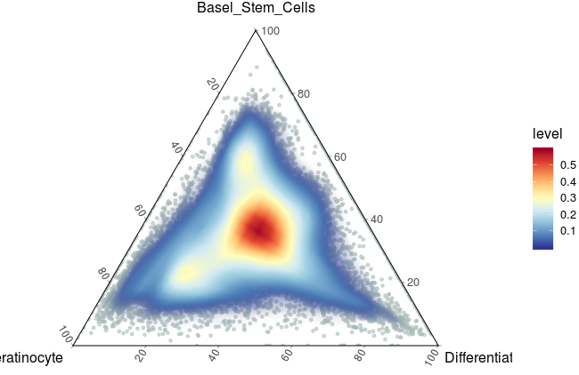

~~~r

all_tmp$new_group <- gsub("Heso_6_para","Heso_cancer6",all_tmp$group)
all_tmp$new_group <- gsub("Heso_6_cancer","Heso_cancer6",all_tmp$new_group)
all_tmp$new_group <- gsub("Heso_cancer","Patient ",all_tmp$new_group)
uniq_group <- unique(all_tmp$new_group)
for (i in 1:length(uniq_group)) {
  p1 <- ggtern(subset(all_tmp,new_group==uniq_group[i]) , aes(x = Basel_keratinocyte, y = Basel_Stem_Cells, z = Differentiated_keratinocyte))+
# theme_rgbg()+
   geom_point(alpha = 0.6, color = "#aebfbb", size = 1) + 
    stat_density_tern(
      geom = 'polygon', aes(fill = ..level.., alpha = ..level..),bins = 500,expand = c(1, 1)) +
    guides(alpha = FALSE)+theme_classic()+
    scale_fill_gradientn(colours=alpha(aa,1))+  tern_limits(T = 1, L = 1, R = 1)
ggsave(paste0("/mnt/data/user_data/xiangyu/workshop/Heso/v2_re_analysis/CCI_meta_all/our_scRNA_",uniq_group[i],"_CCI.svg"), plot=p1,width = 15, height = 5,dpi=1080)
}
~~~

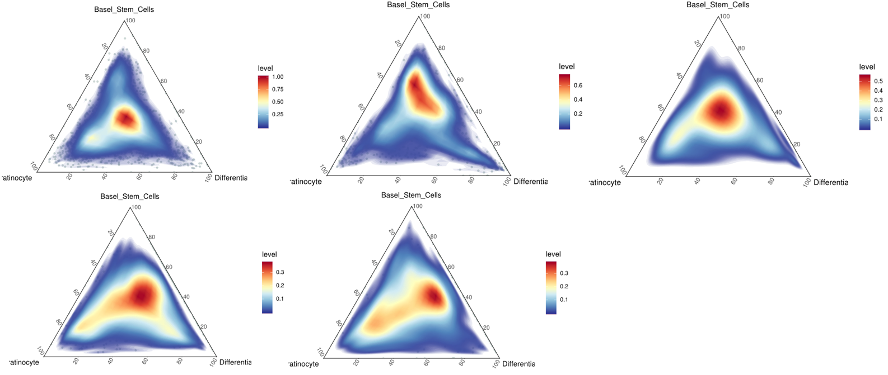

~~~R
all_tmp <- subset(summer_all,new_group=="Normal")
aa <- jdb_palette("brewer_celsius")
p1 <- ggtern(all_tmp , aes(x = Basel_keratinocyte, y = Basel_Stem_Cells, z = Differentiated_keratinocyte))+
# theme_rgbg()+
 geom_point(alpha = 0.6, color = "#aebfbb", size = 1) + 
    stat_density_tern(
      geom = 'polygon', 
      aes(fill = ..level.., alpha = ..level..),bins = 500,expand = c(1, 1)) +
    guides(alpha = FALSE)+theme_classic()+
    scale_fill_gradientn(colours=alpha(aa,1),na.value="NA")+ 
    scale_alpha(range = c(0, 10), guide = FALSE) + tern_limits(T = 1, L = 1, R = 1)
ggsave("/mnt/data/user_data/xiangyu/workshop/Heso/v2_re_analysis/CCI_meta_all/our_scRNA_Normal_CCI.svg", plot=p1,width = 15, height = 5,dpi=1080)
~~~

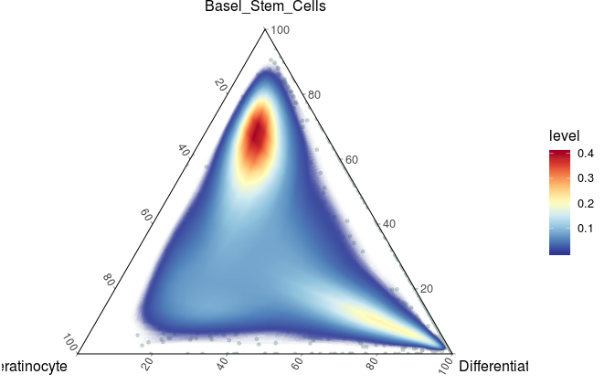

## CCI in single cell HCA data

~~~R
summer_all <- mcreadRDS("/mnt/data/user_data/xiangyu/workshop/Heso/v2_re_analysis/CCI_meta_all/ggtern_ALL_nor_Eso_epi.rds",mc.cores=20)
summer_all1 <- subset(summer_all,patient!="Heso6_normal")
summer_all1$Differentiated_keratinocyte <- (summer_all1$Differentiated_keratinocyte-min(summer_all1$Differentiated_keratinocyte))/(max(summer_all1$Differentiated_keratinocyte)-min(summer_all1$Differentiated_keratinocyte))
summer_all1$Basel_keratinocyte <- (summer_all1$Basel_keratinocyte-min(summer_all1$Basel_keratinocyte))/(max(summer_all1$Basel_keratinocyte)-min(summer_all1$Basel_keratinocyte))
summer_all1$Basel_Stem_Cells <- (summer_all1$Basel_Stem_Cells-min(summer_all1$Basel_Stem_Cells))/(max(summer_all1$Basel_Stem_Cells)-min(summer_all1$Basel_Stem_Cells))
library(ggtern)
library(BuenColors)
aa <- jdb_palette("brewer_celsius")
uniq_group <- unique(summer_all1$patient)
for (i in 1:length(uniq_group)) {
  p1 <- ggtern(subset(summer_all1,patient==uniq_group[i]) , aes(x = Basel_keratinocyte, y = Basel_Stem_Cells, z = Differentiated_keratinocyte))+
# theme_rgbg()+
   geom_point(alpha = 0.6, color = "#aebfbb", size = 1) + 
    stat_density_tern(
      geom = 'polygon', 
      aes(fill = ..level.., alpha = ..level..),bins = 500) +
    guides(alpha = FALSE)+theme_classic()+
    scale_fill_gradientn(colours=alpha(aa,1))+  tern_limits(T = 1, L = 1, R = 1)
# ggsave(paste0("/mnt/data/user_data/xiangyu/workshop/Heso/v2_re_analysis/Normal_sclandscape_confused_density_scESCC_",uniq_group[i],".svg"), plot=p1,width = 15, height = 5,dpi=1080)
ggsave(paste0("/mnt/data/user_data/xiangyu/workshop/Heso/v2_re_analysis/CCI_meta_all/scHCA_Normal_",uniq_group[i],"_CCI.svg"), plot=p1,width = 15, height = 5,dpi=1080)
}
~~~

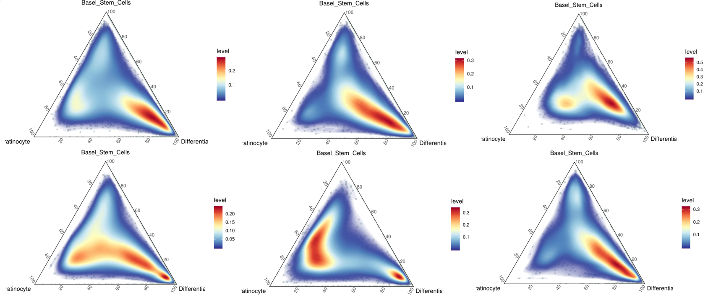

~~~R
aa <- jdb_palette("brewer_celsius")
p1 <- ggtern(summer_all1 , aes(x = Basel_keratinocyte, y = Basel_Stem_Cells, z = Differentiated_keratinocyte))+
 geom_point(alpha = 0.6, color = "#aebfbb", size = 1) + 
    stat_density_tern(
      geom = 'polygon', 
      aes(fill = ..level.., alpha = ..level..),bins = 500,inherit.aes=TRUE) +
    guides(alpha = FALSE)+theme_classic()+
    scale_fill_gradientn(colours=alpha(aa,1),na.value="NA")+ tern_limits(T = 1, L = 1, R = 1)
ggsave("/mnt/data/user_data/xiangyu/workshop/Heso/v2_re_analysis/CCI_meta_all/scHCA_Normal_CCI.svg", plot=p1,width = 15, height = 5,dpi=1080)
~~~

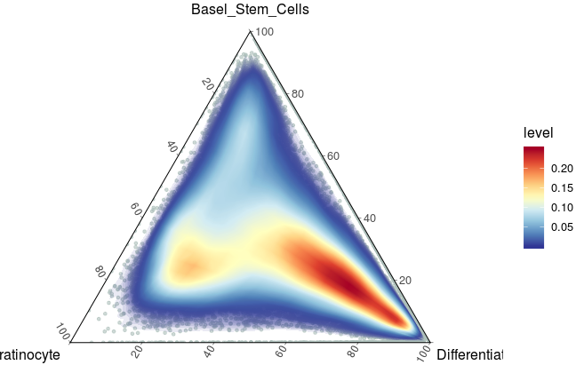

~~~R
library(trqwe)
summer_all <- mcreadRDS("/mnt/data/user_data/xiangyu/workshop/Heso/v2_re_analysis/CCI_meta_all/scESCC_landscape_all_summer_all.rds", mc.cores = 20)
summer_all <- mcreadRDS("/mnt/data/user_data/xiangyu/workshop/Heso/v2_re_analysis/CCI_meta_all/scESCC_landscape_all_summer_all.rds", mc.cores = 20)
summer_all <- subset(summer_all,new_group=="ESCC")
stageI <- subset(summer_all,new_stage=="I")
aa <- jdb_palette("brewer_celsius")
p1 <- ggtern(stageI , aes(x = BK, y = BS, z = DK))+
# theme_rgbg()+
   geom_point(alpha = 0.6, color = "#aebfbb", size = 1) + 
    stat_density_tern(
      geom = 'polygon', 
      aes(fill = ..level.., alpha = ..level..),bins = 500) +
    guides(alpha = FALSE)+theme_classic()+
    scale_fill_gradientn(colours=alpha(aa,1))+  tern_limits(T = 1, L = 1, R = 1)
ggsave("/mnt/data/user_data/xiangyu/workshop/Heso/v2_re_analysis/CCI_meta_all/NC_scESCC_stageI_CCI.svg", plot=p1,width = 15, height = 5,dpi=1080)
~~~

## CCI in single cell HCL data

~~~R
library(trqwe)
library(ggtern)
library(BuenColors)
summer_all <- mcreadRDS("/mnt/data/user_data/xiangyu/workshop/Heso/v2_re_analysis/CCI_meta_all/ggtern_scHCL.rds",mc.cores=20)
all_tmp <- subset(summer_all,group!="Heso6_normal")
aa <- jdb_palette("brewer_celsius")
p1 <- ggtern(all_tmp , aes(x = Basel_keratinocyte, y = Basel_Stem_Cells, z = Differentiated_keratinocyte))+
# theme_rgbg()+
 geom_point(alpha = 0.6, color = "#aebfbb", size = 1) + 
    stat_density_tern(
      geom = 'polygon', 
      aes(fill = ..level.., alpha = ..level..),bins = 500) +
    guides(alpha = FALSE)+theme_classic()+
    scale_fill_gradientn(colours=alpha(aa,1),na.value="NA")+tern_limits(T = 1, L = 1, R = 1)
ggsave("/mnt/data/user_data/xiangyu/workshop/Heso/v2_re_analysis/CCI_meta_all/scHCL_Normal_CCI.svg", plot=p1,width = 15, height = 5,dpi=1080)
~~~

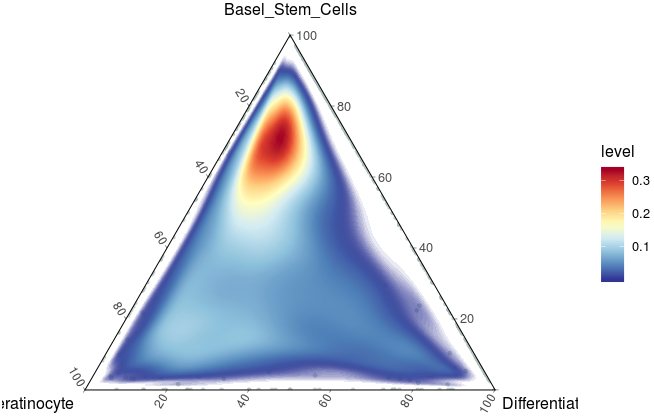

## CCI in single cell ESCC data

~~~R
library(trqwe)
summer_all <- mcreadRDS("/mnt/data/user_data/xiangyu/workshop/Heso/v2_re_analysis/CCI_meta_all/scESCC_landscape_all_summer_all.rds", mc.cores = 20)
summer_all <- mcreadRDS("/mnt/data/user_data/xiangyu/workshop/Heso/v2_re_analysis/CCI_meta_all/scESCC_landscape_all_summer_all.rds", mc.cores = 20)
summer_all <- subset(summer_all,new_group=="ESCC")
stageI <- subset(summer_all,new_stage=="I")
aa <- jdb_palette("brewer_celsius")
p1 <- ggtern(stageI , aes(x = BK, y = BS, z = DK))+
# theme_rgbg()+
   geom_point(alpha = 0.6, color = "#aebfbb", size = 1) + 
    stat_density_tern(
      geom = 'polygon', 
      aes(fill = ..level.., alpha = ..level..),bins = 500) +
    guides(alpha = FALSE)+theme_classic()+
    scale_fill_gradientn(colours=alpha(aa,1))+  tern_limits(T = 1, L = 1, R = 1)
ggsave("/mnt/data/user_data/xiangyu/workshop/Heso/v2_re_analysis/CCI_meta_all/NC_scESCC_stageI_CCI.svg", plot=p1,width = 15, height = 5,dpi=1080)
~~~

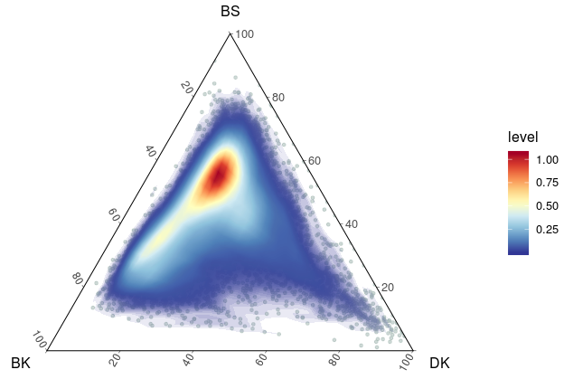

~~~R
stageII_III <- subset(summer_all,new_stage!="I")
p1 <- ggtern(stageII_III , aes(x = BK, y = BS, z = DK))+
# theme_rgbg()+
   geom_point(alpha = 0.6, color = "#aebfbb", size = 1) + 
    stat_density_tern(
      geom = 'polygon', 
      aes(fill = ..level.., alpha = ..level..),bins = 500) +
    guides(alpha = FALSE)+theme_classic()+
    scale_fill_gradientn(colours=alpha(aa,1))+  tern_limits(T = 1, L = 1, R = 1)
ggsave("/mnt/data/user_data/xiangyu/workshop/Heso/v2_re_analysis/CCI_meta_all/NC_scESCC_stageII_III_CCI.svg", plot=p1,width = 15, height = 5,dpi=1080)
~~~

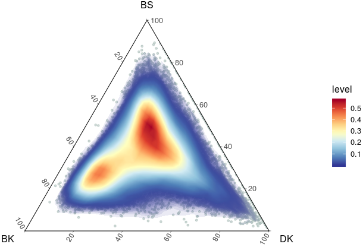

# Codes of confused cell identity (CCI) in micro-array data

~~~R
All_data_list_calculate_Confused <- mcreadRDS("/mnt/data/user_data/xiangyu/workshop/scRNA/eso_scRNA/Heso_all_sample_merge/OTS_data/All_data_merge.rds")
summer_all_all <- future_lapply(All_data_list_calculate_Confused,function(x) {
  summer_all <- Seurat::FetchData(object = x, vars = c("Differentiated_keratinocyte","Basel_keratinocyte","Basel_Stem_Cells","sample","group","Confusion_score","Confusion_score1"),slot="counts")
  return(summer_all)
  })
mcsaveRDS(summer_all_all,"/mnt/data/user_data/xiangyu/workshop/scRNA/eso_scRNA/Heso_all_sample_merge/OTS_data/All_data_merge_only_meta.rds")
~~~

## CCI in GSE20347

~~~R
summer_all_all <- mcreadRDS("/mnt/data/user_data/xiangyu/workshop/Heso/v2_re_analysis/CCI_meta_all/All_data_merge_only_meta.rds")
summer_all <- summer_all_all[[1]]
colnames(summer_all) <- c("DK","BK","BS","sample","group","Confusion_score","Confusion_score1")
summer_all$group <- factor(summer_all$group,levels=c("Normal","ESCC"))
library(ggtern)
library(BuenColors)
aa <- jdb_palette("brewer_celsius")
p1 <- ggtern(subset(summer_all,group=="Normal") , aes(x = BK, y = BS, z = DK))+
# theme_rgbg()+
 geom_point(alpha = 0.6, color = "#aebfbb", size = 1) + 
    stat_density_tern(
      geom = 'polygon', 
      aes(fill = ..level.., alpha = ..level..),bins = 500) +theme_classic()+
    guides(alpha = FALSE)+
    scale_fill_gradientn(colours=alpha(aa,1))+  tern_limits(T = 0.45, L = 0.45, R = 0.45)
ggsave("/mnt/data/user_data/xiangyu/workshop/Heso/v2_re_analysis/CCI_meta_all/GSE20347_Normal_confused_density_scESCC.svg", plot=p1,width = 15, height = 5,dpi=1080)
p1 <- ggtern(subset(summer_all,group=="ESCC") , aes(x = BK, y = BS, z = DK))+
# theme_rgbg()+
 geom_point(alpha = 0.6, color = "#aebfbb", size = 1) + 
    stat_density_tern(
      geom = 'polygon', 
      aes(fill = ..level.., alpha = ..level..),bins = 500) +theme_classic()+
    guides(alpha = FALSE)+
    scale_fill_gradientn(colours=alpha(aa,1))+  tern_limits(T = 0.49, L = 0.49, R = 0.49)
ggsave("/mnt/data/user_data/xiangyu/workshop/Heso/v2_re_analysis/CCI_meta_all/GSE20347_ESCC_confused_density_scESCC.svg", plot=p1,width = 15, height = 5,dpi=1080)
~~~

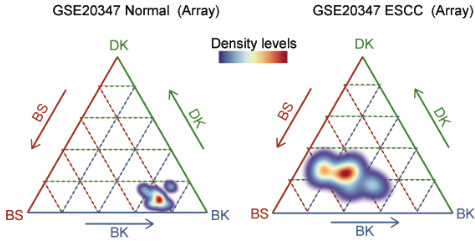

## CCI in GSE45168

~~~R
summer_all <- summer_all_all[[3]]
colnames(summer_all) <- c("DK","BK","BS","sample","group","Confusion_score","Confusion_score1")
summer_all$group <- factor(summer_all$group,levels=c("Normal","ESCC"))
p1 <- ggtern(subset(summer_all,group=="Normal") , aes(x = BK, y = BS, z = DK))+
# theme_rgbg()+
 geom_point(alpha = 0.6, color = "#aebfbb", size = 1) + 
    stat_density_tern(
      geom = 'polygon', 
      aes(fill = ..level.., alpha = ..level..),bins = 500) +theme_classic()+
    guides(alpha = FALSE)+
    scale_fill_gradientn(colours=alpha(aa,1))+  tern_limits(T = 0.45, L = 0.45, R = 0.45)
ggsave("/mnt/data/user_data/xiangyu/workshop/Heso/v2_re_analysis/CCI_meta_all/GSE23400_1_Normal_confused_density_scESCC.svg", plot=p1,width = 15, height = 5,dpi=1080)
p1 <- ggtern(subset(summer_all,group=="ESCC") , aes(x = BK, y = BS, z = DK))+
# theme_rgbg()+
 geom_point(alpha = 0.6, color = "#aebfbb", size = 1) + 
    stat_density_tern(
      geom = 'polygon', 
      aes(fill = ..level.., alpha = ..level..),bins = 500) +theme_classic()+
    guides(alpha = FALSE)+
    scale_fill_gradientn(colours=alpha(aa,1))+  tern_limits(T = 0.45, L = 0.45, R = 0.45)
ggsave("/mnt/data/user_data/xiangyu/workshop/Heso/v2_re_analysis/CCI_meta_all/GSE23400_1_ESCC_confused_density_scESCC.svg", plot=p1,width = 15, height = 5,dpi=1080)
~~~

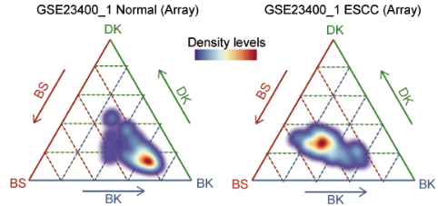

## CCI in GSE23400_1

~~~R
summer_all <- summer_all_all[[4]]
colnames(summer_all) <- c("DK","BK","BS","sample","group","Confusion_score","Confusion_score1")
summer_all$group <- factor(summer_all$group,levels=c("Normal","ESCC"))
p1 <- ggtern(subset(summer_all,group=="Normal") , aes(x = BK, y = BS, z = DK))+
# theme_rgbg()+
 geom_point(alpha = 0.6, color = "#aebfbb", size = 1) + 
    stat_density_tern(
      geom = 'polygon', 
      aes(fill = ..level.., alpha = ..level..),bins = 500) +theme_classic()+
    guides(alpha = FALSE)+
    scale_fill_gradientn(colours=alpha(aa,1))+  tern_limits(T = 0.48, L = 0.48, R = 0.48)
ggsave("/mnt/data/user_data/xiangyu/workshop/Heso/v2_re_analysis/CCI_meta_all/GSE23400_2_Normal_confused_density_scESCC.svg", plot=p1,width = 15, height = 5,dpi=1080)
p1 <- ggtern(subset(summer_all,group=="ESCC") , aes(x = BK, y = BS, z = DK))+
# theme_rgbg()+
 geom_point(alpha = 0.6, color = "#aebfbb", size = 1) + 
    stat_density_tern(
      geom = 'polygon', 
      aes(fill = ..level.., alpha = ..level..),bins = 500) +theme_classic()+
    guides(alpha = FALSE)+
    scale_fill_gradientn(colours=alpha(aa,1))+  tern_limits(T = 0.45, L = 0.45, R = 0.45)
ggsave("/mnt/data/user_data/xiangyu/workshop/Heso/v2_re_analysis/CCI_meta_all/GSE23400_2_ESCC_confused_density_scESCC.svg", plot=p1,width = 15, height = 5,dpi=1080)
~~~

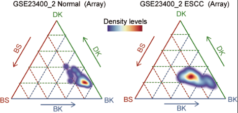

## CCI in GSE23400_2

~~~R
summer_all <- summer_all_all[[5]]
colnames(summer_all) <- c("DK","BK","BS","sample","group","Confusion_score","Confusion_score1")
summer_all$group <- factor(summer_all$group,levels=c("Normal","ESCC"))
p1 <- ggtern(subset(summer_all,group=="Normal") , aes(x = BK, y = BS, z = DK))+
# theme_rgbg()+
 geom_point(alpha = 0.6, color = "#aebfbb", size = 1) + 
    stat_density_tern(
      geom = 'polygon', 
      aes(fill = ..level.., alpha = ..level..),bins = 500) +theme_classic()+
    guides(alpha = FALSE)+
    scale_fill_gradientn(colours=alpha(aa,1))+  tern_limits(T = 0.45, L = 0.45, R = 0.45)
ggsave("/mnt/data/user_data/xiangyu/workshop/Heso/v2_re_analysis/CCI_meta_all/GSE70409_Normal_confused_density_scESCC.svg", plot=p1,width = 15, height = 5,dpi=1080)
p1 <- ggtern(subset(summer_all,group=="ESCC") , aes(x = BK, y = BS, z = DK))+
# theme_rgbg()+
 geom_point(alpha = 0.6, color = "#aebfbb", size = 1) + 
    stat_density_tern(
      geom = 'polygon', 
      aes(fill = ..level.., alpha = ..level..),bins = 500) +theme_classic()+
    guides(alpha = FALSE)+
    scale_fill_gradientn(colours=alpha(aa,1))+  tern_limits(T = 0.45, L = 0.45, R = 0.45)
ggsave("/mnt/data/user_data/xiangyu/workshop/Heso/v2_re_analysis/CCI_meta_all/GSE70409_ESCC_confused_density_scESCC.svg", plot=p1,width = 15, height = 5,dpi=1080)
~~~

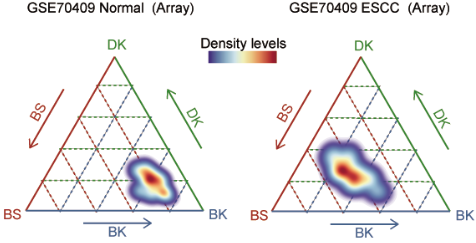

## CCI in GSE70409

~~~R
summer_all <- summer_all_all[[6]]
colnames(summer_all) <- c("DK","BK","BS","sample","group","Confusion_score","Confusion_score1")
summer_all$group <- factor(summer_all$group,levels=c("Normal","ESCC"))
p1 <- ggtern(subset(summer_all,group=="Normal") , aes(x = BK, y = BS, z = DK))+
# theme_rgbg()+
 geom_point(alpha = 0.6, color = "#aebfbb", size = 1) + 
    stat_density_tern(
      geom = 'polygon', 
      aes(fill = ..level.., alpha = ..level..),bins = 500) +theme_classic()+
    guides(alpha = FALSE)+
    scale_fill_gradientn(colours=alpha(aa,1))+  tern_limits(T = 0.45, L = 0.45, R = 0.45)
ggsave("/mnt/data/user_data/xiangyu/workshop/Heso/v2_re_analysis/CCI_meta_all/GSE53624_Normal_confused_density_scESCC.svg", plot=p1,width = 15, height = 5,dpi=1080)
p1 <- ggtern(subset(summer_all,group=="ESCC") , aes(x = BK, y = BS, z = DK))+
# theme_rgbg()+
 geom_point(alpha = 0.6, color = "#aebfbb", size = 1) + 
    stat_density_tern(
      geom = 'polygon', 
      aes(fill = ..level.., alpha = ..level..),bins = 500) +theme_classic()+
    guides(alpha = FALSE)+
    scale_fill_gradientn(colours=alpha(aa,1))+  tern_limits(T = 0.45, L = 0.45, R = 0.45)
ggsave("/mnt/data/user_data/xiangyu/workshop/Heso/v2_re_analysis/CCI_meta_all/GSE53624_ESCC_confused_density_scESCC.svg", plot=p1,width = 15, height = 5,dpi=1080)
~~~

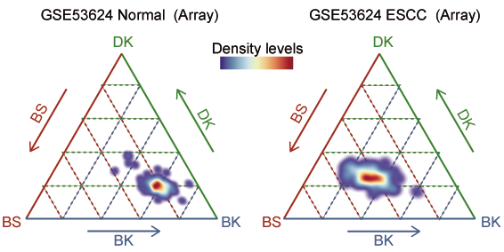

## CCI in GSE53624

~~~R

summer_all <- summer_all_all[[7]]
colnames(summer_all) <- c("DK","BK","BS","sample","group","Confusion_score","Confusion_score1")
summer_all$group <- factor(summer_all$group,levels=c("Normal","ESCC"))
p1 <- ggtern(subset(summer_all,group=="Normal") , aes(x = BK, y = BS, z = DK))+
# theme_rgbg()+
 geom_point(alpha = 0.6, color = "#aebfbb", size = 1) + 
    stat_density_tern(
      geom = 'polygon', 
      aes(fill = ..level.., alpha = ..level..),bins = 500) +theme_classic()+
    guides(alpha = FALSE)+
    scale_fill_gradientn(colours=alpha(aa,1))+  tern_limits(T = 0.52, L = 0.52, R = 0.52)
ggsave("/mnt/data/user_data/xiangyu/workshop/Heso/v2_re_analysis/CCI_meta_all/NC_Omics_Normal_confused_density_scESCC.svg", plot=p1,width = 15, height = 5,dpi=1080)
p1 <- ggtern(subset(summer_all,group=="ESCC") , aes(x = BK, y = BS, z = DK))+
# theme_rgbg()+
 geom_point(alpha = 0.6, color = "#aebfbb", size = 1) + 
    stat_density_tern(
      geom = 'polygon', 
      aes(fill = ..level.., alpha = ..level..),bins = 500) +theme_classic()+
    guides(alpha = FALSE)+
    scale_fill_gradientn(colours=alpha(aa,1))+  tern_limits(T = 0.65, L = 0.65, R = 0.65)
ggsave("/mnt/data/user_data/xiangyu/workshop/Heso/v2_re_analysis/CCI_meta_all/NC_Omics_ESCC_confused_density_scESCC.svg", plot=p1,width = 15, height = 5,dpi=1080)
~~~

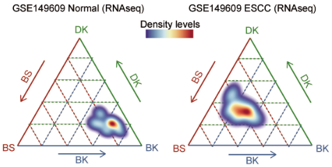

# Codes of confused cell identity (CCI) in bulk RNAseq (TCGA-ESCC)

~~~R
ESCC_FPKM <- fread("/mnt/data/user_data/xiangyu/workshop/DATABASE/TCGA_ESCA/ESCA_RNA_transfer_symbol.csv")
ESCC_FPKM <- as.data.frame(ESCC_FPKM)
rownames(ESCC_FPKM) <- ESCC_FPKM$V1
ESCC_FPKM <- ESCC_FPKM[,-1]
Escc_clinical <- fread("/mnt/data/user_data/xiangyu/workshop/DATABASE/TCGA_ESCA/ESCA_all_clinical.csv")
Escc_clinical <- as.data.frame(Escc_clinical)
rownames(Escc_clinical) <- Escc_clinical$V1
Escc_clinical <- Escc_clinical[,c("gender","V1","submitter_id","primary_diagnosis","tumor_stage","age_at_diagnosis","days_to_death","vital_status","days_to_last_follow_up")]
Escc_clinical$submitter_id <- gsub("-",".",Escc_clinical$submitter_id)
rownames(Escc_clinical) <- Escc_clinical$submitter_id
Escc_clinical <- subset(Escc_clinical,primary_diagnosis=="Basaloid squamous cell carcinoma" | primary_diagnosis == "Squamous cell carcinoma, keratinizing, NOS" |
  primary_diagnosis == "Squamous cell carcinoma, NOS")
both_id <- intersect(Escc_clinical$submitter_id,colnames(ESCC_FPKM))
Escc_clinical <- Escc_clinical[both_id,]
ESCC_FPKM <- ESCC_FPKM[,both_id]
only_Normal_epi.markers <- mcreadRDS("/mnt/data/user_data/xiangyu/workshop/scRNA/eso_scRNA/Heso_cancer6/normal/Heso6_normal_only_epi_hetero.marker.rds",mc.cores=20)
only_Normal_epi.markers$cluster <- as.character(only_Normal_epi.markers$cluster)
only_Normal_epi.markers_DK <- subset(only_Normal_epi.markers,cluster=="Differentiated_keratinocyte" &pct.2 < 0.4)
only_Normal_epi.markers_BK <- subset(only_Normal_epi.markers,cluster=="Basel_keratinocyte" &pct.2 < 0.4)
only_Normal_epi.markers_BS <- subset(only_Normal_epi.markers,cluster=="Basel_Stem_Cells" &pct.2 < 0.4)

TCGA_ESCC <- data.frame(DK=apply(ESCC_FPKM[intersect(rownames(ESCC_FPKM),only_Normal_epi.markers_DK$gene),],2,mean),
  BK=apply(ESCC_FPKM[intersect(rownames(ESCC_FPKM),only_Normal_epi.markers_BK$gene),],2,mean),
  BS=apply(ESCC_FPKM[intersect(rownames(ESCC_FPKM),only_Normal_epi.markers_BS$gene),],2,mean),
  TPM4=as.character(ESCC_FPKM["TPM4",]))
TCGA_ESCC$DK <- as.numeric(as.character(TCGA_ESCC$DK))
TCGA_ESCC$BK <- as.numeric(as.character(TCGA_ESCC$BK))
TCGA_ESCC$BS <- as.numeric(as.character(TCGA_ESCC$BS))
TCGA_ESCC$TPM4 <- as.numeric(as.character(TCGA_ESCC$TPM4))

a <- TCGA_ESCC$BK
b <- TCGA_ESCC$DK
c <- TCGA_ESCC$BS
TCGA_ESCC$cos1 <- (a^2 +(((a^2+b^2+c^2)^0.5)^2)-(((b^2+c^2)^0.5)^2))/(2*a*((a^2+b^2+c^2)^0.5))
TCGA_ESCC$cos2 <- (b^2 +(((a^2+b^2+c^2)^0.5)^2)-(((a^2+c^2)^0.5)^2))/(2*b*((a^2+b^2+c^2)^0.5))
TCGA_ESCC$cos3 <- (c^2 +(((a^2+b^2+c^2)^0.5)^2)-(((a^2+b^2)^0.5)^2))/(2*c*((a^2+b^2+c^2)^0.5))
TCGA_ESCC$cos1[which((2*a*((a^2+b^2+c^2)^0.5)==0))] <- 2
TCGA_ESCC$cos2[which((2*b*((a^2+b^2+c^2)^0.5)==0))] <- 2
TCGA_ESCC$cos3[which((2*c*((a^2+b^2+c^2)^0.5)==0))] <- 2
TCGA_ESCC$Confusion_score <- future_apply(TCGA_ESCC[,c("cos1","cos2","cos3")],1,sd)
TCGA_ESCC$Confusion_score <- 1/TCGA_ESCC$Confusion_score
TCGA_ESCC$Confusion_score1 <- log(TCGA_ESCC$Confusion_score+1,2)

library("survival")
library("survminer")
Escc_clinical_sel <- Escc_clinical[rownames(TCGA_ESCC),]
Escc_clinical_ <- cbind(Escc_clinical_sel,TCGA_ESCC)
meta <- Escc_clinical_
meta[is.na(meta)] <- "HHH"
tmp <- subset(meta,days_to_last_follow_up=="HHH")
tmp$days_to_last_follow_up <- tmp$days_to_death
no_na <- meta[setdiff(rownames(meta),rownames(tmp)),]
all_merge <- rbind(tmp,no_na)
all_merge <- subset(all_merge,days_to_last_follow_up != "HHH")
all_merge$vital_status <- as.character(all_merge$vital_status)
all_merge$status <- ifelse(all_merge$vital_status=="Alive",0,1)
all_merge$days_to_last_follow_up <- as.numeric(all_merge$days_to_last_follow_up)

TCGA_ESCC_stage <- subset(all_merge,tumor_stage != "not reported")
TCGA_ESCC_stage$Tumor_status <- gsub("stage ia","stage i",TCGA_ESCC_stage$tumor_stage)
TCGA_ESCC_stage$Tumor_status <- gsub("stage ib","stage i",TCGA_ESCC_stage$Tumor_status)
TCGA_ESCC_stage$Tumor_status <- gsub("stage iia","stage ii/iii",TCGA_ESCC_stage$Tumor_status)
TCGA_ESCC_stage$Tumor_status <- gsub("stage iib","stage ii/iii",TCGA_ESCC_stage$Tumor_status)
TCGA_ESCC_stage$Tumor_status <- gsub("stage iiia","stage ii/iii",TCGA_ESCC_stage$Tumor_status)
TCGA_ESCC_stage$Tumor_status <- gsub("stage iiib","stage ii/iii",TCGA_ESCC_stage$Tumor_status)
TCGA_ESCC_stage$Tumor_status <- gsub("stage iva","stage ii/iii",TCGA_ESCC_stage$Tumor_status)
TCGA_ESCC_stage$Tumor_status <- gsub("stage iiic","stage ii/iii",TCGA_ESCC_stage$Tumor_status)
TCGA_ESCC_stage$Tumor_status <- gsub("stage iv","stage ii/iii",TCGA_ESCC_stage$Tumor_status)
TCGA_ESCC_stage$Tumor_status <- gsub("stage iii","stage ii/iii",TCGA_ESCC_stage$Tumor_status)
mcsaveRDS(TCGA_ESCC_stage,"/mnt/data/user_data/xiangyu/workshop/scRNA/eso_scRNA/Heso_all_sample_merge/OTS_data/TCGA_ESCC_summary.rds")
~~~

~~~R
TCGA_ESCC_stage <- mcreadRDS("/mnt/data/user_data/xiangyu/workshop/Heso/v2_re_analysis/CCI_meta_all/TCGA_ESCC_summary.rds")
library(ggtern)
library(BuenColors)
TCGA_ESCC_stage1 <- subset(TCGA_ESCC_stage,Tumor_status=="stage i")
aa <- jdb_palette("brewer_celsius")
p1 <- ggtern(TCGA_ESCC_stage1 , aes(x = BK, y = BS, z = DK))+
# theme_rgbg()+
 geom_point(alpha = 0.6, color = "#aebfbb", size = 1) + 
     stat_density_tern(
      geom = 'polygon', 
      aes(fill = ..level.., alpha = ..level..),bins = 100) +
    guides(alpha = FALSE)+theme_classic()+
    scale_fill_gradientn(colours=alpha(aa,1))+  tern_limits(T = 1, L = 1, R = 1)
ggsave("/mnt/data/user_data/xiangyu/workshop/Heso/v2_re_analysis/CCI_meta_all/TCGA_ESCC_CCI_stage_i.svg", plot=p1,width = 15, height = 5,dpi=1080)

TCGA_ESCC_stage1 <- subset(TCGA_ESCC_stage,Tumor_status=="stage ii/iii")
p1 <- ggtern(TCGA_ESCC_stage1 , aes(x = BK, y = BS, z = DK))+
# theme_rgbg()+
    stat_density_tern(
      geom = 'polygon', 
      aes(fill = ..level.., alpha = ..level..),bins = 100) +
    guides(alpha = FALSE)+theme_classic()+
    scale_fill_gradientn(colours=alpha(aa,1))+  tern_limits(T = 1, L = 1, R = 1)
ggsave("/mnt/data/user_data/xiangyu/workshop/Heso/v2_re_analysis/CCI_meta_all/TCGA_ESCC_CCI_stage_ii.svg", plot=p1,width = 15, height = 5,dpi=1080)
~~~

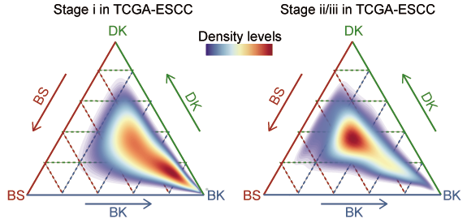

