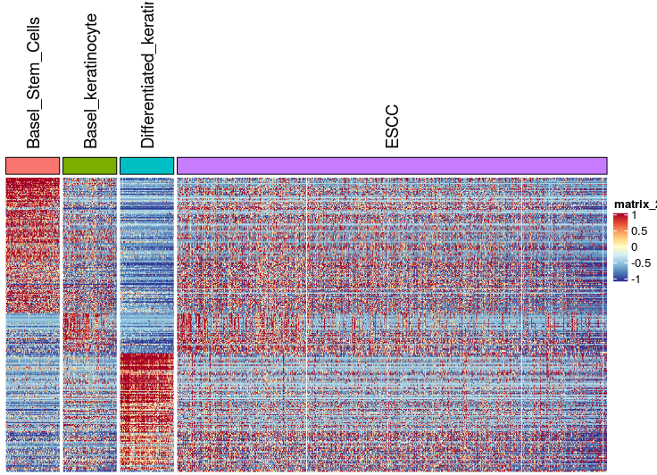
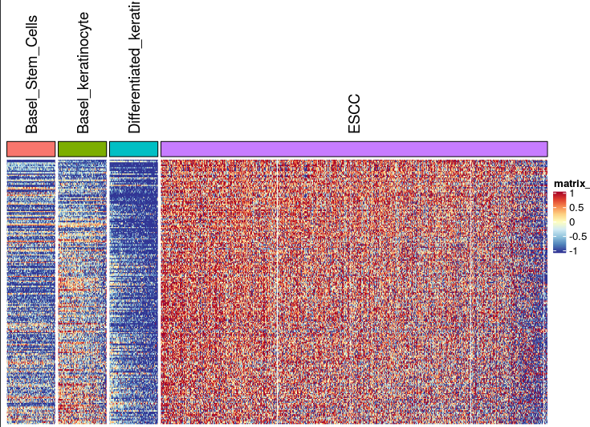
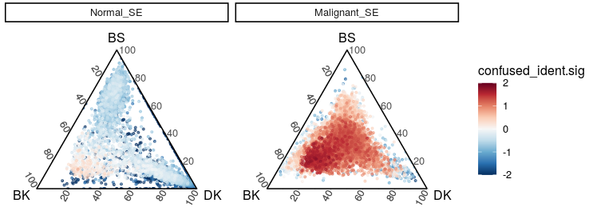
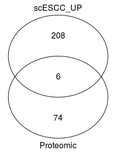
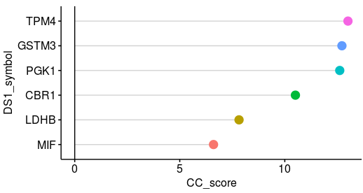
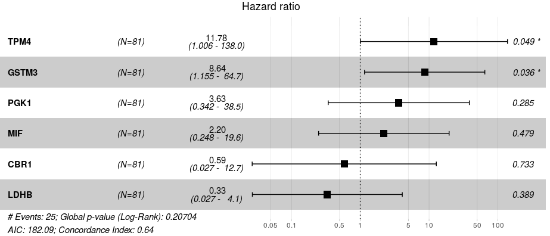

#  Codes of CCI signatures

This part included the generation of CCI signatures mentioned in paper. And here, we showed the ESCC cells could expressed all normal signatures, but exclusively expressed the CCI signatures on single cell levels. 

## 1. CCI signatures identified

* To save the meomry and time on scRNA data processing, we downsampled the scRNA data firstly. 

~~~R
merge_Malignant_And_Normal_SE <- mcreadRDS("/mnt/data/user_data/xiangyu/workshop/scRNA/eso_scRNA/Heso_cancer6/normal/merge_Malignant_And_Normal_SE.rds",mc.cores=20)
only_Normal_epi.markers <- mcreadRDS("/mnt/data/user_data/xiangyu/workshop/scRNA/eso_scRNA/Heso_cancer6/normal/Heso6_normal_only_epi_hetero.marker.rds",mc.cores=20)
only_Normal_epi.markers$cluster <- as.character(only_Normal_epi.markers$cluster)
All_path <- unique(only_Normal_epi.markers$cluster)
for (i in c(1:length(All_path))) {
  sel_path <- subset(only_Normal_epi.markers,cluster==All_path[i] &pct.2 < 0.4)
  Lineage_marker <- intersect(rownames(GetAssayData(object = merge_Malignant_And_Normal_SE, slot = "data",assay="RNA")),sel_path$gene)
  speci_raw <- FetchData(object = merge_Malignant_And_Normal_SE, vars = Lineage_marker,slot="data")
  merge_Malignant_And_Normal_SE[[All_path[i]]] <- (rowSums(speci_raw))/length(Lineage_marker)
  }
merge_Malignant_And_Normal_SE@meta.data[!(merge_Malignant_And_Normal_SE$predicted.id %in% c("Differentiated_keratinocyte","Basel_keratinocyte","Basel_Stem_Cells")),]$predicted.id <- 
merge_Malignant_And_Normal_SE@meta.data[!(merge_Malignant_And_Normal_SE$predicted.id %in% c("Differentiated_keratinocyte","Basel_keratinocyte","Basel_Stem_Cells")),]$group
merge_Malignant_And_Normal_SE$predicted.id <- factor(merge_Malignant_And_Normal_SE$predicted.id,
  levels=c("Basel_Stem_Cells","Basel_keratinocyte","Differentiated_keratinocyte",
    "Heso_1","Heso_2","Heso_3","Heso_4","Heso_5","Heso_6_para","Heso_6_cancer"))
Idents(merge_Malignant_And_Normal_SE) <- merge_Malignant_And_Normal_SE$group
merge_Malignant_And_Normal_SE1 <- subset(merge_Malignant_And_Normal_SE,idents=c("Heso_1","Heso_2","Heso_3","Heso_5","Heso_6_cancer","Heso6_normal","Heso_6_para"))
Idents(merge_Malignant_And_Normal_SE1) <- merge_Malignant_And_Normal_SE1$predicted.id

only_Normal_epi.markers <- mcreadRDS("/mnt/data/user_data/xiangyu/workshop/scRNA/eso_scRNA/Heso_cancer6/normal/Heso6_normal_only_epi_hetero.marker.rds",mc.cores=20)
only_Normal_epi.markers$cluster <- as.character(only_Normal_epi.markers$cluster)
only_Normal_epi.markers_DK <- subset(only_Normal_epi.markers,cluster=="Differentiated_keratinocyte" &pct.2 < 0.4)
only_Normal_epi.markers_BK <- subset(only_Normal_epi.markers,cluster=="Basel_keratinocyte" &pct.2 < 0.4)
only_Normal_epi.markers_BS <- subset(only_Normal_epi.markers,cluster=="Basel_Stem_Cells" &pct.2 < 0.4)
only_Normal_sig <- c(only_Normal_epi.markers_BS$gene,only_Normal_epi.markers_BK$gene,only_Normal_epi.markers_DK$gene)

merge_Malignant_And_Normal_SE1$predicted.id2 <- as.character(merge_Malignant_And_Normal_SE1$predicted.id)
merge_Malignant_And_Normal_SE1$predicted.id2[which(merge_Malignant_And_Normal_SE1$predicted.id2!="Basel_Stem_Cells" & 
  merge_Malignant_And_Normal_SE1$predicted.id2!="Basel_keratinocyte" & 
    merge_Malignant_And_Normal_SE1$predicted.id2!="Differentiated_keratinocyte")] <- "ESCC"
Idents(merge_Malignant_And_Normal_SE1) <- merge_Malignant_And_Normal_SE1$predicted.id2
cell_sub <- c("Basel_Stem_Cells","Basel_keratinocyte","Differentiated_keratinocyte","ESCC")
All_pseudo_bulk_ <- future_lapply(1:length(cell_sub),function(x) {
  sel_sub <- cell_sub[x]
  Idents(merge_Malignant_And_Normal_SE1) <- merge_Malignant_And_Normal_SE1$predicted.id2
  merge_Malignant_And_Normal_SE1_tmp <- subset(merge_Malignant_And_Normal_SE1,idents=sel_sub)
  if (sel_sub!="ESCC") {
    peudo_bulk_T1 <- pseudo_bulk_seurat_mean(seurat_obj=merge_Malignant_And_Normal_SE1_tmp,num_split=500,seed.use=1,slot="data",prefix=sel_sub)
    metadata <- data.frame(group=c(rep(sel_sub,500)),
      row.names=colnames(peudo_bulk_T1))
    all_gsva_seurat_1 <- CreateSeuratObject(counts = peudo_bulk_T1,assay = 'RNA',project = 'RNA',min.cells = 0,meta.data = metadata)
  } else {
    peudo_bulk_T1 <- pseudo_bulk_seurat_mean(seurat_obj=merge_Malignant_And_Normal_SE1_tmp,num_split=4000,seed.use=1,slot="data",prefix=sel_sub)
    metadata <- data.frame(group=c(rep(sel_sub,4000)),
      row.names=colnames(peudo_bulk_T1))
    all_gsva_seurat_1 <- CreateSeuratObject(counts = peudo_bulk_T1,assay = 'RNA',project = 'RNA',min.cells = 0,meta.data = metadata)
  }
  message(x," is done")
  return(all_gsva_seurat_1)
  })
All_pseudo_bulk <- merge(All_pseudo_bulk_[[1]],All_pseudo_bulk_[c(2:length(All_pseudo_bulk_))])
aa <- jdb_palette("brewer_celsius",type="continuous")[length(jdb_palette("brewer_celsius",type="continuous")):1]
All_pseudo_bulk$group <- factor(All_pseudo_bulk$group,levels=c("Basel_Stem_Cells","Basel_keratinocyte","Differentiated_keratinocyte","ESCC"))
couts <- GetAssayData(All_pseudo_bulk,slot="data")
meta_info <- as.data.frame(All_pseudo_bulk@meta.data)
meta_info <- meta_info[order(meta_info$nCount_RNA,decreasing=TRUE),]
couts <- couts[,rownames(meta_info)]
all_gsva_seurat_1 <- CreateSeuratObject(counts = couts,assay = 'RNA',project = 'RNA',min.cells = 0,meta.data = meta_info)
mcsaveRDS(all_gsva_seurat_1,"/mnt/data/user_data/xiangyu/workshop/scRNA/eso_scRNA/Heso_all_sample_merge/v2_re_analysis/All_data_merge_DS.rds",mc.cores=20)
~~~

* Here, we obvisouly found each SE cell from ESCC patients would expresse the normal SE signatrues. 

~~~R
pdf("./v2_re_analysis/confused_marker_scESCC.pdf")
XY_heatmap(seurat_obj=all_gsva_seurat_1,group="group",genes=only_Normal_sig,all_num=FALSE,new_names=NULL,labels_rot=90,
  assay_sel="RNA",color=aa,min_and_max_cut=1,show_row_names=FALSE,mark_gene=NULL,label_size=0,scale=TRUE)
dev.off()
~~~

* Then, we began to identify the CCI signaturs in ESCC SE cells. 

~~~R
Idents(merge_Malignant_And_Normal_SE1) <- merge_Malignant_And_Normal_SE1$predicted.id
Malignant_VS_Normal <- FindMarkers(object = merge_Malignant_And_Normal_SE1, ident.1=c("Heso_1","Heso_2","Heso_3","Heso_5","Heso_6_para","Heso_6_cancer"),ident.2=c("Basel_Stem_Cells","Basel_keratinocyte","Differentiated_keratinocyte"),
  only.pos = FALSE, min.pct = 0.2,logfc.threshold = 0.2)
mcsaveRDS(Malignant_VS_Normal,"./Malignant_VS_Normal_markers.rds",mc.cores=20)
~~~

~~~R

Malignant_VS_Normal1 <- subset(Malignant_VS_Normal,avg_logFC>0.2 & p_val_adj < 0.05)
Malignant_VS_Normal1$gene <- rownames(Malignant_VS_Normal1)
Malignant_VS_Normal1[which(Malignant_VS_Normal1$gene=="TPM4"),]
only_Normal_epi.markers <- mcreadRDS("/mnt/data/user_data/xiangyu/workshop/scRNA/eso_scRNA/Heso_cancer6/normal/Heso6_normal_only_epi_hetero.marker.rds",mc.cores=20)
only_Normal_epi.markers$cluster <- as.character(only_Normal_epi.markers$cluster)
only_Normal_epi.markers_DK <- subset(only_Normal_epi.markers,cluster=="Differentiated_keratinocyte" &pct.2 < 0.4)
only_Normal_epi.markers_BK <- subset(only_Normal_epi.markers,cluster=="Basel_keratinocyte" &pct.2 < 0.4)
only_Normal_epi.markers_BS <- subset(only_Normal_epi.markers,cluster=="Basel_Stem_Cells" &pct.2 < 0.4)
malig_uniq2 <- c(only_Normal_epi.markers_DK$gene,only_Normal_epi.markers_BK$gene,only_Normal_epi.markers_BS$gene)
malig_uniq2 <- setdiff(Malignant_VS_Normal1$gene,malig_uniq2)
malig_uniq2[which(malig_uniq2=="TPM4")]

all_merge.markers <- read.csv(file="/mnt/data/user_data/xiangyu/workshop/scRNA/eso_scRNA/Heso_all_sample_merge/V2_Heso_cancer_all_merge_done_anno.markers.csv")
all_merge.markers_exce_SE <- subset(all_merge.markers,cluster!="Squamous Epithelium")
all_merge.markers_exce_SE <- subset(all_merge.markers_exce_SE,pct.2 <0.5)
malig_uniq2 <- setdiff(malig_uniq2,all_merge.markers_exce_SE$gene)
malig_uniq2[which(malig_uniq2=="TPM4")]

Malignant_VS_Normal1$gene <- rownames(Malignant_VS_Normal1)
Malignant_VS_Normal1_specific <- XY_subset(Malignant_VS_Normal1,"gene",malig_uniq2)

Sel_data <- GetAssayData(merge_Malignant_And_Normal_SE1,slot="data")[malig_uniq2,]
Sel_data <- apply(Sel_data,1,mean)
Sel_data <- as.data.frame(Sel_data)
Malignant_VS_Normal1_specific$baseMean <- Sel_data[Malignant_VS_Normal1_specific$gene,]
Malignant_VS_Normal1_specific$CC_SCORE <- Malignant_VS_Normal1_specific$avg_logFC*Malignant_VS_Normal1_specific$baseMean*Malignant_VS_Normal1_specific$pct.1
Malignant_VS_Normal1_specific <- Malignant_VS_Normal1_specific[order(Malignant_VS_Normal1_specific$CC_SCORE,decreasing=TRUE),]
which(Malignant_VS_Normal1_specific$gene=="TPM4")
mcsaveRDS(Malignant_VS_Normal1_specific,"./confused_identity_sig_with_FC.rds",mc.cores=20)
write.csv(Malignant_VS_Normal1_specific,"./confused_identity_sig_with_FC.csv")
~~~

* Here, we found the SE cells from ESCC exclusively expressed the congused siganatures.

~~~R
all_gsva_seurat_1 <- mcreadRDS("/mnt/data/user_data/xiangyu/workshop/scRNA/eso_scRNA/Heso_all_sample_merge/v2_re_analysis/All_data_merge_DS.rds",mc.cores=20)
aa <- jdb_palette("brewer_celsius",type="continuous")[length(jdb_palette("brewer_celsius",type="continuous")):1]
Malignant_VS_Normal1_specific <- mcreadRDS("/mnt/data/user_data/xiangyu/workshop/scRNA/eso_scRNA/Heso_all_sample_merge/v2_re_analysis/confused_identity_sig_with_FC.rds",mc.cores=20)
Malignant_VS_Normal1_specific <- subset(Malignant_VS_Normal1_specific,baseMean > 0.8 & pct.1 > 0.8)
malig_uniq2 <- Malignant_VS_Normal1_specific$gene
pdf("./confused_states_sig_scESCC.pdf")
XY_heatmap(seurat_obj=all_gsva_seurat_1,group="group",genes=malig_uniq2,all_num=FALSE,new_names=NULL,labels_rot=90,
  assay_sel="RNA",color=aa,min_and_max_cut=1,show_row_names=FALSE,mark_gene=NULL,label_size=0,scale=TRUE)
dev.off()
~~~

## 2. CCI signatures projection on the ternary map

* Then, we projected the CCI sigantures on the ternary map.

~~~R
Malignant_VS_Normal1_specific <- mcreadRDS("/mnt/data/user_data/xiangyu/workshop/scRNA/eso_scRNA/Heso_cancer6/normal/confused_identity_sig_with_FC.rds",mc.cores=20)
Malignant_VS_Normal1_specific <- subset(Malignant_VS_Normal1_specific,baseMean > 0.8 & pct.1 > 0.8)
malig_uniq2 <- Malignant_VS_Normal1_specific$gene
merge_Malignant_And_Normal_SE <- mcreadRDS("/mnt/data/user_data/xiangyu/workshop/scRNA/eso_scRNA/Heso_cancer6/normal/merge_Malignant_And_Normal_SE.rds",mc.cores=20)

library(BisqueRNA)
ALL_GSEA_GMT <- read.gmt("/mnt/data/user_data/xiangyu/programme/gsea/msigdb_v7.1/msigdb_v7.1_GMTs/all_merge/msigdb.v7.1.symbols.gmt")
ALL_GSEA_GMT$ont <- as.character(ALL_GSEA_GMT$ont)
KEGG_JAK_STAT <- subset(ALL_GSEA_GMT,ont=="KEGG_JAK_STAT_SIGNALING_PATHWAY")
Lineage_marker <- intersect(rownames(GetAssayData(object = merge_Malignant_And_Normal_SE, slot = "data",assay="RNA")),KEGG_JAK_STAT$gene)
speci_raw <- FetchData(object = merge_Malignant_And_Normal_SE, vars = Lineage_marker,slot="data")
merge_Malignant_And_Normal_SE[["KEGG_JAK_STAT"]] <- (rowSums(speci_raw))/length(Lineage_marker)
Lineage_marker <- intersect(rownames(GetAssayData(object = merge_Malignant_And_Normal_SE, slot = "data",assay="RNA")),malig_uniq2)
speci_raw <- FetchData(object = merge_Malignant_And_Normal_SE, vars = Lineage_marker,slot="data")
merge_Malignant_And_Normal_SE[["confused_ident.sig"]] <- (rowSums(speci_raw))/length(Lineage_marker)
summer_all <- FetchData(object = merge_Malignant_And_Normal_SE, vars = c("Differentiated_keratinocyte","Basel_keratinocyte","Basel_Stem_Cells"),slot="data")
colnames(summer_all) <- c("DK","BK","BS")
a <- summer_all$BK
b <- summer_all$DK
c <- summer_all$BS
summer_all$cos1 <- (a^2 +(((a^2+b^2+c^2)^0.5)^2)-(((b^2+c^2)^0.5)^2))/(2*a*((a^2+b^2+c^2)^0.5))
summer_all$cos2 <- (b^2 +(((a^2+b^2+c^2)^0.5)^2)-(((a^2+c^2)^0.5)^2))/(2*b*((a^2+b^2+c^2)^0.5))
summer_all$cos3 <- (c^2 +(((a^2+b^2+c^2)^0.5)^2)-(((a^2+b^2)^0.5)^2))/(2*c*((a^2+b^2+c^2)^0.5))
summer_all$cos1[which((2*a*((a^2+b^2+c^2)^0.5)==0))] <- 2
summer_all$cos2[which((2*b*((a^2+b^2+c^2)^0.5)==0))] <- 2
summer_all$cos3[which((2*c*((a^2+b^2+c^2)^0.5)==0))] <- 2
summer_all$Confusion_score <- future_apply(summer_all[,c("cos1","cos2","cos3")],1,sd)
summer_all$Confusion_score <- 1/summer_all$Confusion_score
merge_Malignant_And_Normal_SE$Confusion_score <- summer_all[rownames(merge_Malignant_And_Normal_SE@meta.data),]$Confusion_score
merge_Malignant_And_Normal_SE$Confusion_score1 <- log(merge_Malignant_And_Normal_SE$Confusion_score+1,2)
summer_all <- FetchData(object = merge_Malignant_And_Normal_SE, vars = c("Differentiated_keratinocyte","Basel_keratinocyte","Basel_Stem_Cells","new_group2",
  "confused_ident.sig","Confusion_score1","TPM4","group","KEGG_JAK_STAT","SOX2"),slot="data")
colnames(summer_all) <- c("DK","BK","BS","new_group2","confused_ident.sig","Confusion_score1","TPM4","group","KEGG_JAK_STAT","SOX2")
library(ggtern)
library(BuenColors)
summer_all <- subset(summer_all,group=="Heso_1" | group=="Heso_2" | group=="Heso_3" | group=="Heso_4" | group=="Heso_5" | group=="Heso_6_cancer" | group=="Heso6_normal" | group=="Heso_6_para")
library(ggtern)
library(BuenColors)
summer_all$new_group2 <- factor(summer_all$new_group2,levels=c("Normal_SE","Malignant_SE"))
summer_all <- summer_all[order(summer_all$confused_ident.sig,decreasing=FALSE),]
summer_all$confused_ident.sig <- as.numeric(as.character(scale(summer_all$confused_ident.sig)))
summer_all$confused_ident.sig[summer_all$confused_ident.sig>2] <- 2
summer_all$confused_ident.sig[summer_all$confused_ident.sig< -2] <- -2
aa <- jdb_palette("brewer_yes")
p1 <- ggtern(summer_all , aes(x = BK, y = BS, z = DK, color = confused_ident.sig))+
# theme_rgbg()+
    geom_point(alpha = 0.6, size = 0.8)+theme_classic()+
    scale_colour_gradientn(colours=alpha(aa,1), limits=c(-2, 2))+  tern_limits(T = 1, L = 1, R = 1) +facet_wrap(~new_group2)
ggsave("./figure_making/confused_states_sig_scESCC_projection.svg", plot=p1,width = 15, height = 5,dpi=1080)
~~~

## 3. The overlayed genes between CCI signatures and up-regulated protein

~~~R
Malignant_VS_Normal1_specific <- mcreadRDS("/mnt/data/user_data/xiangyu/workshop/scRNA/eso_scRNA/Heso_cancer6/normal/confused_identity_sig_with_FC.rds",mc.cores=20)
Malignant_VS_Normal1_specific <- subset(Malignant_VS_Normal1_specific,baseMean > 0.8 & pct.1 > 0.8)
malig_uniq2 <- Malignant_VS_Normal1_specific$gene
intersect(all_data1$DS1_symbol,malig_uniq2)
library(ChIPseeker)
genes = list(Proteomic=all_data1$DS1_symbol,
  scESCC_UP=malig_uniq2
  )
pdf("./figure_making/protomics_and_RNA_ESCC_up_venn.pdf")
vennplot(genes)
dev.off()
~~~

~~~R
inter <- intersect(as.character(all_data1$DS1_symbol),malig_uniq2)
enrich_pvalue(24223, length(setdiff(all_data1$DS1_symbol,inter)),
  length(setdiff(malig_uniq2,inter)),
  length(inter))
~~~

~~~R
p = 7.729139e-05
~~~

~~~R
all_data2 <- XY_subset(all_data1,"DS1_symbol",intersect(all_data1$DS1_symbol,malig_uniq2))
all_data2 <- all_data2[order(all_data2$CC_score,decreasing=FALSE),]
library(ggpubr)
p1 <- ggdotchart(all_data2, x="DS1_symbol", y="CC_score", color = "DS1_symbol",
add = "segments", rotate = TRUE, group = "DS1_symbol", dot.size = 4,
font.label = list(color="white", size=3, vjust=0.1), legend = "none") + geom_hline(yintercept=0)
ggsave("./figure_making/protomics_and_RNA_ESCC_up_summary_dotplot.svg", plot=p1,width = 5, height = 4,dpi=1080)
~~~

## 4. Cox regression of the overlayed genes

~~~R
ESCC_FPKM <- fread("/mnt/data/user_data/xiangyu/workshop/DATABASE/TCGA_ESCA/ESCA_RNA_transfer_symbol.csv")
ESCC_FPKM <- as.data.frame(ESCC_FPKM)
rownames(ESCC_FPKM) <- ESCC_FPKM$V1
ESCC_FPKM <- ESCC_FPKM[,-1]
Escc_clinical <- fread("/mnt/data/user_data/xiangyu/workshop/DATABASE/TCGA_ESCA/ESCA_all_clinical.csv")
Escc_clinical <- as.data.frame(Escc_clinical)
rownames(Escc_clinical) <- Escc_clinical$V1
Escc_clinical <- Escc_clinical[,c("gender","V1","submitter_id","primary_diagnosis","tumor_stage","age_at_diagnosis","days_to_death","vital_status","days_to_last_follow_up")]
Escc_clinical$submitter_id <- gsub("-",".",Escc_clinical$submitter_id)
rownames(Escc_clinical) <- Escc_clinical$submitter_id
Escc_clinical <- subset(Escc_clinical,primary_diagnosis=="Basaloid squamous cell carcinoma" | primary_diagnosis == "Squamous cell carcinoma, keratinizing, NOS" |
  primary_diagnosis == "Squamous cell carcinoma, NOS")
both_id <- intersect(Escc_clinical$submitter_id,colnames(ESCC_FPKM))
Escc_clinical <- Escc_clinical[both_id,]
ESCC_FPKM <- ESCC_FPKM[,both_id]
ESCC_FPKM <- ESCC_FPKM[apply(ESCC_FPKM,1,sd)!=0,]
ESCC_FPKM_Sel <- apply(ESCC_FPKM,1,function(x) {(x-mean(x))/(max(x)-min(x))})
range(ESCC_FPKM_Sel[1,])
ESCC_FPKM_Sel <- as.data.frame(ESCC_FPKM_Sel)

library("survival")
library("survminer")
Escc_clinical_sel <- Escc_clinical[rownames(ESCC_FPKM_Sel),]
Escc_clinical_ <- cbind(Escc_clinical_sel,ESCC_FPKM_Sel)
meta <- Escc_clinical_
meta$days_to_last_follow_up[is.na(meta$days_to_last_follow_up)] <- "HHH"
tmp <- subset(meta,days_to_last_follow_up=="HHH")
tmp$days_to_last_follow_up <- tmp$days_to_death
no_na <- meta[setdiff(rownames(meta),rownames(tmp)),]
all_merge <- rbind(tmp,no_na)
all_merge <- subset(all_merge,days_to_last_follow_up != "HHH")
all_merge$vital_status <- as.character(all_merge$vital_status)
all_merge$status <- ifelse(all_merge$vital_status=="Alive",0,1)
all_merge$days_to_last_follow_up <- as.numeric(all_merge$days_to_last_follow_up)

all_merge1 <- all_merge
colnames(all_merge1) <- gsub("-","_",colnames(all_merge1))

coxph_result <- coxph(formula = Surv(days_to_last_follow_up, status) ~ TPM4+GSTM3+PGK1+MIF+CBR1+LDHB, data = all_merge1)
summary(coxph_result,data=all_merge)
ggforest(coxph_result, data =all_merge, 
         main = "Hazard ratio", 
         fontsize = 1.0, 
         refLabel = "1", noDigits = 2)
aa <- ggforest(coxph_result, data =all_merge, 
         main = "Hazard ratio", 
         fontsize = 1.0, 
         refLabel = "1", noDigits = 2)
ggsave("/mnt/data/user_data/xiangyu/workshop/scRNA/eso_scRNA/Heso_all_sample_merge/v2_re_analysis/cox_regress_v2.svg", plot=aa,width = 6, height = 5,dpi=1080)
~~~

