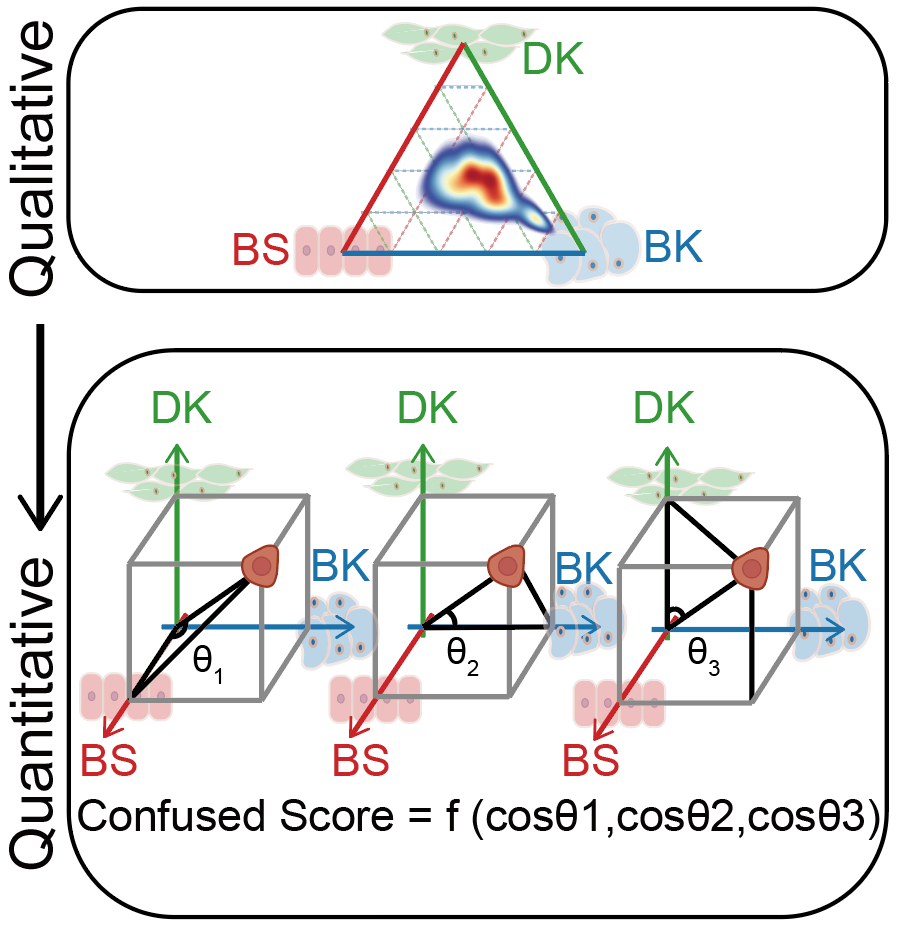

# Codes of confused score generation in Omics data

This part recorded the codes of confused scores calculation, including scRNA-seq data, bulk RNA-seq data and micro-array data. The detail methods could be learned from paper.  The basic concepts of confused score were described as following: 

# Codes of Confused score in scRNA-seq data

## Confused score in our scRNA-seq data

~~~R
scESCC_HCA_merge <- mcreadRDS("/mnt/data/GEO_SUBMIT/CCI_ESCC/scESCC_HCA_merge.rds",mc.cores=20)
only_Normal_epi.markers <- mcreadRDS("/mnt/data/user_data/xiangyu/workshop/scRNA/eso_scRNA/Heso_cancer6/normal/Heso6_normal_only_epi_hetero.marker.rds",mc.cores=20)
only_Normal_epi.markers$cluster <- as.character(only_Normal_epi.markers$cluster)
All_path <- unique(only_Normal_epi.markers$cluster)
for (i in c(1:length(All_path))) {
  sel_path <- subset(only_Normal_epi.markers,cluster==All_path[i] &pct.2 < 0.4)
  Lineage_marker <- intersect(rownames(GetAssayData(object = scESCC_HCA_merge, slot = "data",assay="RNA")),sel_path$gene)
  speci_raw <- FetchData(object = scESCC_HCA_merge, vars = Lineage_marker,slot="data")
  scESCC_HCA_merge[[All_path[i]]] <- (rowSums(speci_raw))/length(Lineage_marker)
  }
scESCC_HCA_merge@meta.data[!(scESCC_HCA_merge$predicted.id %in% c("Differentiated_keratinocyte","Basel_keratinocyte","Basel_Stem_Cells")),]$predicted.id <- 
scESCC_HCA_merge@meta.data[!(scESCC_HCA_merge$predicted.id %in% c("Differentiated_keratinocyte","Basel_keratinocyte","Basel_Stem_Cells")),]$group
scESCC_HCA_merge$predicted.id <- factor(scESCC_HCA_merge$predicted.id,
  levels=c("Basel_Stem_Cells","Basel_keratinocyte","Differentiated_keratinocyte",
    "Heso_1","Heso_2","Heso_3","Heso_4","Heso_5","Heso_6_para","Heso_6_cancer"))
Idents(scESCC_HCA_merge) <- scESCC_HCA_merge$group
scESCC_HCA_merge1 <- subset(scESCC_HCA_merge,idents=c("Heso_1","Heso_2","Heso_3","Heso_4","Heso_5","Heso_6_cancer","Heso6_normal","Heso_6_para"))

summer_all <- scESCC_HCA_merge[[c("Differentiated_keratinocyte","Basel_keratinocyte","Basel_Stem_Cells","new_group2","group")]]
table(summer_all$group)
# summer_all <- subset(summer_all,new_group2=="Normal_SE")
table(summer_all$group)
colnames(summer_all) <- c("DK","BK","BS","new_group2","patient")
a <- summer_all$BK
b <- summer_all$DK
c <- summer_all$BS
summer_all$cos1 <- (a^2 +(((a^2+b^2+c^2)^0.5)^2)-(((b^2+c^2)^0.5)^2))/(2*a*((a^2+b^2+c^2)^0.5))
summer_all$cos2 <- (b^2 +(((a^2+b^2+c^2)^0.5)^2)-(((a^2+c^2)^0.5)^2))/(2*b*((a^2+b^2+c^2)^0.5))
summer_all$cos3 <- (c^2 +(((a^2+b^2+c^2)^0.5)^2)-(((a^2+b^2)^0.5)^2))/(2*c*((a^2+b^2+c^2)^0.5))

summer_all$cos1[which((2*a*((a^2+b^2+c^2)^0.5)==0))] <- 2
summer_all$cos2[which((2*b*((a^2+b^2+c^2)^0.5)==0))] <- 2
summer_all$cos3[which((2*c*((a^2+b^2+c^2)^0.5)==0))] <- 2
summer_all$Confusion_score <- future_apply(summer_all[,c("cos1","cos2","cos3")],1,sd)
summer_all$Confusion_score <- 10/summer_all$Confusion_score
summer_all$Confusion_score1 <- log(summer_all$Confusion_score+1,2)
summer_all$Confusion_score2 <- summer_all$Confusion_score1
summer_all$Confusion_score2[which(summer_all$cos1==2)] <- 2^summer_all$Confusion_score2[which(summer_all$cos1==2)] 
summer_all$Confusion_score2[which(summer_all$cos2==2)] <- 2^summer_all$Confusion_score2[which(summer_all$cos2==2)] 
summer_all$Confusion_score2[which(summer_all$cos3==2)] <- 2^summer_all$Confusion_score2[which(summer_all$cos3==2)] 
~~~

~~~R
library(ggpubr)
median(subset(summer_all,new_group2=="Malignant_SE")$Confusion_score)
[1] 43.18917
median(subset(summer_all,new_group2=="Normal_SE")$Confusion_score)
[1] 21.18788

p1 <- ggboxplot(summer_all, x = "new_group2", y = "Confusion_score", fill="new_group2",
  title="Confusion_score", legend = "none",outlier.shape = NA,ylim=c(10,100),notch = TRUE) +
  rotate_x_text(angle = 45)+ stat_compare_means(comparisons =list(c("Normal_SE","Malignant_SE")),
    label = "p.signif", method = "wilcox.test",label.y=c(100))
ggsave("./Confusion_score_Ours.svg", plot=p1,width = 5, height = 5,dpi=1080)
~~~

## Confused score in single cell ESCC data

~~~R
scESCC_seurat_only <- mcreadRDS("/mnt/data/GEO_SUBMIT/CCI_ESCC/scESCC_map_from_Zhang_only_SE.rds", mc.cores = 20)
summer_all <- scESCC_seurat_only[[c("sample","new_group","DK","BK","BS","annotated_type")]]
a <- summer_all$BK
b <- summer_all$DK
c <- summer_all$BS
summer_all$cos1 <- (a^2 +(((a^2+b^2+c^2)^0.5)^2)-(((b^2+c^2)^0.5)^2))/(2*a*((a^2+b^2+c^2)^0.5))
summer_all$cos2 <- (b^2 +(((a^2+b^2+c^2)^0.5)^2)-(((a^2+c^2)^0.5)^2))/(2*b*((a^2+b^2+c^2)^0.5))
summer_all$cos3 <- (c^2 +(((a^2+b^2+c^2)^0.5)^2)-(((a^2+b^2)^0.5)^2))/(2*c*((a^2+b^2+c^2)^0.5))
summer_all$cos1[which((2*a*((a^2+b^2+c^2)^0.5)==0))] <- 2
summer_all$cos2[which((2*b*((a^2+b^2+c^2)^0.5)==0))] <- 2
summer_all$cos3[which((2*c*((a^2+b^2+c^2)^0.5)==0))] <- 2
summer_all$Confusion_score <- future_apply(summer_all[,c("cos1","cos2","cos3")],1,sd)
summer_all$Confusion_score <- 10/summer_all$Confusion_score
summer_all$Confusion_score1 <- log(summer_all$Confusion_score+1,2)
scESCC_seurat_only$Confusion_score <- summer_all$Confusion_score
scESCC_seurat_only$Confusion_score1 <- summer_all$Confusion_score1

speci_raw <- FetchData(object = scESCC_seurat_only, vars = c("sample","new_group","DK","BK","BS","annotated_type","TPM4","KRT7",
  "Confusion_score1","Confusion_score","nFeature_RNA","Pathologic.stage","new_stage"),slot="data")
speci_raw$new_group <- factor(speci_raw$new_group,levels=c("Normal","ESCC"))
speci_raw <- subset(speci_raw,new_group=="ESCC")
p1 <- ggboxplot(speci_raw, x = "new_stage", y = "Confusion_score", fill="new_stage",
  title="Confusion_score", legend = "none",outlier.shape = NA,ylim=c(20,60),notch = TRUE) +
  rotate_x_text(angle = 45)+ stat_compare_means(comparisons =list(c("I","II_III")),
    label = "p.signif", method = "wilcox.test",label.y=c(60))
~~~

# Confused score related pathways

~~~R
Malignant_SE_filter <- mcreadRDS("/mnt/data/GEO_SUBMIT/CCI_ESCC/scESCC_map_only_MSE.rds",mc.cores=20)
peudo_bulk_Malig_SE <- pseudo_bulk_seurat_mean(seurat_obj=Malignant_SE_filter,num_split=600,seed.use=1,slot="data",prefix="Malig_SE")
only_Normal_epi.markers <- mcreadRDS("/mnt/data/user_data/xiangyu/workshop/scRNA/eso_scRNA/Heso_cancer6/normal/Heso6_normal_only_epi_hetero.marker.rds",mc.cores=20)
only_Normal_epi.markers$cluster <- as.character(only_Normal_epi.markers$cluster)
All_path <- unique(only_Normal_epi.markers$cluster)
Sel_data <- c()
for (i in c(1:length(All_path))) {
  sel_path <- subset(only_Normal_epi.markers,cluster==All_path[i] &pct.2 < 0.4)
  Lineage_marker <- intersect(rownames(peudo_bulk_Malig_SE),sel_path$gene)
  Sel_data_ <- (colSums(peudo_bulk_Malig_SE[Lineage_marker,]))/length(Lineage_marker)
  Sel_data_ <- as.data.frame(t(as.data.frame(Sel_data_)))
  Sel_data <- rbind(Sel_data,Sel_data_)
  }
rownames(Sel_data) <- c("DK","BK","BS")
Sel_data <- as.data.frame(t(Sel_data))
a <- Sel_data$BK
b <- Sel_data$DK
c <- Sel_data$BS
Sel_data$cos1 <- (a^2 +(((a^2+b^2+c^2)^0.5)^2)-(((b^2+c^2)^0.5)^2))/(2*a*((a^2+b^2+c^2)^0.5))
Sel_data$cos2 <- (b^2 +(((a^2+b^2+c^2)^0.5)^2)-(((a^2+c^2)^0.5)^2))/(2*b*((a^2+b^2+c^2)^0.5))
Sel_data$cos3 <- (c^2 +(((a^2+b^2+c^2)^0.5)^2)-(((a^2+b^2)^0.5)^2))/(2*c*((a^2+b^2+c^2)^0.5))
Sel_data$cos1[which((2*a*((a^2+b^2+c^2)^0.5)==0))] <- 2
Sel_data$cos2[which((2*b*((a^2+b^2+c^2)^0.5)==0))] <- 2
Sel_data$cos3[which((2*c*((a^2+b^2+c^2)^0.5)==0))] <- 2
Sel_data$Confusion_score <- future_apply(Sel_data[,c("cos1","cos2","cos3")],1,sd)
Sel_data$Confusion_score <- 1/Sel_data$Confusion_score
Sel_data$Confusion_score1 <- log(Sel_data$Confusion_score+1,2)

sle_stem_tumor_Cells <- t(peudo_bulk_Malig_SE)
sle_stem_tumor_Cells <- cbind(Sel_data$Confusion_score1,sle_stem_tumor_Cells)
colnames(sle_stem_tumor_Cells)[1] <- "Confusion_score1"
sle_stem_tumor_Cells <- as.matrix(sle_stem_tumor_Cells)

library(data.table)
stem_tumor_cor <- future_lapply(2:ncol(sle_stem_tumor_Cells),function(x) {
  tmp <- cor(x=sle_stem_tumor_Cells[,1],y = sle_stem_tumor_Cells[,x],method = c("pearson"))
  tmp_test <- cor.test(x=sle_stem_tumor_Cells[,1],y = sle_stem_tumor_Cells[,x])
  cor_tmp <- data.frame(cor_num=tmp,pval=tmp_test$p.value,row.names=colnames(sle_stem_tumor_Cells)[x])
  return(cor_tmp)
  })
stem_tumor_cor <- as.data.frame(rbindlist(stem_tumor_cor))
rownames(stem_tumor_cor) <- colnames(sle_stem_tumor_Cells)[-1]
stem_tumor_cor$gene <- rownames(stem_tumor_cor)
stem_tumor_cor <- stem_tumor_cor[order(stem_tumor_cor$cor_num,decreasing=TRUE),]

library(BisqueRNA)
ALL_GSEA_GMT <- read.gmt("/mnt/data/user_data/xiangyu/programme/gsea/msigdb_v7.1/msigdb_v7.1_GMTs/all_merge/msigdb.v7.1.symbols.gmt")
ALL_GSEA_GMT$ont <- as.character(ALL_GSEA_GMT$ont)
stem_tumor_cor <- stem_tumor_cor[order(stem_tumor_cor$cor_num,decreasing=TRUE),]
geneList <- stem_tumor_cor$cor_num
names(geneList) <- rownames(stem_tumor_cor)
geneList <- sort(geneList, decreasing = TRUE)
GSEA_res <- GSEA(geneList, TERM2GENE=ALL_GSEA_GMT, verbose=TRUE,minGSSize=5,pvalueCutoff = 0.05)
GSEA_res_DATA <- as.data.frame(GSEA_res)
mcsaveRDS(GSEA_res_DATA,"/mnt/data/user_data/xiangyu/workshop/scRNA/eso_scRNA/Heso_all_sample_merge/GSEA_confused_sig_cor.rds",mc.cores=20)
GSEA_res_DATA <- XY_subset(GSEA_res_DATA,"Description",c(
  "HALLMARK_DNA_REPAIR","SUNG_METASTASIS_STROMA_DN","VANTVEER_BREAST_CANCER_METASTASIS_DN",
  "HALLMARK_GLYCOLYSIS","HALLMARK_UNFOLDED_PROTEIN_RESPONSE","HALLMARK_REACTIVE_OXYGEN_SPECIES_PATHWAY",
"HALLMARK_PI3K_AKT_MTOR_SIGNALING","GO_EPITHELIAL_CELL_DEVELOPMENT","GO_EPITHELIAL_CELL_PROLIFERATION","GO_KERATINOCYTE_PROLIFERATION",
"CHANDRAN_METASTASIS_UP","HALLMARK_TGF_BETA_SIGNALING","WANG_TUMOR_INVASIVENESS_UP",
  "DARWICHE_SQUAMOUS_CELL_CARCINOMA_UP", "HOLLERN_SQUAMOUS_BREAST_TUMOR","GO_REGULATION_OF_STEM_CELL_POPULATION_MAINTENANCE","PECE_MAMMARY_STEM_CELL_UP","CROMER_TUMORIGENESIS_UP"
))
GSEA_res_DATA$ID <- 1:nrow(GSEA_res_DATA)
rownames(GSEA_res_DATA) <- GSEA_res_DATA$ID
geneSets <- as(GSEA_res_DATA[, "ID"], "list")
names(geneSets) <- GSEA_res_DATA[, "ID"]
rownames(GSEA_res_DATA) <- GSEA_res_DATA$ID
gsea_tmp <- new("gseaResult", result = GSEA_res_DATA, geneSets = geneSets, geneList = geneList,
        params = list(pvalueCutoff = 1, nPerm = 1000,
        pAdjustMethod = "BH", exponent = 1, minGSSize = 5,
        maxGSSize = 500), readable = FALSE)
gsea_tmp@organism <- "UNKNOWN"
gsea_tmp@setType <- "UNKNOWN"
gsea_tmp@keytype <- "UNKNOWN"
aa <- jdb_palette("brewer_celsius",type = "continuous")[1:length(jdb_palette("brewer_celsius",type = "continuous"))]
p1 <- heatplot(gsea_tmp, foldChange=geneList)+scale_fill_gradientn(name = "p.adjust", colors=aa)
ggsave("./figure_making/GSEA_confused_sig_cor_res.svg", plot=p1,width = 12, height = 4,dpi=1080)
~~~

# Codes of Confused score in micro-array data

~~~R
GSE20347_array <- mcreadRDS("/mnt/data/user_data/xiangyu/workshop/scRNA/eso_scRNA/Heso_all_sample_merge/OTS_data/GSE20347/GSE20347_integrated.rds",mc.cores=20)
GSE45168_array <- mcreadRDS("/mnt/data/user_data/xiangyu/workshop/scRNA/eso_scRNA/Heso_all_sample_merge/OTS_data/GSE45168/GSE45168_integrated.rds",mc.cores=20)
GSE23400_1_array <- mcreadRDS("/mnt/data/user_data/xiangyu/workshop/scRNA/eso_scRNA/Heso_all_sample_merge/OTS_data/GSE23400/GSE23400_integrated_1.rds",mc.cores=20)
GSE23400_2_array <- mcreadRDS("/mnt/data/user_data/xiangyu/workshop/scRNA/eso_scRNA/Heso_all_sample_merge/OTS_data/GSE23400/GSE23400_integrated_2.rds",mc.cores=20)
GSE70409_array <- mcreadRDS("/mnt/data/user_data/xiangyu/workshop/scRNA/eso_scRNA/Heso_all_sample_merge/OTS_data/GSE70409/GSE70409_integrated.rds",mc.cores=20)
GSE53624_array <- mcreadRDS("/mnt/data/user_data/xiangyu/workshop/scRNA/eso_scRNA/Heso_all_sample_merge/OTS_data/GSE53624/GSE53624_integrated.rds",mc.cores=20)
NC_Omics <- mcreadRDS("/mnt/data/user_data/xiangyu/workshop/scRNA/eso_scRNA/Heso_all_sample_merge/OTS_data/NC_Omics/NC_Omics_integrated.rds",mc.cores=20)
All_data_list <- list(GSE20347_array,GSE45168_array,GSE23400_1_array,GSE23400_2_array,GSE70409_array,GSE53624_array,NC_Omics)
names <- c("GSE20347_array","GSE45168_array","GSE23400_1_array","GSE23400_2_array","GSE70409_array","GSE53624_array","NC_Omics")

only_Normal_epi.markers <- mcreadRDS("/mnt/data/user_data/xiangyu/workshop/scRNA/eso_scRNA/Heso_cancer6/normal/Heso6_normal_only_epi_hetero.marker.rds",mc.cores=20)
only_Normal_epi.markers_DK <- subset(only_Normal_epi.markers,cluster=="Differentiated_keratinocyte" &pct.2 < 0.4)
only_Normal_epi.markers_BK <- subset(only_Normal_epi.markers,cluster=="Basel_keratinocyte" &pct.2 < 0.4)
only_Normal_epi.markers_BS <- subset(only_Normal_epi.markers,cluster=="Basel_Stem_Cells" &pct.2 < 0.4)
Malignant_VS_Normal1_specific <- mcreadRDS("/mnt/data/user_data/xiangyu/workshop/scRNA/eso_scRNA/Heso_cancer6/normal/confused_identity_sig_with_FC.rds",mc.cores=20)
Malignant_VS_Normal1_specific <- subset(Malignant_VS_Normal1_specific,baseMean > 0.8 & pct.1 > 0.8)
library(BisqueRNA)
ALL_GSEA_GMT <- read.gmt("/mnt/data/user_data/xiangyu/programme/gsea/msigdb_v7.1/msigdb_v7.1_GMTs/all_merge/msigdb.v7.1.symbols.gmt")
ALL_GSEA_GMT$ont <- as.character(ALL_GSEA_GMT$ont)
KEGG_JAK_STAT <- subset(ALL_GSEA_GMT,ont=="KEGG_JAK_STAT_SIGNALING_PATHWAY")

All_data_list_calculate_Confused <- future_lapply(1:length(All_data_list),function(x) {
  sel_obj <- All_data_list[[x]]
  Lineage_marker <- intersect(rownames(GetAssayData(object = sel_obj, slot = "counts",assay="RNA")),only_Normal_epi.markers_DK$gene)
  speci_raw <- FetchData(object = sel_obj, vars = Lineage_marker,slot="counts")
  sel_obj[["Differentiated_keratinocyte"]] <- (rowSums(speci_raw))/length(Lineage_marker)
  sel_obj$Differentiated_keratinocyte <- as.numeric(as.character(sel_obj$Differentiated_keratinocyte))

  Lineage_marker <- intersect(rownames(GetAssayData(object = sel_obj, slot = "counts",assay="RNA")),only_Normal_epi.markers_BK$gene)
  speci_raw <- FetchData(object = sel_obj, vars = Lineage_marker,slot="counts")
  sel_obj[["Basel_keratinocyte"]] <- (rowSums(speci_raw))/length(Lineage_marker)
  sel_obj$Basel_keratinocyte <- as.numeric(as.character(sel_obj$Basel_keratinocyte))

  Lineage_marker <- intersect(rownames(GetAssayData(object = sel_obj, slot = "counts",assay="RNA")),only_Normal_epi.markers_BS$gene)
  speci_raw <- FetchData(object = sel_obj, vars = Lineage_marker,slot="counts")
  sel_obj[["Basel_Stem_Cells"]] <- (rowSums(speci_raw))/length(Lineage_marker)
  sel_obj$Basel_Stem_Cells <- as.numeric(as.character(sel_obj$Basel_Stem_Cells))

  summer_all <- sel_obj[[c("Differentiated_keratinocyte","Basel_keratinocyte","Basel_Stem_Cells")]]
  colnames(summer_all) <- c("DK","BK","BS")
  a <- summer_all$BK
  b <- summer_all$DK
  c <- summer_all$BS
  summer_all$cos1 <- (a^2 +(((a^2+b^2+c^2)^0.5)^2)-(((b^2+c^2)^0.5)^2))/(2*a*((a^2+b^2+c^2)^0.5))
  summer_all$cos2 <- (b^2 +(((a^2+b^2+c^2)^0.5)^2)-(((a^2+c^2)^0.5)^2))/(2*b*((a^2+b^2+c^2)^0.5))
  summer_all$cos3 <- (c^2 +(((a^2+b^2+c^2)^0.5)^2)-(((a^2+b^2)^0.5)^2))/(2*c*((a^2+b^2+c^2)^0.5))
  summer_all$cos1[which((2*a*((a^2+b^2+c^2)^0.5)==0))] <- 2
  summer_all$cos2[which((2*b*((a^2+b^2+c^2)^0.5)==0))] <- 2
  summer_all$cos3[which((2*c*((a^2+b^2+c^2)^0.5)==0))] <- 2
  summer_all$Confusion_score <- future_apply(summer_all[,c("cos1","cos2","cos3")],1,sd)
  summer_all$Confusion_score <- 1/summer_all$Confusion_score
  summer_all$Confusion_score1 <- log(summer_all$Confusion_score+1,2)
  sel_obj$Confusion_score <- summer_all$Confusion_score
  sel_obj$Confusion_score1 <- summer_all$Confusion_score1
  malig_uniq2 <- Malignant_VS_Normal1_specific$gene
  Lineage_marker <- intersect(rownames(GetAssayData(object = sel_obj, slot = "data",assay="RNA")),malig_uniq2)
  speci_raw <- FetchData(object = sel_obj, vars = Lineage_marker,slot="data")
  sel_obj[["confused_ident.sig"]] <- (rowSums(speci_raw))/length(Lineage_marker)
  Lineage_marker <- intersect(rownames(GetAssayData(object = sel_obj, slot = "data",assay="RNA")),KEGG_JAK_STAT$gene)
  speci_raw <- FetchData(object = sel_obj, vars = Lineage_marker,slot="data")
  sel_obj[["KEGG_JAK_STAT"]] <- (rowSums(speci_raw))/length(Lineage_marker)
  message(names[x]," is done")
  return(sel_obj)
  })
mcsaveRDS(All_data_list_calculate_Confused,"/mnt/data/user_data/xiangyu/workshop/scRNA/eso_scRNA/Heso_all_sample_merge/OTS_data/All_data_merge.rds")

All_data_list_calculate_Confused <- mcreadRDS("/mnt/data/user_data/xiangyu/workshop/scRNA/eso_scRNA/Heso_all_sample_merge/OTS_data/All_data_merge.rds")
library(ggpubr)
All_plot <- future_lapply(1:length(All_data_list_calculate_Confused),function(x) {
  sel_obj <- All_data_list_calculate_Confused[[x]]
  summer_all <- FetchData(object = sel_obj, vars = c("Differentiated_keratinocyte","Basel_keratinocyte","Basel_Stem_Cells","sample","group","Confusion_score","Confusion_score1"),slot="counts")
  summer_all$group <- factor(summer_all$group,levels=c("Normal","ESCC"))
  plot <- ggboxplot(summer_all, x = "group", y = "Confusion_score", fill="group",
    title="Confusion_score", legend = "none",outlier.shape = NA,notch = FALSE,ylim=c(5,50)) +
    rotate_x_text(angle = 45)+ stat_compare_means(comparisons =list(c("Normal","ESCC")),
      label = "p.signif", method = "wilcox.test",label.y=40)+labs(title=unique(summer_all$sample))
    message(unique(summer_all$sample)," is done")
    return(plot)
  })
p1 <- CombinePlots(All_plot[-2],ncol=6)
ggsave("/mnt/data/user_data/xiangyu/workshop/scRNA/eso_scRNA/Heso_all_sample_merge/figure_making/Confusion_score_all_array.svg", plot=p1,width = 15, height = 5,dpi=1080)
~~~

# Codes of Confused score in bulk RNA-seq data (TCGA-ESCC)

~~~R
ESCC_FPKM <- fread("/mnt/data/user_data/xiangyu/workshop/DATABASE/TCGA_ESCA/ESCA_RNA_transfer_symbol.csv")
ESCC_FPKM <- as.data.frame(ESCC_FPKM)
rownames(ESCC_FPKM) <- ESCC_FPKM$V1
ESCC_FPKM <- ESCC_FPKM[,-1]
Escc_clinical <- fread("/mnt/data/user_data/xiangyu/workshop/DATABASE/TCGA_ESCA/ESCA_all_clinical.csv")
Escc_clinical <- as.data.frame(Escc_clinical)
rownames(Escc_clinical) <- Escc_clinical$V1
Escc_clinical <- Escc_clinical[,c("gender","V1","submitter_id","primary_diagnosis","tumor_stage","age_at_diagnosis","days_to_death","vital_status","days_to_last_follow_up")]
Escc_clinical$submitter_id <- gsub("-",".",Escc_clinical$submitter_id)
rownames(Escc_clinical) <- Escc_clinical$submitter_id
Escc_clinical <- subset(Escc_clinical,primary_diagnosis=="Basaloid squamous cell carcinoma" | primary_diagnosis == "Squamous cell carcinoma, keratinizing, NOS" |
  primary_diagnosis == "Squamous cell carcinoma, NOS")
both_id <- intersect(Escc_clinical$submitter_id,colnames(ESCC_FPKM))
Escc_clinical <- Escc_clinical[both_id,]
ESCC_FPKM <- ESCC_FPKM[,both_id]
only_Normal_epi.markers <- mcreadRDS("/mnt/data/user_data/xiangyu/workshop/scRNA/eso_scRNA/Heso_cancer6/normal/Heso6_normal_only_epi_hetero.marker.rds",mc.cores=20)
only_Normal_epi.markers$cluster <- as.character(only_Normal_epi.markers$cluster)
only_Normal_epi.markers_DK <- subset(only_Normal_epi.markers,cluster=="Differentiated_keratinocyte" &pct.2 < 0.4)
only_Normal_epi.markers_BK <- subset(only_Normal_epi.markers,cluster=="Basel_keratinocyte" &pct.2 < 0.4)
only_Normal_epi.markers_BS <- subset(only_Normal_epi.markers,cluster=="Basel_Stem_Cells" &pct.2 < 0.4)

TCGA_ESCC <- data.frame(DK=apply(ESCC_FPKM[intersect(rownames(ESCC_FPKM),only_Normal_epi.markers_DK$gene),],2,mean),
  BK=apply(ESCC_FPKM[intersect(rownames(ESCC_FPKM),only_Normal_epi.markers_BK$gene),],2,mean),
  BS=apply(ESCC_FPKM[intersect(rownames(ESCC_FPKM),only_Normal_epi.markers_BS$gene),],2,mean),
  TPM4=as.character(ESCC_FPKM["TPM4",]))
TCGA_ESCC$DK <- as.numeric(as.character(TCGA_ESCC$DK))
TCGA_ESCC$BK <- as.numeric(as.character(TCGA_ESCC$BK))
TCGA_ESCC$BS <- as.numeric(as.character(TCGA_ESCC$BS))
TCGA_ESCC$TPM4 <- as.numeric(as.character(TCGA_ESCC$TPM4))

a <- TCGA_ESCC$BK
b <- TCGA_ESCC$DK
c <- TCGA_ESCC$BS
TCGA_ESCC$cos1 <- (a^2 +(((a^2+b^2+c^2)^0.5)^2)-(((b^2+c^2)^0.5)^2))/(2*a*((a^2+b^2+c^2)^0.5))
TCGA_ESCC$cos2 <- (b^2 +(((a^2+b^2+c^2)^0.5)^2)-(((a^2+c^2)^0.5)^2))/(2*b*((a^2+b^2+c^2)^0.5))
TCGA_ESCC$cos3 <- (c^2 +(((a^2+b^2+c^2)^0.5)^2)-(((a^2+b^2)^0.5)^2))/(2*c*((a^2+b^2+c^2)^0.5))
TCGA_ESCC$cos1[which((2*a*((a^2+b^2+c^2)^0.5)==0))] <- 2
TCGA_ESCC$cos2[which((2*b*((a^2+b^2+c^2)^0.5)==0))] <- 2
TCGA_ESCC$cos3[which((2*c*((a^2+b^2+c^2)^0.5)==0))] <- 2
TCGA_ESCC$Confusion_score <- future_apply(TCGA_ESCC[,c("cos1","cos2","cos3")],1,sd)
TCGA_ESCC$Confusion_score <- 10/TCGA_ESCC$Confusion_score
TCGA_ESCC$Confusion_score1 <- log(TCGA_ESCC$Confusion_score+1,2)

library("survival")
library("survminer")
Escc_clinical_sel <- Escc_clinical[rownames(TCGA_ESCC),]
Escc_clinical_ <- cbind(Escc_clinical_sel,TCGA_ESCC)
meta <- Escc_clinical_
meta[is.na(meta)] <- "HHH"
tmp <- subset(meta,days_to_last_follow_up=="HHH")
tmp$days_to_last_follow_up <- tmp$days_to_death
no_na <- meta[setdiff(rownames(meta),rownames(tmp)),]
all_merge <- rbind(tmp,no_na)
all_merge <- subset(all_merge,days_to_last_follow_up != "HHH")
all_merge$vital_status <- as.character(all_merge$vital_status)
all_merge$status <- ifelse(all_merge$vital_status=="Alive",0,1)
all_merge$days_to_last_follow_up <- as.numeric(all_merge$days_to_last_follow_up)

TCGA_ESCC_stage <- subset(all_merge,tumor_stage != "not reported")
TCGA_ESCC_stage$Tumor_status <- gsub("stage ia","stage i",TCGA_ESCC_stage$tumor_stage)
TCGA_ESCC_stage$Tumor_status <- gsub("stage ib","stage i",TCGA_ESCC_stage$Tumor_status)
TCGA_ESCC_stage$Tumor_status <- gsub("stage iia","stage ii/iii",TCGA_ESCC_stage$Tumor_status)
TCGA_ESCC_stage$Tumor_status <- gsub("stage iib","stage ii/iii",TCGA_ESCC_stage$Tumor_status)
TCGA_ESCC_stage$Tumor_status <- gsub("stage iiia","stage ii/iii",TCGA_ESCC_stage$Tumor_status)
TCGA_ESCC_stage$Tumor_status <- gsub("stage iiib","stage ii/iii",TCGA_ESCC_stage$Tumor_status)
TCGA_ESCC_stage$Tumor_status <- gsub("stage iva","stage ii/iii",TCGA_ESCC_stage$Tumor_status)
TCGA_ESCC_stage$Tumor_status <- gsub("stage iiic","stage ii/iii",TCGA_ESCC_stage$Tumor_status)
TCGA_ESCC_stage$Tumor_status <- gsub("stage iv","stage ii/iii",TCGA_ESCC_stage$Tumor_status)
TCGA_ESCC_stage$Tumor_status <- gsub("stage iii","stage ii/iii",TCGA_ESCC_stage$Tumor_status)

library(ggpubr)
p1 <- ggboxplot(TCGA_ESCC_stage, x = "Tumor_status", y = "Confusion_score", fill="Tumor_status",
  title="Confusion_score", legend = "none",outlier.shape = NA,ylim=c(20,100),notch = FALSE) +
  rotate_x_text(angle = 45)+ stat_compare_means(comparisons =list(c("stage i","stage ii/iii")),
    label = "p.signif", method = "t.test",label.y=c(50))
ggsave("/mnt/data/user_data/xiangyu/workshop/scRNA/eso_scRNA/Heso_all_sample_merge/figure_making/Confusion_score_TCGA.svg", plot=p1,width = 5, height = 5,dpi=1080)
~~~

