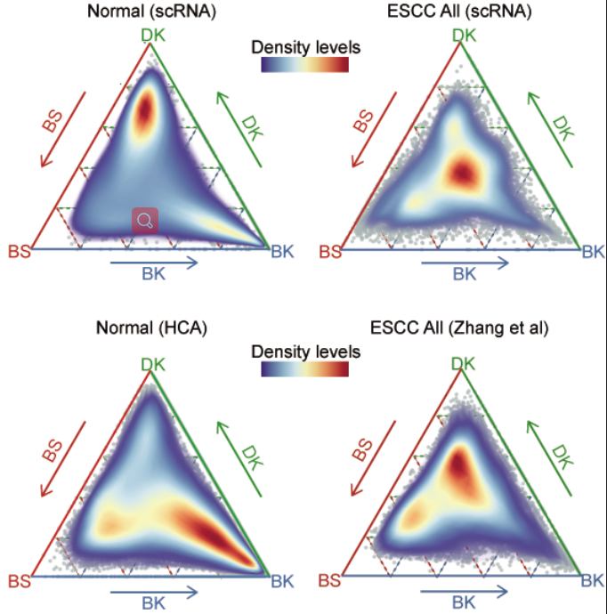

# **The confused cell identity is associated with aggressiveness in esophageal squamous cell carcinoma**

This page recorded the codes used and mentioned in [this paper](). 

To increase the reproducibility of omics analysis mentioned in our paper, we will record and submit all scripts, raw data and processed data for sharing our bioinformatics tools and academic principles. We have submitted all processed data on [Figshare](https://figshare.com/account/projects/92384/articles/13206338) and you could download them followed according agreements. Raw data also had been submitted on GEO database, and you could be accessible by clicking [GSEXXX]( https://www.ncbi.nlm.nih.gov/geo/query/acc.cgi?acc=GSE161570). Besides, we also recorded our figures-making codes in Markdown files, which could be regarded as tutorials for beginner of omics analysis. More detail descriptions of the submitted data you could get in following pages.

In this project, to better analyze and visualize our data, we have modified a lot of function formulas from previous perfect packages. And we also be happy to share them to help you improve your work efficiency in omics data analysis and visualizations.

# **The usage of CCI-Identify** (update recently)

# **Codes of analyzing and visualization**

The codes of this project included four parts, `scRNA-seq` data analysis, `TCGA-ESCC`data analysis, `micro-array` data analysis and `protein` data analysis. The general processing of these data had been recorded in following pages, and stored as markdown files. 

* ## 1. Codes of ESCC single-cell landscape

This part recorded the basic codes which could generate Figure1. And you could access this code by click [here](bulk_RNA.md).

* ##  2. Codes of single-cell normal SE development

This part recorded the basic codes which could generate Figure1 and related materials. And you could access this code by click [here](bulk_RNA.md).

* ## 3. Codes of protein data processing

This part recorded the basic codes which could generate Figure3 and protein data related materials. And you could access this code by click [here](bulk_RNA.md).

* ## 4. Codes of Confused signatures identified

This part recorded the basic codes which could generate Figure3 and Confused signatures related materials. And you could access this code by click [here](bulk_RNA.md).

The most important part of this study was to identify the confused cell identity (CCI), a general and special feature of ESCC. Therefore, we used a single part to display how we generated these plots mentioned in our paper. And we also showed how to generate the confused score to quantify the CCI in ESCC, among scRNA-seq, bulk RNA-seq and even micro-array data. 

* ## 1. Codes of confused cell identity (CCI) in Omics data

This part recorded the codes of CCI visualization in Omics data, including scRNA-seq data, bulk RNA-seq data and micro-array data. And you could access this code by click [here](bulk_RNA.md).

* ## 2. Codes of confused score generation in Omics data

This part recorded the codes of confused score generation in Omics data, including scRNA-seq data, bulk RNA-seq data and micro-array data. And you could access this code by click [here](bulk_RNA.md).

* ## 3. Codes of CCI as an independent dignosis marker

This part recorded the codes to validate the CCI was an independent dignosis marker. And you could access this code by click [here](bulk_RNA.md).

* ## 4. Codes of CCI in murine data

This part recorded the codes of CCI in murine data. And you could access this code by click [here](bulk_RNA.md).

# **Citation**

Our paper has been published on XXXXX

You could downloaded raw data from [GEO Database GSEXXX](https://www.ncbi.nlm.nih.gov/geo/query/acc.cgi?acc=GSEXXX)

You could downloaded processed data from [Figshare Database]()