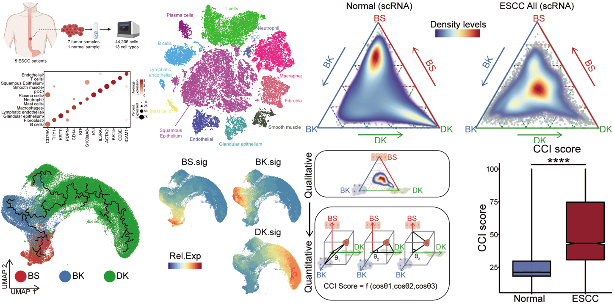
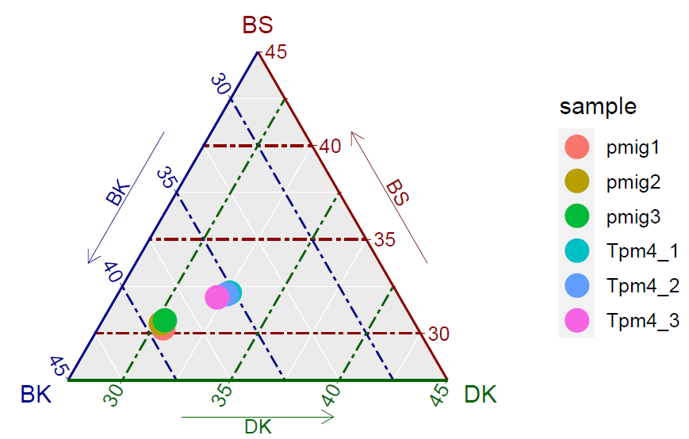
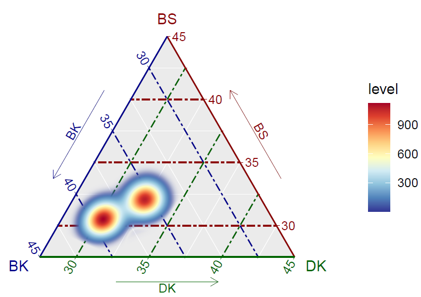

# **The confused cell identity is associated with aggressiveness in esophageal squamous cell carcinoma**



This page recorded the codes used and mentioned in [this paper](https://www.nature.com/articles/s41392-022-00946-8).  And you could downloaded this paper by clicking [here](paper/CCI.pdf)

To increase the reproducibility of omics analysis mentioned in our paper, we will record and submit all scripts, raw data and processed data for sharing our bioinformatics tools and academic principles. We have submitted all `processed data` and `Raw data` also had been submitted on GEO database, and you could be accessible by clicking [GEO Database GSE188955](https://www.ncbi.nlm.nih.gov/geo/query/acc.cgi?acc=GSE188955) and you could download them followed GEO agreements. Besides, we also recorded our figures-making codes in Markdown files, which could be regarded as tutorials for beginner of omics analysis. More detail descriptions of the submitted data you could get in following pages.

In this project, to better analyze and visualize our data, we have modified a lot of function formulas from previous perfect packages. And we are also happy to share them to help you improve your work efficiency in omics data analysis and visualizations.

# **The usage of CCI-Identify** 

To better validate the Confused Cell Identity (CCI) in ESCC and calculate the CCI score in each sample/single-cell, we had created a pipeline, named `CCI-Identify.R` , to directly generate the CCI related results mentioned in our paper. And you could get the pipeline by clicking [here](CCI-Identify).

You also could get the `CCI-Identify.R` by downloading this git:

~~~shell
git clone git@github.com:pangxueyu233/CCI-in-ESCC.git
cd ./CCI-in-ESCC/CCI-Identify
tree
.
├── BS_BK_DK_sig.csv
├── `CCI-Identify.R`
├── R_PACKAGES
│   ├── ggplot2_3.1.0.tar.gz
│   └── ggtern_3.1.0.tar.gz
├── out_tmp
│   ├── TPM4oe_vs_Ctrl_mouse_RNAseq_CCI.pdf
│   ├── TPM4oe_vs_Ctrl_mouse_RNAseq_CCI.score.csv
│   └── TPM4oe_vs_Ctrl_mouse_RNAseq_CCI.svg
└── test_counts.csv

2 directories, 8 files
~~~

Then, you could used the `CCI-Identify.R` stored in `./CCI-in-ESCC/CCI-Identify`

---

This part would help you yo understand the detail input files in  `CCI-Identify.R` pipeline. Firstly, you should install the appropriate `R (version >= 3.5)`, `ggplot2 (version=3.1)`, `ggtern (version=3.1)`, `dplyr`, `nichenetr` and `data.table`. The `ggplot2 (version=3.1)`and `ggtern (version=3.1)` should be installed before you run the `CCI-Identify.R`. You also could use another version of them, but the  `version=3.1` of them were most stable, because the function to calculate the density of distribution in the different version of ggplot2 has some differences, which might impact the visualization of CCI. And the source data of the two packages had been stored in the `./CCI-in-ESCC/CCI-Identify/R_PACKAGES`. You could install them on the local Linux system:

```R
R CMD INSTALL ./CCI-in-ESCC/CCI-Identify/R_PACKAGES/ggplot2_3.1.0.tar.gz
R CMD INSTALL ./CCI-in-ESCC/CCI-Identify/R_PACKAGES/ggtern_3.1.0.tar.gz
```

These pipeline included some important parameters. And here, we will introduce each of them. 

~~~R
Rscript ./CCI-Identify.R

    Xiangyu Pan
    11/11/2021
      The R Script of CCI-Identify

      Mandatory arguments:
      --BS_BK_DK_sig=BS_BK_DK_sig            - the pathway of BS, BK, and DK signatrues
      --input=transcriptome_data             - the input of transcriptome matrix
      --species=species                      - the species of samples (mouse or human)
      --data_type=type_of_input              - the types of input data (RNAseq, microarray and scRNA)
      --range=axis_range                     - the range of axis in ternary map
      --output=output_pathways               - the output pathway of CCI results
      --prefix=prefix                        - the prefix of output files
      --log_transform=log_transform          - the log-transformation before CCI quantification
      --help                                 - print this text

  WARNING : You should install the R packages ggplot2 (version=3.1), ggtern (version=3.1), dplyr, nichenetr and data.table.
            Only RNAseq, microarray and scRNA was supported for this function. And you should specialise your data_type.

  Example:
            Rscript ./CCI-Identify.R \
                    --BS_BK_DK_sig=./BS_BK_DK_sig.csv \
                    --input=./test_counts.csv \
                    --species=mouse \
                    --data_type=RNAseq \
                    --range=0.45 \
                    --output=./out_tmp/ \
                    --prefix=TPM4oe_vs_Ctrl \
                    --log_transform=YES
~~~

* 1. The `BS_BK_DK_sig` could be accessed in `./CCI-Identify` files, named `BS_BK_DK_sig.csv`. And you could get these files by clicking [here](CCI-Identify)

* 2. The test `input` files had also been stored  in `./CCI-Identify` files, named `test_counts.csv`

     Here, you should generate the `input` files as following structure: (top 6 rows were showed)

| Gene          | pmig1    | pmig2    | pmig3    | Tpm4_1   | Tpm4_2   | Tpm4_3   |
| ------------- | -------- | -------- | -------- | -------- | -------- | -------- |
| 0610005C13Rik | 0        | 0        | 0        | 0        | 0        | 0        |
| 0610009B22Rik | 735.1797 | 779.3857 | 734.1931 | 585.3008 | 556.8213 | 661.1024 |
| 0610009L18Rik | 12.4081  | 20.20955 | 16.35366 | 10.30459 | 8.803498 | 10.98177 |
| 0610010F05Rik | 175.7814 | 198.5808 | 203.1296 | 144.2643 | 88.03498 | 114.2104 |
| 0610010K14Rik | 1024.702 | 1014.871 | 843.5044 | 927.4132 | 967.2844 | 1057.544 |
| 0610012G03Rik | 1010.226 | 1000.812 | 914.944  | 776.9662 | 981.5901 | 716.0112 |

​			*You should pay attention the first column is the gene name, and called`Gene`*

* 3. In `axis_range`, it's a parameter based on the experience. For mouse bulk RNA-seq data, we suggested `0.45` as the appropriate value. For human scRNA-seq data, RNAs-seq and micro-array data, the `1` was recommended. If you get the ternary map didn't displayed your samples, you need set a higher number of this parameter 

* 4. In `log_transform`, default is `TRUE`. if you are not sure your data should be processed by log-transformation, you could keep the default value. 

Then, you could try the test codes with test data stored in `./CCI-Identify` as following:

~~~R
time Rscript ./CCI-Identify.R \
--BS_BK_DK_sig=./BS_BK_DK_sig.csv \
--input=./test_counts.csv \
--species=mouse \
--data_type=RNAseq \
--range=0.45 \
--output=./out_tmp/ \
--prefix=TPM4oe_vs_Ctrl \
--log_transform=YES
~~~

~~~shell
loading packages
CCI calculation done
CCI distribution done
The density of CCI distrubution done

real:0m6.931s; user:0m6.560s; sys:0m0.348s
~~~

And then, you could get the output files as following:

~~~shell
tree -lh ./out_tmp/
├── [447K]  TPM4oe_vs_Ctrl_mouse_RNAseq_CCI_density.pdf
├── [2.1M]  TPM4oe_vs_Ctrl_mouse_RNAseq_CCI_density.svg
├── [5.4K]  TPM4oe_vs_Ctrl_mouse_RNAseq_CCI.pdf
├── [ 838]  TPM4oe_vs_Ctrl_mouse_RNAseq_CCI.score.csv
└── [ 48K]  TPM4oe_vs_Ctrl_mouse_RNAseq_CCI.svg
0 directories, 5 files
~~~

* The `*_CCI.score.csv` files would record the CCI score of each sample, the expression levels of BS, BK and DK signatures and the cosine values of each angle. 

|        | DK       | BK       | BS       | cos1     | cos2     | cos3     | CCI_score |
| ------ | -------- | -------- | -------- | -------- | -------- | -------- | --------- |
| pmig1  | 8.000606 | 10.3016  | 7.952671 | 0.674334 | 0.523713 | 0.520575 | 11.37901  |
| pmig2  | 7.96781  | 10.33458 | 8.044437 | 0.67415  | 0.51976  | 0.524759 | 11.39865  |
| pmig3  | 7.95078  | 10.2034  | 8.044389 | 0.669833 | 0.521953 | 0.528098 | 11.95297  |
| Tpm4_1 | 8.411138 | 9.085932 | 8.30473  | 0.609437 | 0.564176 | 0.557038 | 35.19001  |
| Tpm4_2 | 8.426748 | 9.174584 | 8.321803 | 0.612408 | 0.562489 | 0.555484 | 32.21563  |
| Tpm4_3 | 8.353699 | 9.325516 | 8.28812  | 0.621091 | 0.556366 | 0.551999 | 25.84578  |

* The `*_CCI.pdf/.svg` files recorded the distribution of each sample on the ternary map

  

* The `*_CCI_density.pdf/.svg` files recorded the density of CCI distribution on the ternary map 



# **Codes of analyzing and visualization in omics data**

The codes of this project included four parts, `scRNA-seq` data analysis, `TCGA-ESCC`data analysis, `micro-array` data analysis and `protein` data analysis. The general processing of these data had been recorded in following pages, and stored as markdown files. 

* ## 1. Codes of ESCC single-cell landscape

This part recorded the basic codes which could generate `Figure1`. And you could access this code by clicking [here](scESCC_Ours.md).

* ##  2. Codes of single-cell normal SE development

This part recorded the basic codes which could generate `Figure1` and related materials. And you could access this code by clicking [here](scSE_development.md).

* ## 3. Codes of protein data processing

This part recorded the basic codes which could generate `Figure3` and protein data related materials. And you could access this code by clicking [here](protein_process.md).

* ## 4. Codes of  CCI signatures identified

This part recorded the basic codes which could generate `Figure` and CCI signatures related materials. And you could access this code by clicking [here](CCI_signatures_Identified.md).

# **Codes of confused cell identity and CCI scores**

The most important part of this study was to identify the confused cell identity (CCI), a general and special feature of ESCC. Therefore, we used a single part to display how we generated these plots mentioned in our paper. And we also showed how to generate the CCI score to quantify the CCI in ESCC, among scRNA-seq, bulk RNA-seq and even micro-array data. 

* ## 1. Codes of confused cell identity (CCI) in Omics data

This part recorded the codes of CCI visualization in Omics data, including scRNA-seq data, bulk RNA-seq data and micro-array data. And you could access this code by clicking [here](CCI_in_Omics.md).

* ## 2. Codes of CCI scores generation in Omics data

This part recorded the codes of CCI score generation in Omics data, including scRNA-seq data, bulk RNA-seq data and micro-array data. And you could access this code by clicking [here](Confused_score_in_Omics.md).

* ## 3. Codes of CCI as an independent dignosis marker

This part recorded the codes to validate the CCI was an independent dignosis marker. And you could access this code by clicking [here](CCI_as_dignosis_marker.md).

* ## 4. Codes of CCI in murine data

This part recorded the codes of CCI in murine data. And you could access this code by clicking [here](cci_in_murine.md).

# **Citation**

Our paper has been published on [*Signal Transduction and Targeted Therapy*](https://www.nature.com/articles/s41392-022-00946-8)

You could downloaded this paper by clicking [here](paper/CCI.pdf)

You could downloaded raw data from [GEO Database GSE188955](https://www.ncbi.nlm.nih.gov/geo/query/acc.cgi?acc=GSE188955)
