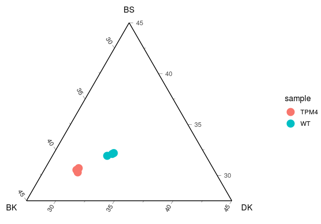
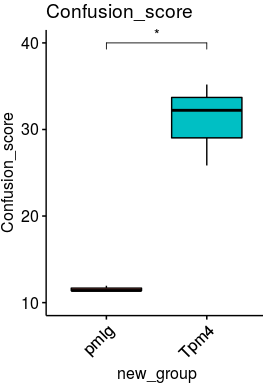
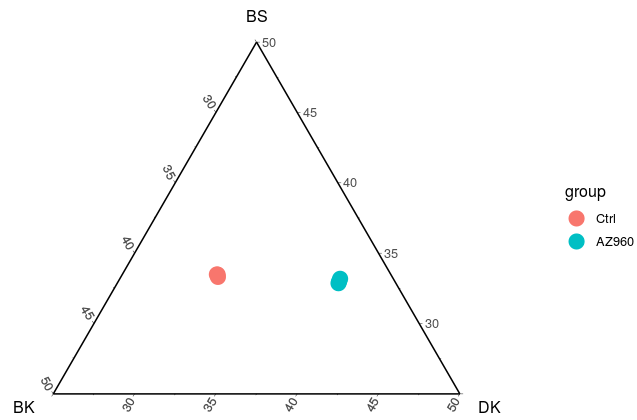
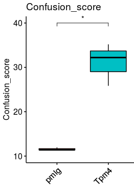

# Codes of CCI in murine data

This part recorded the codes of CCI in murine data, including the data TPM4 overexpression and the data JAK inhibitor treatment.

## 1. CCI in TPM4 overexpression data

~~~R
DESeq2_count <- read.csv("/mnt/data/user_data/xiangyu/workshop/RNAseq/TPM4/V2_data/sortedByCoord.out.bam/Tpm4_vs_pmigwork_file/PXY_2_DESeq2_count.csv")
rownames(DESeq2_count) <- DESeq2_count$X
DESeq2_count <- DESeq2_count[,-1]
DESeq2_count <- DESeq2_count[,-ncol(DESeq2_count)]
DESeq2_count_log <- log(DESeq2_count+1,2)
DESeq2_count_log$gene <- rownames(DESeq2_count_log)
library(iTALK)
library(nichenetr)
library(data.table)
DESeq2_count_log = DESeq2_count_log %>% mutate(hsa_Gs = convert_mouse_to_human_symbols(gene))
DESeq2_count_log <- DESeq2_count_log[!duplicated(DESeq2_count_log$hsa_Gs),]
DESeq2_count_log <- na.omit(DESeq2_count_log)
rownames(DESeq2_count_log) <- DESeq2_count_log$hsa_Gs
DESeq2_count_log <- DESeq2_count_log[,colnames(DESeq2_count)]
only_Normal_epi.markers <- mcreadRDS("/mnt/data/user_data/xiangyu/workshop/scRNA/eso_scRNA/Heso_cancer6/normal/Heso6_normal_only_epi_hetero.marker.rds",mc.cores=20)
only_Normal_epi.markers$cluster <- as.character(only_Normal_epi.markers$cluster)
only_Normal_epi.markers_DK <- subset(only_Normal_epi.markers,cluster=="Differentiated_keratinocyte" &pct.2 < 0.4)
only_Normal_epi.markers_BK <- subset(only_Normal_epi.markers,cluster=="Basel_keratinocyte" &pct.2 < 0.4)
only_Normal_epi.markers_BS <- subset(only_Normal_epi.markers,cluster=="Basel_Stem_Cells" &pct.2 < 0.4)
DK_genes <- intersect(rownames(DESeq2_count_log),only_Normal_epi.markers_DK$gene)
BK_genes <- intersect(rownames(DESeq2_count_log),only_Normal_epi.markers_BK$gene)
BS_genes <- intersect(rownames(DESeq2_count_log),only_Normal_epi.markers_BS$gene)

bulk_RNAseq <- data.frame(DK=apply(DESeq2_count_log[DK_genes,],2,mean),
BK=apply(DESeq2_count_log[BK_genes,],2,mean),
BS=apply(DESeq2_count_log[BS_genes,],2,mean))
bulk_RNAseq$sample <- c("TPM4","TPM4","TPM4","WT","WT","WT")
library(ggtern)
library(BuenColors)
aa <- jdb_palette("brewer_yes")

bulk_RNAseq$sample <- rownames(bulk_RNAseq)
library("ggplot2")
library("ggrepel")
p1 <- ggtern(bulk_RNAseq , aes(x = BK, y = BS, z = DK))+
# theme_rgbg()+
    geom_point(size = 5) + 
    guides(alpha = FALSE)+ theme_classic()+ tern_limits(T = 0.45, L = 0.45, R = 0.45)
~~~

## 2. CCI scores in TPM4 overexpression data

~~~R
DESeq2_count <- read.csv("/mnt/data/user_data/xiangyu/workshop/RNAseq/TPM4/V2_data/sortedByCoord.out.bam/Tpm4_vs_pmigwork_file/PXY_2_DESeq2_count.csv")
rownames(DESeq2_count) <- DESeq2_count$X
DESeq2_count <- DESeq2_count[,-1]
DESeq2_count <- DESeq2_count[,-ncol(DESeq2_count)]
DESeq2_count_log <- log(DESeq2_count+1,2)
DESeq2_count_log$gene <- rownames(DESeq2_count_log)
library(iTALK)
library(nichenetr)
library(data.table)
DESeq2_count_log = DESeq2_count_log %>% mutate(hsa_Gs = convert_mouse_to_human_symbols(gene))
DESeq2_count_log <- DESeq2_count_log[!duplicated(DESeq2_count_log$hsa_Gs),]
DESeq2_count_log <- na.omit(DESeq2_count_log)
rownames(DESeq2_count_log) <- DESeq2_count_log$hsa_Gs
DESeq2_count_log <- DESeq2_count_log[,colnames(DESeq2_count)]
only_Normal_epi.markers <- mcreadRDS("/mnt/data/user_data/xiangyu/workshop/scRNA/eso_scRNA/Heso_cancer6/normal/Heso6_normal_only_epi_hetero.marker.rds",mc.cores=20)
only_Normal_epi.markers$cluster <- as.character(only_Normal_epi.markers$cluster)
only_Normal_epi.markers_DK <- subset(only_Normal_epi.markers,cluster=="Differentiated_keratinocyte" &pct.2 < 0.4)
only_Normal_epi.markers_BK <- subset(only_Normal_epi.markers,cluster=="Basel_keratinocyte" &pct.2 < 0.4)
only_Normal_epi.markers_BS <- subset(only_Normal_epi.markers,cluster=="Basel_Stem_Cells" &pct.2 < 0.4)
DK_genes <- intersect(rownames(DESeq2_count_log),only_Normal_epi.markers_DK$gene)
BK_genes <- intersect(rownames(DESeq2_count_log),only_Normal_epi.markers_BK$gene)
BS_genes <- intersect(rownames(DESeq2_count_log),only_Normal_epi.markers_BS$gene)

bulk_RNAseq <- data.frame(DK=apply(DESeq2_count_log[DK_genes,],2,mean),
BK=apply(DESeq2_count_log[BK_genes,],2,mean),
BS=apply(DESeq2_count_log[BS_genes,],2,mean))

bulk_RNAseq$DK <- as.numeric(as.character(bulk_RNAseq$DK))
bulk_RNAseq$BK <- as.numeric(as.character(bulk_RNAseq$BK))
bulk_RNAseq$BS <- as.numeric(as.character(bulk_RNAseq$BS))
a <- bulk_RNAseq$BK
b <- bulk_RNAseq$DK
c <- bulk_RNAseq$BS
bulk_RNAseq$cos1 <- (a^2 +(((a^2+b^2+c^2)^0.5)^2)-(((b^2+c^2)^0.5)^2))/(2*a*((a^2+b^2+c^2)^0.5))
bulk_RNAseq$cos2 <- (b^2 +(((a^2+b^2+c^2)^0.5)^2)-(((a^2+c^2)^0.5)^2))/(2*b*((a^2+b^2+c^2)^0.5))
bulk_RNAseq$cos3 <- (c^2 +(((a^2+b^2+c^2)^0.5)^2)-(((a^2+b^2)^0.5)^2))/(2*c*((a^2+b^2+c^2)^0.5))
bulk_RNAseq$cos1[which((2*a*((a^2+b^2+c^2)^0.5)==0))] <- 2
bulk_RNAseq$cos2[which((2*b*((a^2+b^2+c^2)^0.5)==0))] <- 2
bulk_RNAseq$cos3[which((2*c*((a^2+b^2+c^2)^0.5)==0))] <- 2
bulk_RNAseq$Confusion_score <- future_apply(bulk_RNAseq[,c("cos1","cos2","cos3")],1,sd)
bulk_RNAseq$Confusion_score <- 1/bulk_RNAseq$Confusion_score
bulk_RNAseq$Confusion_score1 <- log(bulk_RNAseq$Confusion_score+1,2)
bulk_RNAseq$sample <- rownames(bulk_RNAseq)
bulk_RNAseq$new_group <- ifelse(bulk_RNAseq$sample=="pmig1" | bulk_RNAseq$sample=="pmig2" | bulk_RNAseq$sample=="pmig3","pmig","Tpm4")

library(ggpubr)
p1 <- ggboxplot(bulk_RNAseq, x = "new_group", y = "Confusion_score", fill="new_group",
  title="Confusion_score", legend = "none",outlier.shape = NA,ylim=c(10,40),notch = FALSE) +
  rotate_x_text(angle = 45)+ stat_compare_means(comparisons =list(c("pmig","Tpm4")),
    label = "p.signif", method = "t.test",label.y=c(40))
ggsave("/mnt/data/user_data/xiangyu/workshop/scRNA/eso_scRNA/Heso_all_sample_merge/figure_making/Confusion_score_mmu_PMIG.svg", plot=p1,width = 5, height = 5,dpi=1080)
~~~

## 3. CCI in JAK inhibitor treatment

~~~R

AZ960_VS_Ctrl <- read.csv("/mnt/data/user_data/xiangyu/workshop/RNAseq/RNAseq_89_WJ_20210825_6samples/sortedByCoord.out.bam/AZ960_vs_Ctrl_3_vs_3_work_file/5_AZ960_VS_Ctrl_count_DESeq2_count_symbol_and_anno.csv")
AZ960_VS_Ctrl$gene <- as.character(AZ960_VS_Ctrl$X)
AZ960_VS_Ctrl = AZ960_VS_Ctrl %>% mutate(hsa_Gs = convert_mouse_to_human_symbols(gene)) %>% drop_na()
AZ960_VS_Ctrl <- AZ960_VS_Ctrl[!duplicated(AZ960_VS_Ctrl$hsa_Gs),]
rownames(AZ960_VS_Ctrl) <- AZ960_VS_Ctrl$hsa_Gs

AZ960_VS_Ctrl_Sel <- AZ960_VS_Ctrl[,c("AZ960_1","AZ960_2","AZ960_3","Ctrl1","Ctrl2","Ctrl3")]
meta_info <- data.frame(group=c("AZ960","AZ960","AZ960","Ctrl","Ctrl","Ctrl"),
  sample=c("AZ960_1","AZ960_2","AZ960_3","Ctrl1","Ctrl2","Ctrl3"),
  row.names=c("AZ960_1","AZ960_2","AZ960_3","Ctrl1","Ctrl2","Ctrl3"))
library(Seurat)
AZ960_VS_Ctrl_Sel <- CreateSeuratObject(counts = AZ960_VS_Ctrl_Sel,assay = 'RNA',project = 'AZ960_VS_Ctrl',min.cells = 0,meta.data = meta_info)

only_Normal_epi.markers <- mcreadRDS("/mnt/data/user_data/xiangyu/workshop/scRNA/eso_scRNA/Heso_cancer6/normal/Heso6_normal_only_epi_hetero.marker.rds",mc.cores=20)
only_Normal_epi.markers_DK <- subset(only_Normal_epi.markers,cluster=="Differentiated_keratinocyte" &pct.2 < 0.4)
only_Normal_epi.markers_BK <- subset(only_Normal_epi.markers,cluster=="Basel_keratinocyte" &pct.2 < 0.4)
only_Normal_epi.markers_BS <- subset(only_Normal_epi.markers,cluster=="Basel_Stem_Cells" &pct.2 < 0.4)
Malignant_VS_Normal1_specific <- mcreadRDS("/mnt/data/user_data/xiangyu/workshop/scRNA/eso_scRNA/Heso_cancer6/normal/confused_identity_sig_with_FC.rds",mc.cores=20)
Malignant_VS_Normal1_specific <- subset(Malignant_VS_Normal1_specific,baseMean > 0.8 & pct.1 > 0.8)
library(BisqueRNA)
ALL_GSEA_GMT <- read.gmt("/mnt/data/user_data/xiangyu/programme/gsea/msigdb_v7.1/msigdb_v7.1_GMTs/all_merge/msigdb.v7.1.symbols.gmt")
ALL_GSEA_GMT$ont <- as.character(ALL_GSEA_GMT$ont)
KEGG_JAK_STAT <- subset(ALL_GSEA_GMT,ont=="KEGG_JAK_STAT_SIGNALING_PATHWAY")

sel_obj <- AZ960_VS_Ctrl_Sel
Lineage_marker <- intersect(rownames(GetAssayData(object = sel_obj, slot = "counts",assay="RNA")),only_Normal_epi.markers_DK$gene)
speci_raw <- FetchData(object = sel_obj, vars = Lineage_marker,slot="counts")
sel_obj[["Differentiated_keratinocyte"]] <- (rowSums(speci_raw))/length(Lineage_marker)
sel_obj$Differentiated_keratinocyte <- as.numeric(as.character(sel_obj$Differentiated_keratinocyte))

Lineage_marker <- intersect(rownames(GetAssayData(object = sel_obj, slot = "counts",assay="RNA")),only_Normal_epi.markers_BK$gene)
speci_raw <- FetchData(object = sel_obj, vars = Lineage_marker,slot="counts")
sel_obj[["Basel_keratinocyte"]] <- (rowSums(speci_raw))/length(Lineage_marker)
sel_obj$Basel_keratinocyte <- as.numeric(as.character(sel_obj$Basel_keratinocyte))

Lineage_marker <- intersect(rownames(GetAssayData(object = sel_obj, slot = "counts",assay="RNA")),only_Normal_epi.markers_BS$gene)
speci_raw <- FetchData(object = sel_obj, vars = Lineage_marker,slot="counts")
sel_obj[["Basel_Stem_Cells"]] <- (rowSums(speci_raw))/length(Lineage_marker)
sel_obj$Basel_Stem_Cells <- as.numeric(as.character(sel_obj$Basel_Stem_Cells))

summer_all <- sel_obj[[c("Differentiated_keratinocyte","Basel_keratinocyte","Basel_Stem_Cells")]]
colnames(summer_all) <- c("DK","BK","BS")
a <- summer_all$BK
b <- summer_all$DK
c <- summer_all$BS
summer_all$cos1 <- (a^2 +(((a^2+b^2+c^2)^0.5)^2)-(((b^2+c^2)^0.5)^2))/(2*a*((a^2+b^2+c^2)^0.5))
summer_all$cos2 <- (b^2 +(((a^2+b^2+c^2)^0.5)^2)-(((a^2+c^2)^0.5)^2))/(2*b*((a^2+b^2+c^2)^0.5))
summer_all$cos3 <- (c^2 +(((a^2+b^2+c^2)^0.5)^2)-(((a^2+b^2)^0.5)^2))/(2*c*((a^2+b^2+c^2)^0.5))
summer_all$cos1[which((2*a*((a^2+b^2+c^2)^0.5)==0))] <- 2
summer_all$cos2[which((2*b*((a^2+b^2+c^2)^0.5)==0))] <- 2
summer_all$cos3[which((2*c*((a^2+b^2+c^2)^0.5)==0))] <- 2
summer_all$Confusion_score <- future_apply(summer_all[,c("cos1","cos2","cos3")],1,sd)
summer_all$Confusion_score <- 1/summer_all$Confusion_score
summer_all$Confusion_score1 <- log(summer_all$Confusion_score+1,2)
sel_obj$Confusion_score <- summer_all$Confusion_score
sel_obj$Confusion_score1 <- summer_all$Confusion_score1
malig_uniq2 <- Malignant_VS_Normal1_specific$gene
Lineage_marker <- intersect(rownames(GetAssayData(object = sel_obj, slot = "data",assay="RNA")),malig_uniq2)
speci_raw <- FetchData(object = sel_obj, vars = Lineage_marker,slot="data")
sel_obj[["confused_ident.sig"]] <- (rowSums(speci_raw))/length(Lineage_marker)
Lineage_marker <- intersect(rownames(GetAssayData(object = sel_obj, slot = "data",assay="RNA")),KEGG_JAK_STAT$gene)
speci_raw <- FetchData(object = sel_obj, vars = Lineage_marker,slot="data")
sel_obj[["KEGG_JAK_STAT"]] <- (rowSums(speci_raw))/length(Lineage_marker)

summer_all <- FetchData(object = sel_obj, vars = c("Differentiated_keratinocyte","Basel_keratinocyte","Basel_Stem_Cells","sample","group","Confusion_score","Confusion_score1"),slot="counts")
summer_all$group <- factor(summer_all$group,levels=c("Ctrl","AZ960"))
colnames(summer_all) <- c("DK","BK","BS","sample","group","Confusion_score","Confusion_score1")
summer_all$group <- factor(summer_all$group,levels=c("Ctrl","AZ960"))
library("ggplot2")
library("ggrepel")
library(ggtern)
p1 <- ggtern(summer_all , aes(x = BK, y = BS, z = DK, color = group))+
    geom_point(size = 2) + 
    guides(alpha = FALSE)+ theme_classic()+ tern_limits(T = 0.5, L = 0.5, R = 0.5)
ggsave("/mnt/data/user_data/xiangyu/workshop/scRNA/eso_scRNA/Heso_all_sample_merge/v2_re_analysis/confused_identity_AZ960_bulkRNAseq.svg", plot=p1,width = 5, height = 5,dpi=1080)
~~~

## 4. CCI scores in JAK inhibitor treatment

~~~R
AZ960_VS_Ctrl <- read.csv("/mnt/data/user_data/xiangyu/workshop/RNAseq/RNAseq_89_WJ_20210825_6samples/sortedByCoord.out.bam/AZ960_vs_Ctrl_3_vs_3_work_file/5_AZ960_VS_Ctrl_count_DESeq2_count_symbol_and_anno.csv")
AZ960_VS_Ctrl$gene <- as.character(AZ960_VS_Ctrl$X)
AZ960_VS_Ctrl = AZ960_VS_Ctrl %>% mutate(hsa_Gs = convert_mouse_to_human_symbols(gene)) %>% drop_na()
AZ960_VS_Ctrl <- AZ960_VS_Ctrl[!duplicated(AZ960_VS_Ctrl$hsa_Gs),]
rownames(AZ960_VS_Ctrl) <- AZ960_VS_Ctrl$hsa_Gs

AZ960_VS_Ctrl_Sel <- AZ960_VS_Ctrl[,c("AZ960_1","AZ960_2","AZ960_3","Ctrl1","Ctrl2","Ctrl3")]
meta_info <- data.frame(group=c("AZ960","AZ960","AZ960","Ctrl","Ctrl","Ctrl"),
  sample=c("AZ960_1","AZ960_2","AZ960_3","Ctrl1","Ctrl2","Ctrl3"),
  row.names=c("AZ960_1","AZ960_2","AZ960_3","Ctrl1","Ctrl2","Ctrl3"))
library(Seurat)
AZ960_VS_Ctrl_Sel <- CreateSeuratObject(counts = AZ960_VS_Ctrl_Sel,assay = 'RNA',project = 'AZ960_VS_Ctrl',min.cells = 0,meta.data = meta_info)

only_Normal_epi.markers <- mcreadRDS("/mnt/data/user_data/xiangyu/workshop/scRNA/eso_scRNA/Heso_cancer6/normal/Heso6_normal_only_epi_hetero.marker.rds",mc.cores=20)
only_Normal_epi.markers_DK <- subset(only_Normal_epi.markers,cluster=="Differentiated_keratinocyte" &pct.2 < 0.4)
only_Normal_epi.markers_BK <- subset(only_Normal_epi.markers,cluster=="Basel_keratinocyte" &pct.2 < 0.4)
only_Normal_epi.markers_BS <- subset(only_Normal_epi.markers,cluster=="Basel_Stem_Cells" &pct.2 < 0.4)

sel_obj <- AZ960_VS_Ctrl_Sel
Lineage_marker <- intersect(rownames(GetAssayData(object = sel_obj, slot = "counts",assay="RNA")),only_Normal_epi.markers_DK$gene)
speci_raw <- FetchData(object = sel_obj, vars = Lineage_marker,slot="counts")
sel_obj[["Differentiated_keratinocyte"]] <- (rowSums(speci_raw))/length(Lineage_marker)
sel_obj$Differentiated_keratinocyte <- as.numeric(as.character(sel_obj$Differentiated_keratinocyte))

Lineage_marker <- intersect(rownames(GetAssayData(object = sel_obj, slot = "counts",assay="RNA")),only_Normal_epi.markers_BK$gene)
speci_raw <- FetchData(object = sel_obj, vars = Lineage_marker,slot="counts")
sel_obj[["Basel_keratinocyte"]] <- (rowSums(speci_raw))/length(Lineage_marker)
sel_obj$Basel_keratinocyte <- as.numeric(as.character(sel_obj$Basel_keratinocyte))

Lineage_marker <- intersect(rownames(GetAssayData(object = sel_obj, slot = "counts",assay="RNA")),only_Normal_epi.markers_BS$gene)
speci_raw <- FetchData(object = sel_obj, vars = Lineage_marker,slot="counts")
sel_obj[["Basel_Stem_Cells"]] <- (rowSums(speci_raw))/length(Lineage_marker)
sel_obj$Basel_Stem_Cells <- as.numeric(as.character(sel_obj$Basel_Stem_Cells))

summer_all <- sel_obj[[c("Differentiated_keratinocyte","Basel_keratinocyte","Basel_Stem_Cells")]]
colnames(summer_all) <- c("DK","BK","BS")
a <- summer_all$BK
b <- summer_all$DK
c <- summer_all$BS
summer_all$cos1 <- (a^2 +(((a^2+b^2+c^2)^0.5)^2)-(((b^2+c^2)^0.5)^2))/(2*a*((a^2+b^2+c^2)^0.5))
summer_all$cos2 <- (b^2 +(((a^2+b^2+c^2)^0.5)^2)-(((a^2+c^2)^0.5)^2))/(2*b*((a^2+b^2+c^2)^0.5))
summer_all$cos3 <- (c^2 +(((a^2+b^2+c^2)^0.5)^2)-(((a^2+b^2)^0.5)^2))/(2*c*((a^2+b^2+c^2)^0.5))
summer_all$cos1[which((2*a*((a^2+b^2+c^2)^0.5)==0))] <- 2
summer_all$cos2[which((2*b*((a^2+b^2+c^2)^0.5)==0))] <- 2
summer_all$cos3[which((2*c*((a^2+b^2+c^2)^0.5)==0))] <- 2
summer_all$Confusion_score <- future_apply(summer_all[,c("cos1","cos2","cos3")],1,sd)
summer_all$Confusion_score <- 1/summer_all$Confusion_score
summer_all$Confusion_score1 <- log(summer_all$Confusion_score+1,2)
sel_obj$Confusion_score <- summer_all$Confusion_score
sel_obj$Confusion_score1 <- summer_all$Confusion_score1

summer_all <- FetchData(object = sel_obj, vars = c("Differentiated_keratinocyte","Basel_keratinocyte","Basel_Stem_Cells","sample","group","Confusion_score","Confusion_score1"),slot="counts")
summer_all$group <- factor(summer_all$group,levels=c("Ctrl","AZ960"))
library(ggpubr)
p1 <- ggboxplot(summer_all, x = "group", y = "Confusion_score", fill="group",
  title="Confusion_score", legend = "none",outlier.shape = NA,notch = FALSE) +
  rotate_x_text(angle = 45)+ stat_compare_means(comparisons =list(c("Ctrl","AZ960")),
    label = "p.signif", method = "t.test")+labs(title="AZ960 vs Ctrl")
ggsave("/mnt/data/user_data/xiangyu/workshop/scRNA/eso_scRNA/Heso_all_sample_merge/figure_making/Confusion_score_mmu_AZ960.svg", plot=p1,width = 5, height = 5,dpi=1080)
~~~

