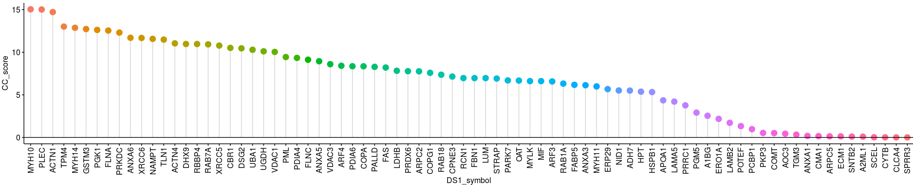

# Codes of protein data processing

In this page, the contents of protein data in Figrue3 could be generated by following codes. And the processed data had been submitted to Figshare. And all protein data were coolected from GSE149609.

~~~R
dataset1 <- read.csv("/mnt/data/user_data/xiangyu/workshop/scRNA/eso_scRNA/Heso_cancer6/normal/Proteomic/dataset1.csv")
dataset2 <- read.csv("/mnt/data/user_data/xiangyu/workshop/scRNA/eso_scRNA/Heso_cancer6/normal/Proteomic/dataset2.csv")
dataset3 <- read.csv("/mnt/data/user_data/xiangyu/workshop/scRNA/eso_scRNA/Heso_cancer6/normal/Proteomic/dataset3.csv")
all_files <- list(dataset1,dataset2,dataset3)
all_files_ <- future_lapply(1:length(all_files),function(x){
  tmp <- all_files[[x]]
  tmp$Accession <- as.character(tmp$Accession)
  GN_all <- unlist(future_lapply(strsplit(tmp$Accession,split="[|]"),function(i){return(i[3])}))
  GN_all <- unlist(future_lapply(strsplit(GN_all,split="_"),function(i){return(i[1])}))
  tmp$symbol <- GN_all
  tmp$Desription <- as.character(tmp$Desription)
  GN_all2 <- unlist(future_lapply(strsplit(tmp$Desription,split="GN="),function(i){return(i[2])}))
  GN_all2 <- unlist(future_lapply(strsplit(GN_all2,split=" PE"),function(i){return(i[1])}))
  tmp$symbol[is.na(tmp$symbol)] <- GN_all2[is.na(tmp$symbol)]
  tmp$Sig <- as.character(tmp$Sig)
  tmp$Sig.1 <- as.character(tmp$Sig.1)
  tmp$Sig.2 <- as.character(tmp$Sig.2)
  tmp$Sig.3 <- as.character(tmp$Sig.3)
  tmp$Sig.4 <- as.character(tmp$Sig.4)
  return(tmp)
  })
dataset1_sel <- all_files_[[1]][,c("GroupID","Hit.Number","Peptide","Unique.Peptide",
  "X1N_114.VS.1T_118","Quant.Number","Sig","X2N_115.VS.2T_119","Quant.Number.1","Sig.1",
  "X6N_116.VS.6T_121","Quant.Number.2","Sig.2","X7N_113.VS.7T_117","Quant.Number.3","Sig.3",
  "Z1N.VS.Z1T","Quant.Number.4","Sig.4","symbol")]
dataset2_sel  <- all_files_[[2]][,c("GroupID","Hit.Number","Peptide","Unique.Peptide",
  "X8N_114.VS.8T_118","Quant.Number","Sig","X9N_115.VS.9T_119","Quant.Number.1","Sig.1",
  "X11N_116.VS.11T_121","Quant.Number.2","Sig.2","X7N_113.VS.7T_117","Quant.Number.3","Sig.3",
  "Z2N.VS.Z2T","Quant.Number.4","Sig.4","symbol")]
dataset3_sel  <- all_files_[[3]][,c("GroupID","Hit.Number","Peptide","Unique.Peptide",
  "X12N_114.VS.12T_118","Quant.Number","Sig","X13N_115.VS.13T_119","Quant.Number.1","Sig.1",
  "X15N_116.VS.15T_121","Quant.Number.2","Sig.2","X7N_113.VS.7T_117","Quant.Number.3","Sig.3",
  "Z3N.VS.Z3T","Quant.Number.4","Sig.4","symbol")]
dataset1_sel$X1N_114.VS.1T_118 <- as.numeric(as.character(dataset1_sel$X1N_114.VS.1T_118))
dataset1_sel$X2N_115.VS.2T_119 <- as.numeric(as.character(dataset1_sel$X2N_115.VS.2T_119))
dataset1_sel$X6N_116.VS.6T_121 <- as.numeric(as.character(dataset1_sel$X6N_116.VS.6T_121))
dataset1_sel$X7N_113.VS.7T_117 <- as.numeric(as.character(dataset1_sel$X7N_113.VS.7T_117))
dataset1_sel$Z1N.VS.Z1T <- as.numeric(as.character(dataset1_sel$Z1N.VS.Z1T))
dataset2_sel$X8N_114.VS.8T_118 <- as.numeric(as.character(dataset2_sel$X8N_114.VS.8T_118))
dataset2_sel$X9N_115.VS.9T_119 <- as.numeric(as.character(dataset2_sel$X9N_115.VS.9T_119))
dataset2_sel$X11N_116.VS.11T_121 <- as.numeric(as.character(dataset2_sel$X11N_116.VS.11T_121))
dataset2_sel$X7N_113.VS.7T_117 <- as.numeric(as.character(dataset2_sel$X7N_113.VS.7T_117))
dataset2_sel$Z2N.VS.Z2T <- as.numeric(as.character(dataset2_sel$Z2N.VS.Z2T))
dataset3_sel$X12N_114.VS.12T_118 <- as.numeric(as.character(dataset3_sel$X12N_114.VS.12T_118))
dataset3_sel$X13N_115.VS.13T_119 <- as.numeric(as.character(dataset3_sel$X13N_115.VS.13T_119))
dataset3_sel$X15N_116.VS.15T_121 <- as.numeric(as.character(dataset3_sel$X15N_116.VS.15T_121))
dataset3_sel$X7N_113.VS.7T_117 <- as.numeric(as.character(dataset3_sel$X7N_113.VS.7T_117))
dataset3_sel$Z3N.VS.Z3T <- as.numeric(as.character(dataset3_sel$Z3N.VS.Z3T))
dataset1_sel <- subset(dataset1_sel,X1N_114.VS.1T_118 > 0 & X2N_115.VS.2T_119 > 0 & X6N_116.VS.6T_121 > 0 & X7N_113.VS.7T_117 > 0 & Z1N.VS.Z1T > 0)
dataset2_sel <- subset(dataset2_sel,X8N_114.VS.8T_118 > 0 & X9N_115.VS.9T_119 > 0 & X11N_116.VS.11T_121 > 0 & X7N_113.VS.7T_117 > 0 & Z2N.VS.Z2T > 0)
dataset3_sel <- subset(dataset3_sel,X12N_114.VS.12T_118 > 0 & X13N_115.VS.13T_119 > 0 & X15N_116.VS.15T_121 > 0 & X7N_113.VS.7T_117 > 0 & Z3N.VS.Z3T > 0)
dataset1_sel$group_sig <- ifelse(dataset1_sel$Sig=="*" | dataset1_sel$Sig.1=="*" | dataset1_sel$Sig.2=="*" | dataset1_sel$Sig.3=="*" | dataset1_sel$Sig.4=="*", "Sig","NoSig")
dataset2_sel$group_sig <- ifelse(dataset2_sel$Sig=="*" | dataset2_sel$Sig.1=="*" | dataset2_sel$Sig.2=="*" | dataset2_sel$Sig.3=="*" | dataset2_sel$Sig.4=="*", "Sig","NoSig")
dataset3_sel$group_sig <- ifelse(dataset3_sel$Sig=="*" | dataset3_sel$Sig.1=="*" | dataset3_sel$Sig.2=="*" | dataset3_sel$Sig.3=="*" | dataset3_sel$Sig.4=="*", "Sig","NoSig")
dataset1_sel <- subset(dataset1_sel,group_sig=="Sig")
dataset2_sel <- subset(dataset2_sel,group_sig=="Sig")

both_id <- intersect(dataset1_sel$symbol,dataset2_sel$symbol)
dataset1_sel <- XY_subset(dataset1_sel,"symbol",both_id)
dataset2_sel <- XY_subset(dataset2_sel,"symbol",both_id)
rownames(dataset1_sel) <- dataset1_sel$symbol
rownames(dataset2_sel) <- dataset2_sel$symbol
dataset1_sel <- dataset1_sel[both_id,]
dataset2_sel <- dataset2_sel[both_id,]
DS2_factors <- dataset2_sel$X7N_113.VS.7T_117/dataset1_sel$X7N_113.VS.7T_117
dataset1_sel$X1N_114.VS.1T_118 <- dataset1_sel$X1N_114.VS.1T_118/1
dataset1_sel$X2N_115.VS.2T_119 <- dataset1_sel$X2N_115.VS.2T_119/1
dataset1_sel$X6N_116.VS.6T_121 <- dataset1_sel$X6N_116.VS.6T_121/1
dataset1_sel$X7N_113.VS.7T_117 <- dataset1_sel$X7N_113.VS.7T_117/1
dataset1_sel$Z1N.VS.Z1T <- dataset1_sel$Z1N.VS.Z1T/1
dataset2_sel$X8N_114.VS.8T_118 <- dataset2_sel$X8N_114.VS.8T_118/DS2_factors
dataset2_sel$X9N_115.VS.9T_119 <- dataset2_sel$X9N_115.VS.9T_119/DS2_factors
dataset2_sel$X11N_116.VS.11T_121 <- dataset2_sel$X11N_116.VS.11T_121/DS2_factors
dataset2_sel$X7N_113.VS.7T_117 <- dataset2_sel$X7N_113.VS.7T_117/DS2_factors
dataset2_sel$Z2N.VS.Z2T <- dataset2_sel$Z2N.VS.Z2T/DS2_factors
dataset1_sel <- dataset1_sel[,c("Peptide","Unique.Peptide","X1N_114.VS.1T_118","Quant.Number","X2N_115.VS.2T_119","Quant.Number.1","Sig.1",
  "X6N_116.VS.6T_121","Quant.Number.2","Sig.2","X7N_113.VS.7T_117","Quant.Number.3","Sig.3",
  "Z1N.VS.Z1T","Quant.Number.4","Sig.4","symbol")]
dataset2_sel  <- dataset2_sel[,c("Peptide","Unique.Peptide","X8N_114.VS.8T_118","Quant.Number","Sig","X9N_115.VS.9T_119","Quant.Number.1","Sig.1",
  "X11N_116.VS.11T_121","Quant.Number.2","Sig.2",
  "Z2N.VS.Z2T","Quant.Number.4","Sig.4")]
colnames(dataset1_sel) <- paste0("DS1_",colnames(dataset1_sel))
colnames(dataset2_sel) <- paste0("DS2_",colnames(dataset2_sel))
all_data <- cbind(dataset1_sel,dataset2_sel)
all_data$DS1_Peptide <- as.numeric(as.character(all_data$DS1_Peptide))
all_data$DS1_Unique.Peptide <- as.numeric(as.character(all_data$DS1_Unique.Peptide))
all_data$DS2_Peptide <- as.numeric(as.character(all_data$DS2_Peptide))
all_data$DS2_Unique.Peptide <- as.numeric(as.character(all_data$DS2_Unique.Peptide))
all_data$CC_score <- all_data$DS1_X1N_114.VS.1T_118*all_data$DS1_X2N_115.VS.2T_119*all_data$DS1_X6N_116.VS.6T_121*
all_data$DS1_X7N_113.VS.7T_117*all_data$DS1_Z1N.VS.Z1T*all_data$DS2_X8N_114.VS.8T_118*all_data$DS2_X9N_115.VS.9T_119*
all_data$DS2_X11N_116.VS.11T_121*all_data$DS2_Z2N.VS.Z2T*
all_data$DS1_Peptide*all_data$DS2_Peptide
all_data$CC_score <- log(all_data$CC_score+1,2)
all_data$entrez <- mapIds(x = org.Hs.eg.db,
                        keys = all_data$DS1_symbol,
            keytype ="SYMBOL",
            column ="ENTREZID",
            multiVals="first")
all_data1 <- na.omit(all_data)
all_data1 <- all_data1[order(all_data1$CC_score,decreasing=TRUE),]
all_data1$order <- 1:nrow(all_data1)
all_data1$order <- as.character(all_data1$order )
mcsaveRDS(all_data1,"/mnt/data/user_data/xiangyu/workshop/scRNA/eso_scRNA/Heso_cancer6/normal/Proteomic/DPE_ESCC_final.rds",mc.cores=20)
mcsaveRDS(all_data1,"/mnt/data/user_data/xiangyu/workshop/scRNA/eso_scRNA/Heso_cancer6/normal/Proteomic/DPE_ESCC_final.rds",mc.cores=20)
~~~

~~~R
all_data1 <- mcreadRDS("/mnt/data/user_data/xiangyu/workshop/scRNA/eso_scRNA/Heso_cancer6/normal/Proteomic/DPE_ESCC_final.rds",mc.cores=20)
library(ggpubr)
p1 <- ggdotchart(all_data1, x="DS1_symbol", y="CC_score", color = "DS1_symbol",
add = "segments", rotate = FALSE, group = "DS1_symbol", dot.size = 4,
font.label = list(color="white", size=3, vjust=0.1), legend = "none") +
  scale_fill_manual(values=col)+
   geom_hline(yintercept=0)
ggsave("./figure_making/protomics_levels_summary_dotplot.svg", plot=p1,width = 12, height = 4,dpi=1080)
~~~

