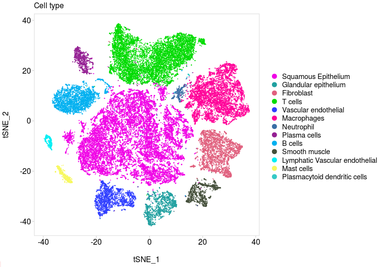
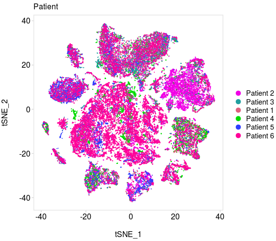
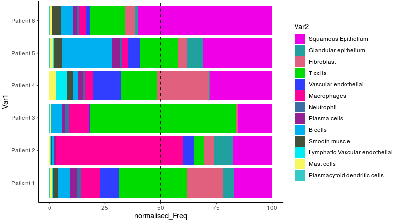
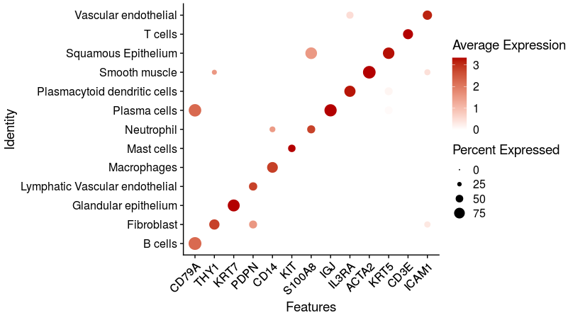
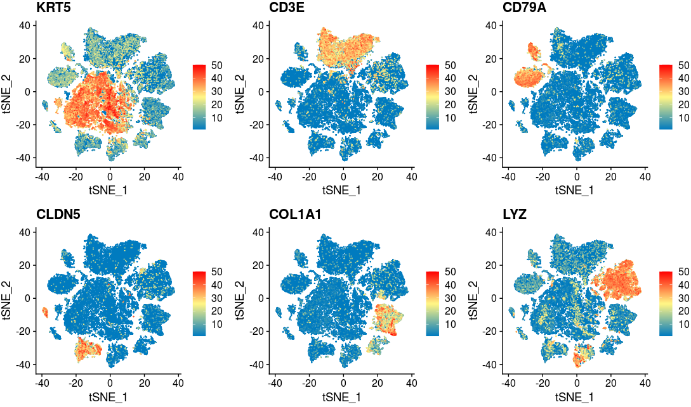
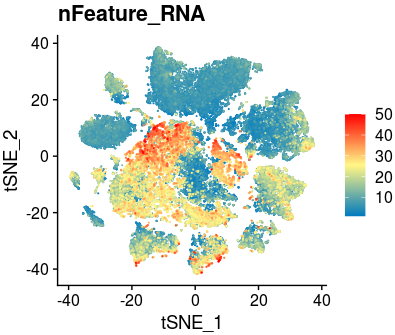
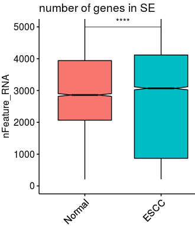

# Codes of ESCC single-cell landscape

In this page, the contents in Figrue1 could be generated by following codes. And the processed data had been submitted to [Figshare](https://figshare.com/articles/dataset/CCI-in-ESCC/19609548). The extended tools used in this pipelines could be visited by clicking [here](CCI-Identify/extended_tools).

Firstly, we should load the packages we need in our projects.

~~~R
suppressPackageStartupMessages({
  library(dplyr)
  library(Seurat)
  library(Matrix)
  library(proxy)
  library(gplots)
  library(Rtsne)
  library(densityClust)
  library(irlba)
  library(monocle)
  library(plyr)
  library(DOSE)
  library(clusterProfiler)
  library(topGO)
  library(pathview)
  library(AnnotationDbi)
  library(cowplot)
  library(ggplot2)
  library(velocyto.R)
  library(trqwe)
  library(Rsamtools)
  library(GenomicFeatures)
  library(GenomicAlignments)
  library(BiocParallel)
  library(pheatmap)
  library(RColorBrewer)
  library(PoiClaClu)
  library(org.Mm.eg.db)
  library(org.Hs.eg.db)
  library(DESeq2)
  library(data.table)
  library(stringr)
  library(iTALK)
  library(nichenetr)
  library(tidyr)
  library(GenomicRanges)
  library(viridis)
  library(chromVAR)
  library(ggpubr)
  library(corrplot)
})
source("/mnt/data/user_data/xiangyu/programme/R_PACKAGES/my_code/MyBestFunction_scRNA.R")
source("/mnt/data/user_data/xiangyu/programme/R_PACKAGES/my_code/Pseudo_CNV_series.R")
library(future)
library(future.apply)
options(future.globals.maxSize = 300 * 1024^3)
plan("multiprocess", workers = 15)
plan()
library(scales)
library(BuenColors)
library(PCAtools)
~~~

~~~R
scESCC_map <- mcreadRDS(file="/mnt/data/GEO_SUBMIT/CCI_ESCC/scESCC_map.rds",mc.cores=20)
color <- c("#f000e6","#21A0A0","#E0607E","#00db00",
  "#2f3eff","#ff0098", "#3A6EA5","#942093","#00b0f0","#45503B",
  "#00eef3","#f7f85e","#36C9C6")
cell_types <- c("Squamous Epithelium", "Glandular epithelium", "Fibroblast", 
  "T cells", "Vascular endothelial", "Macrophages", "Neutrophil","Plasma cells", "B cells", 
  "Smooth muscle", "Lymphatic Vascular endothelial", "Mast cells", "Plasmacytoid dendritic cells")
all_merge$new_anno2 <- factor(all_merge$new_anno2,levels=cell_types)
Idents(all_merge) <- all_merge$new_anno2
p1 <- DimPlot(object = all_merge, reduction = "tsne",label = F,repel=T,cols=color[1:length(unique(all_merge$new_anno2))]) +labs(title="Cell type") + ggmin::theme_powerpoint()

~~~

~~~R
Patient <- c("Patient 2","Patient 3","Patient 1","Patient 4","Patient 5","Patient 6")
aa <- color[1:length(Patient)]
col <- aa
names(col) <- Patient
scESCC_map$new_group <- factor(scESCC_map$new_group,levels=Patient)
Idents(scESCC_map) <- scESCC_map$new_group
p1 <- DimPlot(object = scESCC_map, reduction = "tsne",label = F,repel=T,cols=col) +labs(title="Patient") + ggmin::theme_powerpoint()
ggsave("./figure_making/single_cell_tsne_color_by_Patient.png", plot=p1,width = 6, height = 5,dpi=1080)
~~~

~~~R
color <- c("#f000e6","#21A0A0","#E0607E","#00db00",
  "#2f3eff","#ff0098", "#3A6EA5","#942093","#00b0f0","#45503B",
  "#00eef3","#f7f85e","#36C9C6")
cell_types <- c("Squamous Epithelium", "Glandular epithelium", "Fibroblast", 
  "T cells", "Vascular endothelial", "Macrophages", "Neutrophil","Plasma cells", "B cells", 
  "Smooth muscle", "Lymphatic Vascular endothelial", "Mast cells", "Plasmacytoid dendritic cells")
col <- color
names(col) <- cell_types
group_perc <- as.data.frame(table(all_merge$new_group,all_merge$new_anno2))
group_perc$Var1 <- as.character(group_perc$Var1)
aa_all <- c()
for (i in unique(group_perc$Var1)){
  group_sel <- subset(group_perc,Var1==i)
  group_sel$normalised_Freq <- 100*(group_sel$Freq/sum(group_sel$Freq))
  aa_all <- rbind(aa_all,group_sel)
}
aa_all$Var1 <- as.character(aa_all$Var1)
aa_all$Var1 <- factor(aa_all$Var1,levels=c("Patient 1","Patient 2","Patient 3","Patient 4","Patient 5","Patient 6"))
aa_all <- aa_all[order(aa_all$Var1,decreasing=F),]
p1 <- ggplot(data=aa_all, aes(x=Var1, y=normalised_Freq, fill=Var2))+
  geom_bar(stat="identity") + geom_hline(yintercept = 50, linetype = 2) + coord_flip()+
  scale_fill_manual(values=col)+ theme_classic()
ggsave("./figure_making/single_cell_map_percentage_summary.svg", plot=p1,width = 7.5, height = 5,dpi=1080)
~~~

~~~R
CT <- c("Squamous Epithelium", "Glandular epithelium", "Fibroblast", 
  "T cells", "Vascular endothelial", "Macrophages", "Neutrophil","Plasma cells", "B cells", 
  "Smooth muscle", "Lymphatic Vascular endothelial", "Mast cells", "Plasmacytoid dendritic cells")
CT <- CT[order(CT)]
all_merge$new_anno2 <- factor(all_merge$new_anno2,levels=CT)
Idents(all_merge) <- all_merge$new_anno2
p1 <- DotPlot(all_merge, features = c("CD79A","THY1","KRT7","PDPN","CD14","KIT","S100A8","IGJ","IL3RA","ACTA2","KRT5","CD3E","ICAM1"), cols=c("#ffffff", "#B30000"),scale = TRUE,col.min = 0,col.max = 5) + RotatedAxis()
~~~

~~~R
p1 <- XY_FeaturePlot(object = scESCC_map, features = c("KRT5","CD3E","CD79A","CLDN5","COL1A1","LYZ"),ncol=3,pt.size=.1,reduction="tsne",label=T,cols = CustomPalette(low ="#007BBF", mid = "#FFF485",high = "#FF0000"))
ggsave("./figure_making/scLandscape_CLASSICAL_sig.png", plot=p1,width = 15, height = 9,dpi=1080)
~~~

~~~r
p1 <- XY_FeaturePlot(object = scESCC_map, features = c("nFeature_RNA"),ncol=1,pt.size=.1,reduction="tsne",label=T,cols = CustomPalette(low ="#007BBF", mid = "#FFF485",high = "#FF0000"))
ggsave("./figure_making/single_cell_tsne_color_by_nFeature.png", plot=p1,width = 5, height = 5,dpi=1080)
~~~

~~~R
summer_all <- scESCC_map[[c("nFeature_RNA","new_group2","new_anno2")]]
SE_cells <- subset(summer_all,new_anno2=="Squamous Epithelium")
library(ggpubr)
p1 <- ggboxplot(SE_cells, x = "new_group2", y = "nFeature_RNA", fill="new_group2",
  title="number of genes in SE", legend = "none",outlier.shape = NA,ylim=c(0,5000),notch = TRUE) +
  rotate_x_text(angle = 45)+ stat_compare_means(comparisons =list(c("Normal","ESCC")),
    label = "p.signif", method = "t.test",label.y=c(5000))
ggsave("./figure_making/nFeature_RNA_scESCC.svg", plot=p1,width = 5, height = 5,dpi=1080)
~~~

