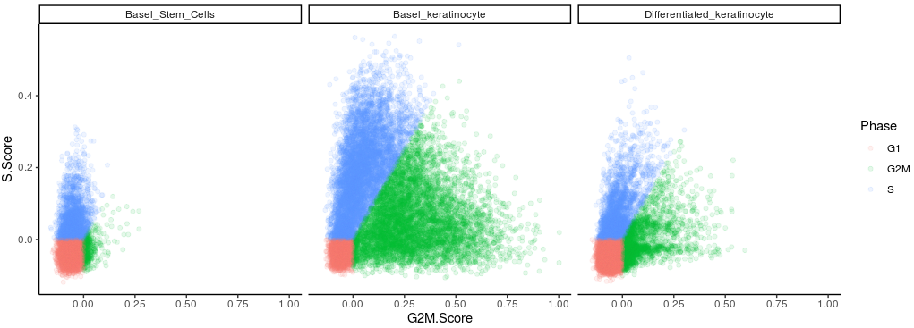

# Codes of single-cell normal SE development

In this page, the contents of single-cell normal SE development could be generated by following codes. And the processed data had been submitted to Figshare.

Firstly, we should load the packages we need in our projects.

~~~R
suppressPackageStartupMessages({
  library(dplyr)
  library(Seurat)
  library(Matrix)
  library(proxy)
  library(gplots)
  library(Rtsne)
  library(densityClust)
  library(irlba)
  library(monocle)
  library(plyr)
  library(DOSE)
  library(clusterProfiler)
  library(topGO)
  library(pathview)
  library(AnnotationDbi)
  library(cowplot)
  library(ggplot2)
  library(velocyto.R)
  library(trqwe)
  library(Rsamtools)
  library(GenomicFeatures)
  library(GenomicAlignments)
  library(BiocParallel)
  library(pheatmap)
  library(RColorBrewer)
  library(PoiClaClu)
  library(org.Mm.eg.db)
  library(org.Hs.eg.db)
  library(DESeq2)
  library(data.table)
  library(stringr)
  library(iTALK)
  library(nichenetr)
  library(tidyr)
  library(GenomicRanges)
  library(viridis)
  library(chromVAR)
  library(ggpubr)
  library(corrplot)
})
source("/mnt/data/user_data/xiangyu/programme/R_PACKAGES/my_code/MyBestFunction_scRNA.R")
source("/mnt/data/user_data/xiangyu/programme/R_PACKAGES/my_code/Pseudo_CNV_series.R")
library(future)
library(future.apply)
options(future.globals.maxSize = 300 * 1024^3)
plan("multiprocess", workers = 15)
plan()
library(scales)
library(BuenColors)
library(PCAtools)
~~~

* Firstly, we annotated the normal esophagus SE in our normal sample. 

~~~r
only_epi <- mcreadRDS("/mnt/data/GEO_SUBMIT/CCI_ESCC/normalSE_development_map.rds",mc.cores=20)
cell_types <- c("Basel_keratinocyte","Basel_Stem_Cells","Differentiated_keratinocyte")
aa <- jdb_palette("corona")[1:length(cell_types)]
col <- aa
names(col) <- cell_types
only_epi$new_anno3 <- factor(only_epi$new_anno3,levels=cell_types)
Idents(only_epi) <- only_epi$new_anno3
p1 <- DimPlot(object = only_epi, reduction = "phate",label = F,repel=T,cols=col[1:length(unique(only_epi$new_anno3))]) +labs(title="Cell type") + ggmin::theme_powerpoint()
ggsave("/mnt/data/user_data/xiangyu/workshop/scRNA/eso_scRNA/Heso_all_sample_merge/figure_making/Normal_Epi_color_by_new_anno.png", plot=p1,width = 8.5, height = 5,dpi=1080)
~~~

~~~R
p1 <- XY_FeaturePlot(object = only_epi, features = c("TP63","SOX2","KRT13","IVL"),ncol=2,pt.size=.1,reduction="phate",label=T,cols = CustomPalette(low ="#007BBF", mid = "#FFF485",high = "#FF0000")) + NoLegend()
ggsave("/mnt/data/user_data/xiangyu/workshop/scRNA/eso_scRNA/Heso_all_sample_merge/figure_making/Normal_Epi_color_by_interested_genes.png", plot=p1,width = 7, height = 5,dpi=1080)
~~~

* Here, we had identified the BS, BK and DK signatures by `FindAllMarkers`

~~~R
only_Normal_epi.markers <- FindAllMarkers(object = only_Normal_epi, only.pos = T, min.pct = 0.25,thresh.use = 0.25)
only_Normal_epi.markers <- subset(only_Normal_epi.markers,p_val_adj < .05)
mcsaveRDS(only_Normal_epi.markers,"/mnt/data/user_data/xiangyu/workshop/scRNA/eso_scRNA/Heso_cancer6/normal/Heso6_normal_only_epi_hetero.marker.rds",mc.cores=20)
~~~

* Then, to widely and generaly validate the subtypes of esophagus SE, we integrate the HCA data aand ours to analysis the development of normal esophagus SE.

~~~R
ALL_nor_Eso_epi <- mcreadRDS(file="/mnt/data/GEO_SUBMIT/CCI_ESCC/scHCA_SE_development.rds",mc.cores=20)
ALL_nor_Eso_epi$predicted.id <- factor(ALL_nor_Eso_epi$predicted.id,levels=c("Basel_Stem_Cells","Basel_keratinocyte","Differentiated_keratinocyte"))
All_Cell_Cycle_data <- FetchData(object = ALL_nor_Eso_epi, vars = c("G2M.Score","S.Score","predicted.id","Phase"),slot="data")
library(BuenColors)
aa <- jdb_palette("brewer_celsius")
p1 <- ggplot(All_Cell_Cycle_data, aes(x=G2M.Score, y=S.Score, color=Phase)) +
  geom_point(alpha=0.1)  +theme_classic() +facet_wrap(~predicted.id)
ggsave("./figure_making/nor_epi_cell_cycle_scatter.png", plot=p1,width = 15, height = 5,dpi=1080)

ALL_nor_Eso_epi$new_group <- ALL_nor_Eso_epi$donor_time
ALL_nor_Eso_epi$new_group[is.na(ALL_nor_Eso_epi$new_group)] <- "Heso_Ours"
Idents(ALL_nor_Eso_epi) <- ALL_nor_Eso_epi$new_group
sel_group <- unique(ALL_nor_Eso_epi$new_group)
peudo_bulk_all_ <- future_lapply(1:length(sel_group),function(i) {
  peudo_bulk_tmp <- pseudo_bulk_seurat_mean(seurat_obj=subset(ALL_nor_Eso_epi,idents=sel_group[i]),num_split=1,seed.use=1,slot="data",prefix=sel_group[i])
  return(peudo_bulk_tmp)
})
peudo_bulk_all <- do.call(cbind,peudo_bulk_all_)

peudo_bulk_all_cor <- cor(peudo_bulk_all)
break1=seq(0.8, 0.9, length.out=50)
break2=seq(0.9, 1, length.out=51)
the_break<-c(break1,break2[-1])
aa <- jdb_palette("brewer_yes")[1:length(jdb_palette("brewer_yes"))]
pdf("./figure_making/Similarity_between_samples.pdf")
pheatmap(peudo_bulk_all_cor,border_color=NA,cluster_cols=T,breaks=the_break,
  color = colorRampPalette(aa)(100),show_rownames=T,cluster_rows=T,main="Pearson betwewn samples")
dev.off()
~~~

~~~R
ALL_nor_Eso_epi <- mcreadRDS(file="/mnt/data/GEO_SUBMIT/CCI_ESCC/scHCA_SE_development.rds",mc.cores=20)
cell_types <- c("Basel_keratinocyte","Basel_Stem_Cells","Differentiated_keratinocyte")
aa <- jdb_palette("corona")[1:length(cell_types)]
col <- aa
names(col) <- cell_types
ALL_nor_Eso_epi$predicted.id <- factor(ALL_nor_Eso_epi$predicted.id,levels=cell_types)
Idents(ALL_nor_Eso_epi) <- ALL_nor_Eso_epi$predicted.id
p1 <- DimPlot(object = ALL_nor_Eso_epi, reduction = "umap",label = F,repel=T,cols=col[1:length(unique(ALL_nor_Eso_epi$predicted.id))]) +labs(title="Cell type") + ggmin::theme_powerpoint()
ggsave("./ALL_nor_Eso_epi_color_by_new_anno.png", plot=p1,width = 8.5, height = 5,dpi=1080)
~~~

~~~R
ALL_nor_Eso_epi$predicted.id <- factor(ALL_nor_Eso_epi$predicted.id,levels=c("Differentiated_keratinocyte","Basel_keratinocyte","Basel_Stem_Cells"))
Idents(ALL_nor_Eso_epi) <- ALL_nor_Eso_epi$predicted.id
p1 <- DotPlot(ALL_nor_Eso_epi, features = c("SOX2","TP63","KRT15","KRT5","KRT4","KRT13","IVL"), cols = c("#ffffff", "#B30000"),scale = TRUE,col.min = 0,col.max = 5) + RotatedAxis()
ggsave("./figure_making/nor_epi_cluster_marker_color_dotplot.svg", plot=p1,width = 8, height = 5,dpi=1080)
~~~

~~~R
only_Normal_epi.markers <- mcreadRDS("/mnt/data/user_data/xiangyu/workshop/scRNA/eso_scRNA/Heso_cancer6/normal/Heso6_normal_only_epi_hetero.marker.rds",mc.cores=20)
only_Normal_epi.markers_DK <- subset(only_Normal_epi.markers,cluster=="Differentiated_keratinocyte" &pct.2 < 0.4)
only_Normal_epi.markers_BK <- subset(only_Normal_epi.markers,cluster=="Basel_keratinocyte" &pct.2 < 0.4)
only_Normal_epi.markers_BS <- subset(only_Normal_epi.markers,cluster=="Basel_Stem_Cells" &pct.2 < 0.4)

Lineage_marker <- only_Normal_epi.markers_DK$gene
Lineage_marker <- intersect(rownames(GetAssayData(object = ALL_nor_Eso_epi, slot = "data",assay="RNA")),Lineage_marker)
speci_raw <- FetchData(object = ALL_nor_Eso_epi, vars = Lineage_marker,slot="data")
ALL_nor_Eso_epi[["Differentiated_keratinocyte"]] <- (rowSums(speci_raw))/length(Lineage_marker)
ALL_nor_Eso_epi$Differentiated_keratinocyte <- as.numeric(as.character(ALL_nor_Eso_epi$Differentiated_keratinocyte))
Lineage_marker <- only_Normal_epi.markers_BK$gene
Lineage_marker <- intersect(rownames(GetAssayData(object = ALL_nor_Eso_epi, slot = "data",assay="RNA")),Lineage_marker)
speci_raw <- FetchData(object = ALL_nor_Eso_epi, vars = Lineage_marker,slot="data")
ALL_nor_Eso_epi[["Basel_keratinocyte"]] <- (rowSums(speci_raw))/length(Lineage_marker)
ALL_nor_Eso_epi$Basel_keratinocyte <- as.numeric(as.character(ALL_nor_Eso_epi$Basel_keratinocyte))
Lineage_marker <- only_Normal_epi.markers_BS$gene
Lineage_marker <- intersect(rownames(GetAssayData(object = ALL_nor_Eso_epi, slot = "data",assay="RNA")),Lineage_marker)
speci_raw <- FetchData(object = ALL_nor_Eso_epi, vars = Lineage_marker,slot="data")
ALL_nor_Eso_epi[["Basel_Stem_Cells"]] <- (rowSums(speci_raw))/length(Lineage_marker)
ALL_nor_Eso_epi$Basel_Stem_Cells <- as.numeric(as.character(ALL_nor_Eso_epi$Basel_Stem_Cells))
p1 <- XY_FeaturePlot(object = ALL_nor_Eso_epi, features = c("Differentiated_keratinocyte","Basel_keratinocyte","Basel_Stem_Cells"),ncol=3,pt.size=.1,reduction="umap",label=T,cols = CustomPalette(low ="#007BBF", mid = "#FFF485",high = "#FF0000"))
ggsave("./figure_making/nor_epi_DK_BK_BS_sig.png", plot=p1,width = 15, height = 5,dpi=1080)
~~~

~~~R
library(monocle3)
monocle_obj <- mcreadRDS("/mnt/data/GEO_SUBMIT/CCI_ESCC/scHCA_SE_development_monocle.rds",mc.cores=20)
p1 <- plot_cells(monocle_obj,
           color_cells_by = "predicted.id",
           label_groups_by_cluster=FALSE,
           label_leaves=FALSE,
           label_branch_points=FALSE,
           graph_label_size=0)
ggsave("./figure_making/ALL_nor_Eso_epi_color_by_new_anno_with_tranj.svg", plot=p1,width = 8.5, height = 5,dpi=1080)
~~~

~~~R

Idents(ALL_nor_Eso_epi) <- ALL_nor_Eso_epi$predicted.id
library(GSVA)
library(GSEABase)
library(Biobase)
library(genefilter)
library(BisqueRNA)
peudo_bulk_DK <- pseudo_bulk_seurat_mean(seurat_obj=subset(ALL_nor_Eso_epi,idents="Differentiated_keratinocyte"),num_split=30,seed.use=1,slot="data",prefix="DK")
peudo_bulk_BK <- pseudo_bulk_seurat_mean(seurat_obj=subset(ALL_nor_Eso_epi,idents="Basel_keratinocyte"),num_split=30,seed.use=1,slot="data",prefix="BK")
peudo_bulk_BS <- pseudo_bulk_seurat_mean(seurat_obj=subset(ALL_nor_Eso_epi,idents="Basel_Stem_Cells"),num_split=30,seed.use=1,slot="data",prefix="BS")
subset.matrix <- do.call(cbind,list(peudo_bulk_DK,peudo_bulk_BK,peudo_bulk_BS))
subset.matrix <- as.matrix(subset.matrix)
library(BisqueRNA)
all_gmt <- list.files("/mnt/data/user_data/xiangyu/programme/gsea/msigdb_v7.1/msigdb_v7.1_GMTs/indivi_gmt/",pattern=".all.v7.1.symbols.gmt")
all_gmt_names <- gsub(".all.v7.1.symbols.gmt","",all_gmt)
all_gmt <- as.list(all_gmt)
names(all_gmt) <- all_gmt_names
all_gmt_inte <- future_lapply(all_gmt,function(x){
  sel_gmt <- read.gmt(paste("/mnt/data/user_data/xiangyu/programme/gsea/msigdb_v7.1/msigdb_v7.1_GMTs/indivi_gmt/",x,sep=""))
  sel_gmt <- getGmt(paste0("/mnt/data/user_data/xiangyu/programme/gsea/msigdb_v7.1/msigdb_v7.1_GMTs/indivi_gmt/",x),
                 collectionType=BroadCollection(category=gsub(".all.v7.1.symbols.gmt","",x)),
                 geneIdType=SymbolIdentifier())
  return(sel_gmt)}
  )
all_gmt_sel <- all_gmt_inte[c("c5","c6","c7","h","c2")]
esrnaseq_c2 <- gsva(subset.matrix, all_gmt_sel$c2,min.sz=5, max.sz=500,
                  mx.diff=TRUE, verbose=FALSE, parallel.sz=30) 
esrnaseq_c5 <- gsva(subset.matrix, all_gmt_sel$c5,min.sz=5, max.sz=500,
                  mx.diff=TRUE, verbose=FALSE, parallel.sz=30) 
esrnaseq_c6 <- gsva(subset.matrix, all_gmt_sel$c6,min.sz=5, max.sz=500,
                  mx.diff=TRUE, verbose=FALSE, parallel.sz=30) 
esrnaseq_c7 <- gsva(subset.matrix, all_gmt_sel$c7,min.sz=5, max.sz=500,
                  mx.diff=TRUE, verbose=FALSE, parallel.sz=30) 
esrnaseq_h <- gsva(subset.matrix, all_gmt_sel$h,min.sz=5, max.sz=500,
                  mx.diff=TRUE, verbose=FALSE, parallel.sz=30) 
all_gsva <- do.call(rbind,list(esrnaseq_c2,esrnaseq_c5,esrnaseq_c6,esrnaseq_c7,esrnaseq_h))
all_gsva <- all_gsva[apply(all_gsva,1,sd)!=0,]
all_gsva <- as.data.frame(all_gsva)
metadata <- data.frame(group=c(rep("DK",30),rep("BK",30),rep("BS",30)),row.names=colnames(all_gsva))
all_gsva_seurat <- CreateSeuratObject(counts = all_gsva,assay = 'RNA',project = 'GSVA',min.cells = 0,meta.data = metadata)
all_gsva_seurat$group <- factor(all_gsva_seurat$group,levels=c("BS","BK","DK"))
Idents(all_gsva_seurat) <- all_gsva_seurat$group
mcsaveRDS(all_gsva_seurat,"./all_gsva_seurat_GSVA_seurat.rds",mc.cores=20)
~~~

~~~R
all_gsva_seurat <- mcreadRDS("/mnt/data/user_data/xiangyu/workshop/scRNA/eso_scRNA/Heso_all_sample_merge/all_gsva_seurat_GSVA_seurat.rds",mc.cores=20)
metadata <- data.frame(group=c(rep("DK",30),rep("BK",30),rep("BS",30)),row.names=colnames(all_gsva_seurat))
all_gsva_seurat <- CreateSeuratObject(counts = GetAssayData(all_gsva_seurat,slot="data")[,c(paste(rep("BS",30),30:1,sep="_"),paste(rep("BK",30),1:30,sep="_"),paste(rep("DK",30),1:30,sep="_"))],assay = 'RNA',project = 'GSVA',min.cells = 0,meta.data = metadata)
all_gsva_seurat$group <- factor(all_gsva_seurat$group,levels=c("BS","BK","DK"))
Interseted_path <- c("GO-EXTRACELLULAR-MATRIX-STRUCTURAL-CONSTITUENT","GO-EPITHELIAL-CELL-FATE-COMMITMENT","KEGG-RIBOSOME",
"HALLMARK-MYC-TARGETS-V1","HALLMARK-MYC-TARGETS-V2","KEGG-SPLICEOSOME","KEGG-DNA-REPLICATION","GO-CONDENSIN-COMPLEX","GO-MAINTENANCE-OF-DNA-METHYLATION",
"GO-EPITHELIAL-CELL-CELL-ADHESION","GO-CORNIFICATION","GO-KERATINIZATION")
pdf("./figure_making/nor_epi_cluster_marker_gsva_heatmap.pdf")
XY_heatmap(seurat_obj=all_gsva_seurat,group="group",genes=Interseted_path,all_num=FALSE,new_names=NULL,labels_rot=90,
  assay_sel="RNA",color=colorRampPalette(brewer.pal(10, "RdBu"))(101),min_and_max_cut=2,show_row_names=TRUE,mark_gene=NULL,label_size=0,scale=TRUE)
dev.off()
~~~

~~~r

aa <- as.data.frame(table(ALL_nor_Eso_epi$Phase,ALL_nor_Eso_epi$predicted.id))
aa_all <- c()
for (i in unique(aa$Var1)){
  group_sel <- subset(aa,Var1==i)
  group_sel$sum_number <- sum(group_sel$Freq)
  aa_all <- rbind(aa_all,group_sel)
}
all_group_normalised<- c()
for (i in unique(aa$Var2)){
  tmp_group <- subset(aa,Var2==i)
  tmp_group$normal_ratio <- (tmp_group$Freq/sum(tmp_group$Freq))*100
  tmp_group$normal_ratio <- round(tmp_group$normal_ratio,2)
  all_group_normalised <- rbind(all_group_normalised,tmp_group)
}
bp1 <- ggplot(subset(all_group_normalised,Var2=="Differentiated_keratinocyte"), aes(x="", y=normal_ratio, fill=Var1))+
geom_bar(width = 1, stat = "identity") + coord_polar("y", start=0) + labs(title="Differentiated_keratinocyte")
bp2 <- ggplot(subset(all_group_normalised,Var2=="Basel_keratinocyte"), aes(x="", y=normal_ratio, fill=Var1))+
geom_bar(width = 1, stat = "identity") + coord_polar("y", start=0) + labs(title="Basel_keratinocyte")
bp3 <- ggplot(subset(all_group_normalised,Var2=="Basel_Stem_Cells"), aes(x="", y=normal_ratio, fill=Var1))+
geom_bar(width = 1, stat = "identity") + coord_polar("y", start=0) + labs(title="Basel_Stem_Cells")
p1 <- plot_grid(bp3,bp2,bp1,nrow=1)
ggsave("./figure_making/nor_epi_cell_cycle.svg", plot=p1,width = 8, height = 5,dpi=1080)
~~~

~~~R
ALL_nor_Eso_epi$predicted.id <- factor(ALL_nor_Eso_epi$predicted.id,levels=c("Basel_Stem_Cells","Basel_keratinocyte","Differentiated_keratinocyte"))
All_Cell_Cycle_data <- FetchData(object = ALL_nor_Eso_epi, vars = c("G2M.Score","S.Score","predicted.id","Phase"),slot="data")
library(BuenColors)
aa <- jdb_palette("brewer_celsius")
p1 <- ggplot(All_Cell_Cycle_data, aes(x=G2M.Score, y=S.Score, color=Phase)) +
  geom_point(alpha=0.1)  +theme_classic() +facet_wrap(~predicted.id)
ggsave("./figure_making/nor_epi_cell_cycle_scatter.png", plot=p1,width = 15, height = 5,dpi=1080)
~~~

